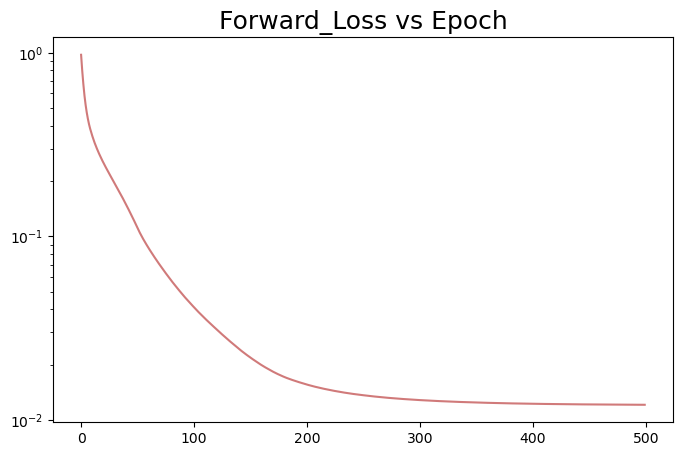
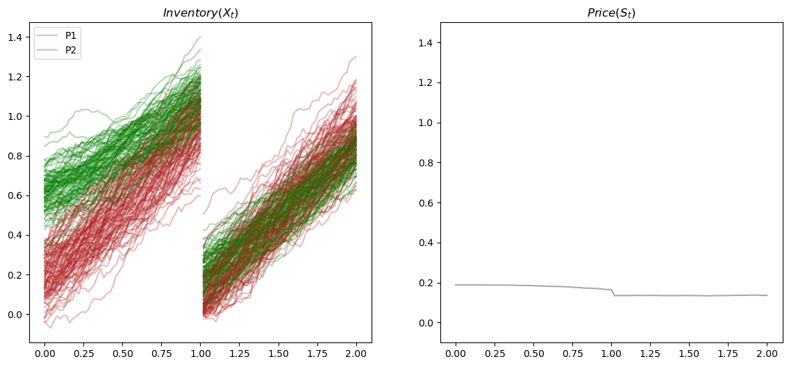
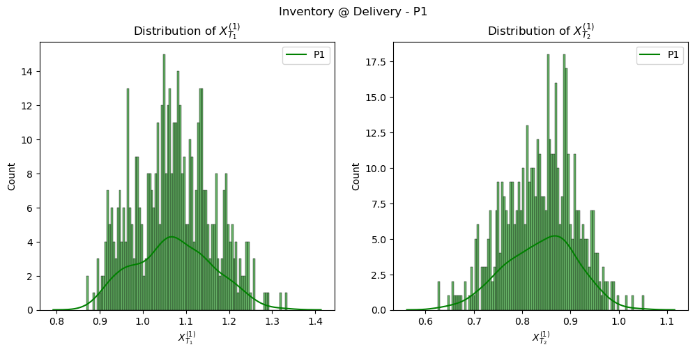
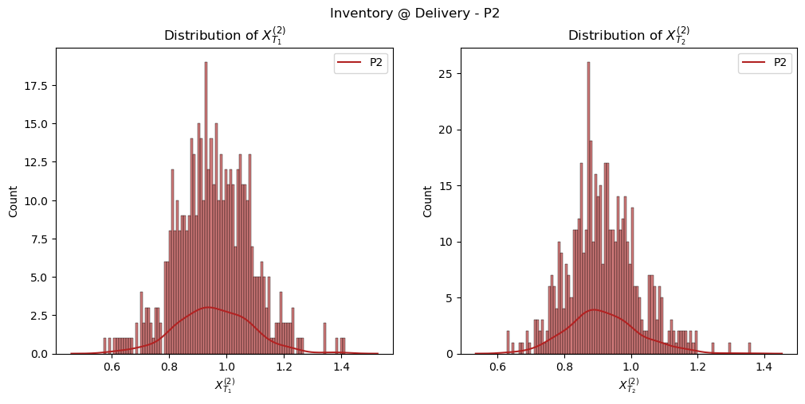
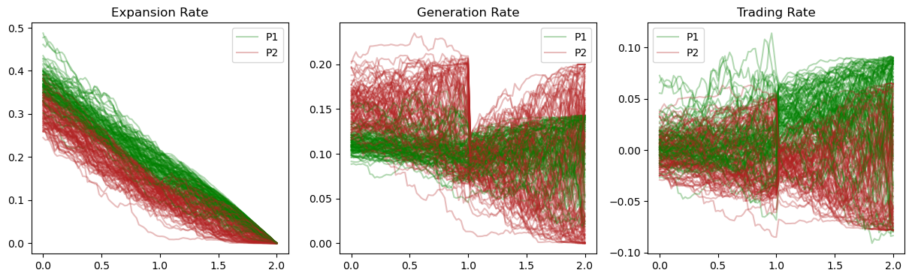
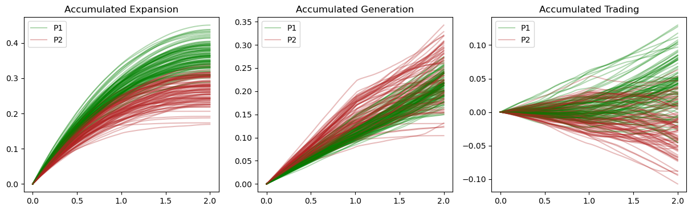
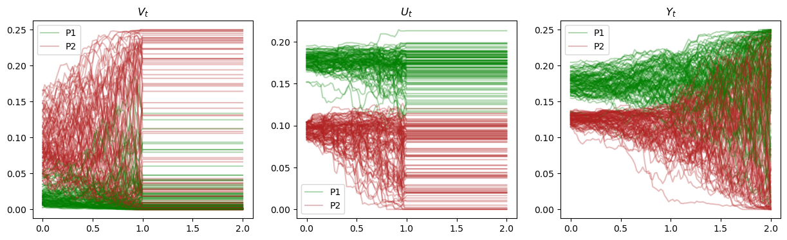
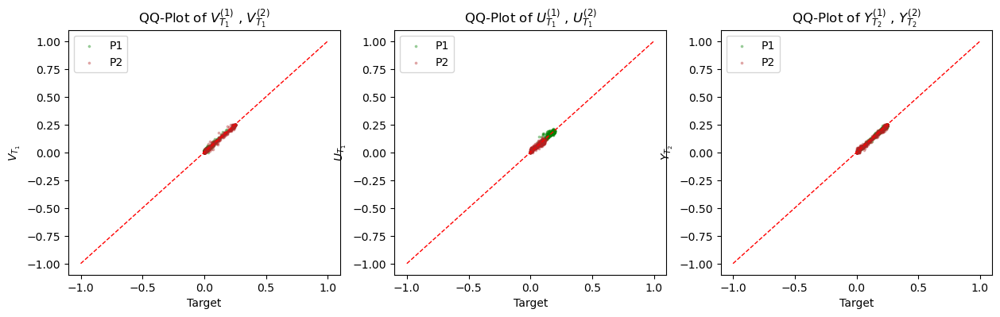

# `Model` 
```python
from Model import *
```
---
- ##  `Params`
    ```python
    CLASS Model.Params(param_type, target_type,trick,loss_type, delta,w=1.0,K=0.9,lr=0.005,NumTrain=500, T=2, NT1=50, NT2=100, device)
    ```

    Sets global parameters for the model, which also facilitates the parameter tuning by simply calling and revising the attributes of `Params()`. 

    - __Parameters:__ 
        - __param_type__ (_str_) - specifies the model parameter sets for an individual population. 
            - `'k1'`: the parameter set for sub-population 1. 
            - `'k2'`: the parameter set for sub-population 2.

            :bulb: See details in __Attributes__.

        - __target_type__ (_str_) - the target function for terminal values. Originally and mathematically, it should be the indicator functions. However, for the sake of numeric stability, we make use some tricks like sigmoid approximation and logit transformation, giving rise to the change of target and loss functions, accordingly.
            - `'indicator'`: learns the indicator functions (with jumps) directly. It would be the hardest to learn especially when `w`=1, which means the largest jump. Thus, models with indicator tagets would be least numercially stable. 
            - `'sigmoid'`: uses smooth $\text{sigmoid}\Big(\frac{K-x}{\delta}\Big)$ to approximate $\text{indicator}\Big(K>x\Big)$, eliminating the jump from 0 to 1. The smaller the `delta` ($\delta$), the greater the 'slope' in the neighbourhood of $x=0$, the closer the approximation of the plain indicator function, yet the harder to learn. 
            
            :bulb: Note that there would be a trade-off of numeric stability and the difficulty of training.
            
        - __trick__ (_str_) - the trick used to increase the numeric stability and avoid exploding of gradients.
            - `'clamp'`: avoids values falling out of the interval $[0,1]$ when learning indicator functions (or sigmoid approximations), we use `torch.Tensor.clamp` to forcefully clamp the values within $[0,1]$ (or $w*[0,1]$, more precisely). 
            - `'logit'`: uses a more numerically stable method to restrict values within $[0,1]$ by taking transformations and $\text{It}\hat{\text{o}}$'s formula:
            $$
            dY_t=(1-Y_t)*Y_t*Z^Y_t*dW_t \\
            \tilde{Y_t}=logit(Y_t)~~\leftrightarrow~~Y_t=sigmoid(\tilde{Y_t})\\
            d\tilde{Y_t}={(Z^Y_t)}^2*(Y_t-\frac{1}{2})*dt+Z^Y_t*dW_t
            $$ 
            :bulb: Note that the same goes for $V_t,~U_t,~Z^V_t,~Z^U_t$. See more math details in the research report [__PA-MFG-FBSDE__](https://github.com/OrangeAoo/PA-MFG-FBSDE).

        - __loss_type__ (_str_) - the loss function paired with a specific trick and target function. 
            - `'MSELoss'`: Mean Squared Error loss. See more details in [`torch.nn.MSELoss`](https://pytorch.org/docs/stable/generated/torch.nn.MSELoss.html#mseloss).
            - `'BCELoss'`: Binary Cross Entropy Loss between the target and the input probabilities (learned values). See more details in [`torch.nn.BCELoss`](https://pytorch.org/docs/stable/generated/torch.nn.BCELoss.html#torch.nn.BCELoss).
            - `'BCEWithLogitsLoss'`: combines a Sigmoid layer and the BCELoss in one single class. See more details in [`torch.nn.BCEWithLogitsLoss`](https://pytorch.org/docs/stable/generated/torch.nn.BCEWithLogitsLoss.html#torch.nn.BCEWithLogitsLoss).

        > :warning: __NOTE:__ 
        There are only 4 sets valid combiantions of `target_type`, `trick`, and `loss_type`:
        > ```python
        > {target_type: 'indicator', trick: 'logit', loss_type: 'BCEWithLogitsLoss'}  ## combo 1
        > {target_type: 'indicator', trick: 'clamp', loss_type: 'BCELoss'}            ## combo 2
        > {target_type: 'indicator', trick: 'clamp', loss_type: 'MSELoss'}            ## combo 3
        > {target_type: 'sigmoid'  , trick: 'clamp', loss_type: 'MSELoss'}            ## combo 4
        > ```
        > Otherwise, errors would be raised.
        - __delta__ (_float_) - $\delta$ of $sigmoid(\frac{K-x}{\delta})$, controlling the closeness of approximation, i.e. the smaller the $\delta$, the closer the approximation of indicator functions. Only valid when `target_type`='sigmoid'.

        - __w__ (_float, optional, defualt: 1.0_) - control of jump size. The real learning targets are $w*indicator(\cdot)$ or $w*sigmoid(\cdot)$, which would be easier to learn when $w<1.0$ since the jumps are reduced from $[0,1]$ to $[0,w]$. Thus the smaller `w` is, the more numerically stable.

        - __K__ (_float, optinal, defualt: 0.9_) - the quota to meet at each end of period. And amount below the quato will be subjected to a penalty of $w*(K-X_T)$. Or more generally, the penalty is defined by a put option (ReLU) function: $w*(K-X_T)_+$. The choice of quato should be "_attainable_" - not too hard nor too easy to meet. 

        - __lr__ (_float, optinal, defualt: 0.005_) - learning rate. Should be adjusted to smaller values when targets are hard to learn, for the sake of better convergence.

        - __NumTrain__ (_int, optinal, defualt: 500_) - number of training samples within each sub-population. 

        - __T__ (_int/float, optinal, defualt: 2_) - the "end of world", or the terminal time for the last period, $T_2$. And the grid size is calculated as $dt=\frac{T_2}{{NT}_2}$.       
        :bulb: Note that though $dt$ has no impact on any of the rate processes $g_t$, $\Gamma_t$, $a_t$, and price process $\S_t$, nevertheless, it will influence the accumulation of inventory, thus how hard it is to meet the quota `K`. Intuitively, given enough time, however small their generation rates are (or, however lazy they are), the agents will be bound to meet the quota. 

        - __NT1__ (_float, optinal, defualt: 50_) - the number of time grids for the first period.

        - __NT2__ (_float, optinal, defualt: 100_) - the number of time grids for the second period. The end of the first period is $T_1=dt*{NT}_1$.
        
        - __device__ (_str, optional_) - the device to train NN models. It is defualtly decided by  device-agnostic code:
            ```python
            device='cuda:0' if torch.cuda.is_available() else 'cpu'
            ```
    - __Attributes:__
        - __param_type__ (_str_)
        - __target_type__ (_str_)
        - __trick__ (_str_) 
        - __loss_type__ (_str_)
        - __delta__ (_float_)
        - __w__ (_float, defualt: 1.0_)
        - __K__ (_float, defualt: 0.9_)
        - __lr__ (_float, defualt: 0.005_)
        - __NumTrain__ (_int, defualt: 500_)
        - __T__ (_int/float, defualt: 2_) - $T_2$
        - __NT1__ (_float, defualt: 50_) - ${T_1}/{dt}$
        - __NT2__ (_float, defualt: 100_) - ${T_2}/{dt}$
        - __device__ (_str_) 
        - __pi__ (_float_) - $\pi^k$
        - __h__ (_float_) - $h^k$
        - __sigma__ (_float_) - $\sigma^k$
        - __zeta__ (_float_) - $\zeta^k$
        - __beta__ (_float_) - $\beta^k$
        - __gamma__ (_float_) - $\gamma^k$ 
        - __mean__ (_float_) - $v^k$
        - __std__ (_float_) - $\eta^k$
        
        &nbsp;
        :dizzy: __Illustration...__            
        > |       |$\pi_k$ | $h^k$ | $\sigma^k$ | $\zeta^k$ | $\gamma^k$ | $v^k$ | $\eta^k$ | $\beta^k$ |
        > | :---: | :----: | :---: | :--------: | :-------: | :--------: | :---: | :------: | :--------:|
        > |   k1  | 0.25   | 0.2   |  0.1       |   1.75    |   1.25     |  0.6  |  0.1     | 1.0       |
        > |   k2  | 0.75   | 0.5   |  0.15      |   1.25    |   1.75     |  0.2  |  0.1     | 1.0       |
        
---
- ## `Network`
    ```python
    CLASS Network(scaler_type=None, input_dims=1, fc1_dims=10, fc2_dims=10, n_outputs=1)
    ```

    A subclass of [`torch.nn.Module`](https://pytorch.org/docs/stable/generated/torch.nn.Module.html#torch.nn.Module). 
    
    Here we use fully connected linear layers for NN models, applying the affine linear transformations to the incoming data:
    $$ 
    y=xA^T+b
    $$
    The weights of linear layers are initialized using [`torch.nn.init.xavier_uniform_`](https://pytorch.org/docs/stable/nn.init.html#torch.nn.init.xavier_uniform_). And the activate layers used here are [`torch.nn.ReLU`](https://pytorch.org/docs/stable/generated/torch.nn.ReLU.html#torch.nn.ReLU).

    - __Parameters:__
        - __scaler_type__ (_str/NoneType, optinal, defualt: None_) - specifies the method for scaling model outputs to $[0,1]$. Should only be used for models for initial values $V_0$, $U_0$, and $Y_0$. 
            - `None`: returns the model output x without scaling.
            - `'minmax'`: returns $\frac{x-x_{min}}{x_{max}-x_{min}}$ in the `forward` function. Keep the original distribution of x.
            - `'sigmoid'`: returns $sigmoid(x)$. Provide greater "differentiability" when computing gradients.
        - __input_dims__ (_int, optinal, defualt: 1_) - the size of each input sample (number of $x$ in the linear transformation). The same as `in_features` of [`torch.nn.Linear`](https://pytorch.org/docs/stable/generated/torch.nn.Linear.html#torch.nn.Linear). 
        
        - __fc1_dims__ (_int, optinal, defualt: 10_) - the size of each output sample (number of $y$, or sets of weights $A^T$ and biases $b$) for the first fully-connected layer. The same as `out_features` of [`torch.nn.Linear`](https://pytorch.org/docs/stable/generated/torch.nn.Linear.html#torch.nn.Linear). Also the number of inputs of the second layer. 

        - __fc2_dims__ (_int, optinal, defualt: 10_) - the number of outputs of the second fully-connected layer, also the number of inputs of the third layer.

        - __n_outputs__ (_int, optinal, defualt: 1_) - the number of output nodes per sample by the last layer.

    - __Attributes:__
        - __scaler_type__ (_str/NoneType, defualt: None_)
        - __input_dims__ (_int, defualt: 1_) 
        - __fc1_dims__ (_int, defualt: 10_)
        - __fc2_dims__ (_int, defualt: 10_)
        - __n_outputs__ (_int, defualt: 1_)
        - __fc1__ (_Module_) - the first fully connected linear layer created with `torch.nn.Linear`. Shape: (_*any, input\_dims_) -> (_*any, fc1\_dims_).
        - __relu1__ (_Module_) - the first activation layer created with `torch.nn.ReLU`. Keeps the shape: (_*any, fc1\_dims_).
        - __fc2__ (_Module_) - the second fully connected linear layer created with `torch.nn.Linear`. Shape: (_*any, fc1\_dims_) -> (_*any, fc2\_dims_).
        - __relu2__ (_Module_) - the second activation layer created with `torch.nn.ReLU`. Keeps the shape: (_*any, fc2\_dims_).
        - __fc3__ (_Module_) - the third fully connected linear layer created with `torch.nn.Linear`. Shape: (_*any, fc2\_dims_) -> (_*any, n\_outputs_).
    &nbsp;
    - > __forward__ ( _input_ )

        Pipes the input tensor through [`torch.nn.Sequential`](https://pytorch.org/docs/stable/generated/torch.nn.Sequential.html#torch.nn.Sequential). And the outputs are scaled accordingly when `scaler_type` is specified. 
        - __Parameters:__
            - __input__ (_tensor_) - the input tensor to be passed through NN layers. Shape: ( _*any_, _`input_dims`_). 
        - __Returns:__
            An output (_tensor_) of shape ( _*any, `n_outputs`_), where all but the last dimension are the same shape as the input. 
            :dizzy: __Illustration...__
            ```python
            def forward(self,input):
            model=nn.Sequential(self.fc1,
                                self.relu1,
                                self.fc2,
                                self.relu2,
                                self.fc3).to(self.device)
            x=model(input)
            if self.scaler_type=='minmax':
                return ((x-x.amin())/(x.amax()-x.amin())).to(self.device)
            if self.scaler_type=='sigmoid':
                return torch.sigmoid(x).to(self.device)
            if self.scaler_type==None:
                return x.to(self.device)
            ```
---
- ## `Main_Models`
    ```python
    CLASS Main_Models(GlobalParams)
    ```

    Defines the NN models for each discretized time point. Models can be saved and/or loaded repeatedly. 

    - __Parameters:__
        - __GlobalParams__ (_Params_) - the parameters for a specific NN model defined by `Params()` instances. 
    - __Attributes:__
        - __GlobalParams__ (_Params_) - the parameters for a specific NN model defined by `Params()` instances. 
        - __loss__ (_list, defualt: None_) - the average forward losses after each epoch. Useful when saving and loading the models. 
        - __dB__ (_tensor, defualt: None_) - the independent Brownian Motion increments generated by `utils.SampleBMIncr`. Shape: (`Numtrain`, `NT2`+1). Should be the same within the same sub-population yet vary across subpopulations.
        - __init_x__ (_tensor, defualt: None_) - the initial values of inventory $X_0$, generated by `utils.Sample_Init`. $X_0^{(k)} \sim \mathcal{N}(v^k, \eta^k)$. 
        - __init_c__ (_tensor, defualt: None_) - the initial increase to the baseline generation rate $C_0$, generated by `utils.Sample_Init()`. $C_0^{(k)} \equiv 0$.
        - __v0_model__ (_Network, defualt: None_) - NN model for $V_0$.
        - __u0_model__ (_Network, defualt: None_) - NN model for $U_0$.
        - __y0_model__ (_Network, defualt: None_) - NN model for $Y_0$.
        - __zv_models__ (_list, defualt: None_) - a list of NN models (_Network_) for $Z^v_t$. Length: `NT1`.
        - __zu_models__ (_list, defualt: None_) - a list of NN models (_Network_) for $Z^U_t$. Length: `NT1`.
        - __zy_models__ (_list, defualt: None_) - a list of NN models (_Network_) for $Z^Y_t$. Length: `NT2`.
        - __model_dict__ (_dict, defualt: None_) - a dictionary of attributes above: trained NN models (_Network_), initial values (_tensor_), BM increments (_tensor_), and global parameters (_Params_). 
    &nbsp;
    - > __create__ ( _y0_model,yt1_model,zy_models,forward_loss=None,dB=None,init_x=None,init_c=None_)

        Sets attributes for a `Main_Models()` instance. 
        - __Parameters:__
            - __v0_model__ (_Network_) - NN model for $V_0$.
            - __u0_model__ (_Network_) - NN model for $U_0$.
            - __y0_model__ (_Network_) - NN model for $Y_0$.
            - __zv_models__ (_list_) - a list of NN models (_Network_) for $Z^v_t$. Length: `NT1`.
            - __zu_models__ (_list_) - a list of NN models (_Network_) for $Z^U_t$. Length: `NT1`.
            - __zy_models__ (_list_) - a list of NN models (_Network_) for $Z^Y_t$. Length: `NT2`.
    &nbsp;
    - > __create_model_dict__ ( _overwrite=False_)

        Creates a dictionary of trained models (attributes of the current `Main_Models()` instance) and set attribute `Main_Models.model_dict`, which can then be saved. 
        - __Parameters:__
            - __overwrite__ (_bool, optional, defualt: False_) - overwrite the existing `Main_Models.model_dict` if is set to `True`.
        - __Return type:__
            The dictionary (_dict_) created.
            :dizzy: __Illustration...__
            ```python
            def create_model_dict(self,overwrite=False):
                model_dict={'v0': self.v0_model,
                            'u0': self.u0_model,
                            'y0': self.y0_model,
                            'zvs': self.zv_models,
                            'zus': self.zu_models,
                            'zys': self.zy_models,
                            'loss':self.loss,
                            'dB':self.dB,
                            'init_x':self.init_x,
                            'init_c':self.init_c,
                            'GlobalParams':self.GlobalParams}
                if overwrite==True:
                    self.model_dict=model_dict
                return model_dict
            ```

    - > __save_entire_models__ ( _path,overwrite=False,model_dict=None_)

        Saves a dictionary of trained models and paramters to a disk file by first calling `Main_Models.create_model_dict()` and then [`torch.save()`](https://pytorch.org/docs/stable/generated/torch.save.html#torch-save).
        - __Parameters:__
            - __path__ (_Union[str, PathLike, BinaryIO, IO[bytes]]_) – a file-like object (has to implement write and flush) or a string or os.PathLike object containing a file name.
            - __overwrite__ (_bool, optional, defualt: False_) - if set to `True`, overwrite the existing `Main_Models.model_dict` with `model_dict` passed. Valid only when `model_dict` is not `None`.
            - __model_dict__ (_dict/NoneType, optinal, defualt: None_) - the dictionary of models and paramters to save. 

    - > __load_entire_models__ ( _path,overwrite=False_)

        Loads a saved dictionary of trained models and parameters from a disk file. 
        - __Parameters:__
            - __overwrite__ (_bool, optional, defualt: False_) - if set to `True`, overwrite the existing `Main_Models.model_dict` with the loaded dictionary. Otherwise only returns the dictionary. 
        - __Returns:__
            The dictionary (_dict_) loaded.
--- 

# `utils`
```python
from utils import *
```      
---
- ## `utils` Functions
    - > __Sample\_Init__ ( _GlobalParams_)    

        Generates samples of $X_0^{(k)} \sim \mathcal{N}(v^k, \eta^k)$ with a given parameter set.
        - __Parameters:__
            - __GlobalParams__ (_Params_) - global parameters for a given sub-population, where `GlobalParams.mean` = $v^k$ and `GlobalParams.std` = $\eta^k$.                     
        - __Returns:__
            The normally distributed initial values $X_0^{(k)}$ (_tensor_) of shape (`GlobalParams.NumTrain`, 1), put to `GlobalParams.device`. 

    &nbsp;
    - > __SampleBMIncr__ ( _GlobalParams_)

        Generates Standard Brownian Motion increments on a discrete time grid by utilizing the property that:
        $$
        dB_t \stackrel{i.i.d}{\sim} \mathcal{N}(0,t)
        $$
        - __Parameters:__
            - __GlobalParams__ (_Params_) - global parameters for a given sub-population.
        - __Returns:__
            A $(dB)_{t\ge 0}$ matrix (_tensor_) of shape (`GlobalParams.NumTrain`, `GlobalParams.NT2`+1).
            > :warning: __NOTE:__ 
            The $(dB)_{t\ge 0}$ matrix should vary from sub-population to sub-population, yet remain the same for agents within the same sub-population.  
        
    &nbsp; 
    - > __target\_V__ ( _x\_t1, GlobalParams, target\_type=None_)
        
        Computes the terminal target for $V_{T_1}^{(k)}$ according to $X_{T_1}^{(k)}$ and specified target types. Represents the scaled probability of missing the quota given inventory in store by the end of period 1: 
        $$w*\mathbb{P}\Big(K>X_{T_1}^{(k)}~|~X_{T_1}^{(k)}\Big)$$
        - __Parameters:__
            - __x\_t1__ (_tensor_) - $X_{T_1}^{(k)}$, total inventories at the end of period 1 ($T_1$) before delivery. 
            - __GlobalParams__ (_Params_) - global parameters for a given sub-population.
            - __target_type__ (_str/NoneType, optional, defualt: None_) - the target function for terminal values. 
                - `None`: set `target_type` to `GlobalParams.target_type` if not specified or specified as `None`. 
                - `'indicator'`: $w*\text{indicator}\left(K>X_{T_1}^{(k)}\right)$. 
                - `'sigmoid'`: $w*\text{sigmoid}\Big(\frac{K-X_{T_1}^{(k)}}{\delta}\Big)$, a more numerically stable approximation to `'indicator'`.

        - __Returns:__
            The target tensor computed if `target_type` is properly specifed. Otherwise, raises the following error messege:
            ```python 
            >>>[Error] "Please check whether 'target_type' matches 'trick' :)"
            ```
    &nbsp; 
    - > __target\_Y__ ( _x\_t2, GlobalParams, target\_type=None_)
        
        Computes the terminal target for $Y_{T_1}^{(k)}$ according to $X_{T_2}^{(k)}$ and specified target types. Represents the scaled probability of missing the quota at the end of period 2 given the inventory in store by the end of period 2 after forfeiting an amount of $\min(K,X_{T_1}^{(k)})$ at $T_1$: 
        $$w*\mathbb{P}\Big(K>X_{T_2}^{(k)}~|~X_{T_2}^{(k)} \Big)$$
        - __Parameters:__
            - __x\_t2__ (_tensor_) - $X_{T_2}^{(k)}$, total inventories at the end of period 1 ($T_1$) before delivery.
            - __GlobalParams__ (_Params_) - global parameters for a given sub-population.
            - __target_type__ (_str/NoneType, optional, defualt: None_) - the target function for terminal values. 
                - `None`: set `target_type` to `GlobalParams.target_type` if not specified or specified as `None`. 
                - `'indicator'`: $w*\text{indicator}\left\{K>X_{T_2}^{(k)}\right\}$. 
                - `'sigmoid'`: $w*\text{sigmoid}\Big(\frac{K-X_{T_2}^{(k)}}{\delta}\Big)$, a more numerically stable approximation to `'indicator'`.
        - __Returns:__
            The target tensor computed if `target_type` is properly specifed. Otherwise, raises the following error messege:
            ```python 
            >>>[Error] "Please check whether 'target_type' matches 'trick' :)"
            ```
    &nbsp;
    - > __target_U__ ( _x\_t1, y\_t1, GlobalParams, target\_type=None_)
        
        Computes the terminal target for $U_{T_1}^{(k)}$ according to $X_{T_1}^{(k)}$, $Y_{T_1}^{(k)}$, and specified target types. Represents the scaled probability of fulfilling the quota at the end of period 1 but missing the quota at the end of period 2 given the inventory in store by the first period end: 
        $$\begin{align}
            & w*\mathbb{P}\Big(K \gt X_{T_2}^{(k)}, K \le X_{T_1}^{(k)}~|~X_{T_1}^{(k)}\Big) \\
            =~&w*\mathbb{P}\Big(K \gt X_{T_2}^{(k)}~|~X_{T_1}^{(k)}\Big)* \mathbb{P}\Big(K \le X_{T_1}^{(k)}~|~X_{T_1}^{(k)}\Big)\\
            =~&Y_{T_1}^{(k)} * \mathbb{P}\Big(K \le X_{T_1}^{(k)}~|~X_{T_1}^{(k)}\Big)\\
        \end{align}$$
        - __Parameters:__
            - __x\_t1__ (_tensor_) - $X_{T_1}^{(k)}$, total inventories at the end of period 1 ($T_1$) before delivery.
            - __y\_t1__ (_tensor_) - $Y_{T_1}^{(k)}$, the scaled probability of failing to meet the quota at $T_2$ given the current amount of inventory, i.e. $w*\mathbb{P}\Big(K>X_{T_2}^{(k)}~|~X_{T_1}^{(k)} \Big)$
            - __GlobalParams__ (_Params_) - global parameters for a given sub-population.
            - __target_type__ (_str/NoneType, optional, defualt: None_) - the target function for terminal values. 
                - `None`: set `target_type` to `GlobalParams.target_type` if not specified or specified as `None`. 
                - `'indicator'`: $Y_{T_1}^{(k)}*\text{indicator}\left\{X_{T_1}^{(k)}>K\right\}$. 
                - `'sigmoid'`: $Y_{T_1}^{(k)}*\text{sigmoid}\Big(\frac{X_{T_1}^{(k)}-K}{\delta}\Big)$, a more numerically stable approximation to `'indicator'`.
        - __Returns:__
            The target tensor computed if `target_type` is properly specifed. Otherwise, raises the following error messege:
            ```python 
            >>>[Error] "Please check whether 'target_type' matches 'trick' :)"
            ```
    &nbsp;
    - > __Loss__ ( _pred, targ, GlobalParams, loss\_type=None_)

        Computes the loss for the learnt values and the learning target, given the model parameters and/or specified loss functions.

        - __Parameters:__
            - __pred__ (_tensor_) - the learnt terminal values. Shape: (`NumTrain`, 1).
            - __targ__ (_tensor_) - the learning targets computed with `target_V`, `target_Y`, or `target_U`. Shape: (`NumTrain`, 1).
            - __GlobalParams__ (_Params_) - global parameters for a given sub-population.
            - __loss\_type__ (_str/NoneType, optional, defualt: None_) - the specified loss metrics. 
                - `None`: when not specified/specified as `None`, takes `GlobalParams.loss_type` as the defualt value, which can be one of the following 3 metrics.
                - `'MSELoss'`: calls [`torch.nn.MSELoss`](https://pytorch.org/docs/stable/generated/torch.nn.MSELoss.html#mseloss).
                - `'BCELoss'`: calls [`torch.nn.BCELoss`](https://pytorch.org/docs/stable/generated/torch.nn.BCELoss.html#torch.nn.BCELoss).
                - `'BCEWithLogitsLoss'`: calls [`torch.nn.BCEWithLogitsLoss`](https://pytorch.org/docs/stable/generated/torch.nn.BCEWithLogitsLoss.html#torch.nn.BCEWithLogitsLoss).
        - __Returns:__
            The average loss (_tensor_) of an epoch (with total 2*`NumTrain` samples in both sub-populations), from which the gradients can be calculated. Shape: _scalar_.
    &nbsp;
    - > __get\_foward\_loss__ ( _pop1\_dict, pop2\_dict_)

        Loops foward through `NT2` time grids to solve the discretized FBSDE, and computes average terminal losses for each batch. 
        
        - __Parameters:__
            - __pop1\_dict__ (_dict_) - a dictionary of Brownian noises, initial values, parameters and untrained NN models for sub-population 1. 
            - __pop2\_dict__ (_dict_) - a dictionary of Brownian noises, initial values, parameters and untrained NN models for sub-population 2. 

            :dizzy: __Illustration...__
            ```python
            pop1_dict = {'dB':dB1,
                        'init_x':init_x1 ,
                        'init_c':init_c1 , 
                        'GlobalParams':GlobalParams1, 
                        'main_models':main_models1}
            '''
            similar for pop1_dict
            '''
            ```
        - __Returns:__
            The average forward loss (_tensor_) of total 2*`NumTrain` samples after looping through `NT2` time grids. Shape: _scalar_.
            &nbsp;
            > :warning: __NOTE:__ 
            >- At $T_1$, 3 things are done:
            >   1. compute the losses for $V_{T_1}^{(k)}$ and $U_{T_1}^{(k)} \to$ `loss_v1`, `loss_u1`, `loss_v2`, `loss_u2`
            >   2. freeze the processes $V_{t}^{(k)}$ and $U_{t}^{(k)} \to ~ V_{t}^{(k)} \equiv V_{T_1}^{(k)} , ~ U_{t}^{(k)} \equiv U_{T_1}^{(k)}$
            >   3. forfeit inventories $X_{T_1}^{(k)} \to$ $\text{ReLU}\left(X_{T_1}^{(k)-K}\right)$
            >- At $T_2$, 2 things are done:
            >   1. calculate the loss for $Y_{T_2}^{(k)} \to$ `loss_y1`, `loss_y2`
            >   2. sum up the 6 losses and return the aggregated loss $\to$ `loss`=(`loss_v1`+`loss_u1`+`loss_y1`)+(`loss_v2`+`loss_u2`+`loss_y2`)
    &nbsp;
    - > __get_target_path__ ( _pop1\_dict, pop2\_dict_)

        Loops through `NT2` time grids with the `torch.inference_mode` on, where the `no_grad` mechanism is locally turned-on, for the sake of better performance when running the code using the trained NN models and having no interactions with autograd. See more details in [inference_mode](https://pytorch.org/docs/stable/generated/torch.autograd.grad_mode.inference_mode.html).

        The forward steps are exactly the same as `get_forward_loss`, except for no losses are calculated here and process values at every time grid are recorded. In other words, we run the trained models again to get the process paths. 

        - __Parameters:__ 
            - __pop1\_dict__ (_dict_) - a dictionary of Brownian noises, initial values, parameters and untrained NN models for sub-population 1. 
            - __pop2\_dict__ (_dict_) - a dictionary of Brownian noises, initial values, parameters and untrained NN models for sub-population 2. 
        - __Returns:__
            - __pop1\_path\_dict__ (_dict_) - a dictionary of learnt process paths (_tensor_), as well as inventory accumulation controls (rates), market-clearing prices derived from the paths for sub-population 1. 
            - __pop2\_path\_dict__ (_dict_) - a dictionary of learnt process paths (_tensor_), as well as inventory accumulation controls (rates), market-clearing prices derived from the paths for sub-population 2. 
            
            :dizzy: __Illustration...__
            ```python
            pop1_path_dict={'inventory':x1_path,          ## current inventories in store <- a tensor of shape (NumTrian, NT2+1)
                            'price':S_path,               ## current market price <- a tensor of shape (NT2+1,)
                            'expansion':a1_path,          ## expansion rate <- a tensor of shape (NumTrian, NT2+1)
                            'generation':g1_path,         ## overtime-generation rate <- a tensor of shape (NumTrian, NT2+1)
                            'trading':Gamma1_path,        ## trading rate <- a tensor of shape (NumTrian, NT2+1)
                            'base':base1_path,            ## baseline generation rate <- a tensor of shape (NT2+1,)
                            'cum_expansion':cum_a1_path,  ## cummulative expansion amount <- a tensor of shape (NumTrian, NT2+1)
                            'cum_generation':cum_g1_path, ## cummulative overtime-generation amount <- a tensor of shape (NumTrian, NT2+1)
                            'cum_trading':cum_Gamma1_path,## cummulative trading amount <- a tensor of shape (NumTrian, NT2+1)
                            'cum_base':cum_base1_path,    ## cummulative baseline production <- a tensor of shape (NT2+1,)
                            'v':v1_path,                  ## learnt V_t process <- a tensor of shape (NumTrian, NT2+1)
                            'u':u1_path,                  ## learnt U_t process <- a tensor of shape (NumTrian, NT2+1)
                            'y':y1_path}                  ## learnt Y_t process <- a tensor of shape (NumTrian, NT2+1)
            '''
            similar for pop1_path_dict
            '''
            ```
            :bulb: See more math details in the research report [__PA-MFG-FBSDE__](https://github.com/OrangeAoo/PA-MFG-FBSDE).
---
- ## `plot_results`
    ```python
    CLASS plot_results(pop1_dict, pop2_dict, loss, PlotPaths=100, seed=42)
    ```

    Facilitates the visualization of learning results of trained NN models. 

    - __Parameters:__
        - __pop1\_dict__ (_dict_) - a dictionary of Brownian noises, initial values, parameters and untrained NN models for sub-population 1, as is described in __get\_foward\_loss__.
        - __pop1\_dict__ (_dict_) - a dictionary of Brownian noises, initial values, parameters and untrained NN models for sub-population 2, as is described in __get\_foward\_loss__. 
        - __loss__ (_list_) - a list of forward losses averaged over `OptimSteps` optimization steps, training with the same epoch. 
        - __PlotPaths__ (_int, optional, defualt: 100_) - number of paths to plot for the sake of visibility and simplicity. 
        - __seed__ (_int, optional, defualt: 42_) - the random seed for selecting `PlotPaths` random paths out of `NumTrain` samples for each sub-population. 

    - __Attributes:__
        - __loss__ (_list_) - the list the average forward losses passed through keyword `loss`. 
         - __pop1\_dict__ (_dict_)
        - __pop1\_dict__ (_dict_)
        - __GlobalParams1__ (_Params_) - the model parameters for sub-population 1, passed by `pop1_dict['GlobalParams']`.
        - __GlobalParams2__ (_Params_) - the model parameters for sub-population 2, passed by `pop2_dict['GlobalParams']`.
        - __h1__ (_float_) - baseline generation rate for sub-population 1. Passed by `GlobalParams1.h`.
        - __h2__ (_float_) - baseline generation rate for sub-population 2. Passed by `GlobalParams2.h`.
        - __target_type__ (_str_) - the target used not for training but for visualizing the terminal convergency. 
            - `'indicator'`: plots $w*\text{indicator}\Big(K-X\Big)$ as targets. Only when `GlobalParams1.target_type` = `'indictor'` AND `GlobalParams1.trick` = `'clamp'`. (Or equivalently, using `GlobalParams2`.)
            - `'sigmiod'`: plots $w*\text{sigmoid}\Big(\frac{K-X}{\delta}\Big)$ as targets. Only when `GlobalParams1.target_type` = `'sigmoid'` OR `GlobalParams1.trick` = `'logit'`. (Or equivalently, using `GlobalParams2`.)
        - __delta__ (_float_) - the delta in sigmoid approximation. Passed by `GlobalParams1.delta` or `GlobalParams2.delta`.
        - __K__ (_float_) - the quota for agents at each period end. Passed by `GlobalParams1.K` or `GlobalParams2.K`.
        - __w__ (_float_) - the weight for scaling the target. Passed by `GlobalParams1.w` or `GlobalParams2.w`.
        - __NT1__ (_int_) - the number of discretized time grids in period 1. Passed by `GlobalParams1.NT1` or `GlobalParams2.NT1`.
        - __NT2__ (_int_) - the total number of discretized time grids 2 periods. Passed by `GlobalParams1.NT2` or `GlobalParams2.NT2`.
        - __dt__ (_float_) - the grid size, passed by `GlobalParams1.dt` or `GlobalParams2.dt`.
        - __t__ (_array_) - the discretized time grid for all periods, computed by:
            ```python
            self.t = np.arange(0, self.NT2+1) * self.dt
            ```
        - __NumTrain__ (_int_) - the numebr of training samples, passed by `GlobalParams1.NumTrain` or `GlobalParams2.NumTrain`.
        - __number_of_paths__ (_int_) - the number of paths for plotting, takes the smaller integer of `PlotPaths` and `NumTrain`.
        - __seed__ (_int_) - the random seed, passed by the keyword parameter `seed`. 
        - __pop1\_path\_dict__ (_dict_) - a dictionary of pop1 paths (_tensor_) returned by __`get_target_path`__. 
        - __pop2\_path\_dict__ (_dict_) - a dictionary of pop2 paths (_tensor_) returned by __`get_target_path`__. 
        - __pop1\_plot__ (_dict_) - a dictionary of pop1 paths (_array_) for plotting. Each _array_ within the dictionary includes only `number_of_paths` out of `NumTrain` selected samples.
        - __pop2\_plot__ (_dict_) - a dictionary of pop2 paths (_array_) for plotting. Each _array_ within the dictionary includes only `number_of_paths` out of `NumTrain` selected samples.
            > :warning: __NOTE:__ 
            The _arrays_ in `pop1_plot` and `pop2_plot` are obtained by detaching the _tensors_ in `pop1_path_dict` and `pop2_path_dict`.
            
            :dizzy: __Illustration...__
            
            ```python
            class plot_results():
                def __init__(self,pop1_dict, pop2_dict, loss, PlotPaths=100, seed=42):
                    ## -------------------------------- Params & Attributes -------------------------------- ##
                    ...  ## passing the models' parameters
                    ## -------------------------------- Process Paths -------------------------------- ##
                    self.pop1_path_dict,self.pop2_path_dict=get_target_path(pop1_dict, pop2_dict)  ## get paths

                    torch.manual_seed(self.seed)  ## set random seed
                    idx_list = np.random.choice(self.NumTrain, self.number_of_paths, replace = False)  ## index of random selected paths
                    self.pop1_plot = {k:v.detach().numpy()[idx_list] for k,v in self.pop1_path_dict.items() if v.shape[0]==self.NumTrain}  ## for 2-dim tensors/arrays 
                    self.pop2_plot = {k:v.detach().numpy()[idx_list] for k,v in self.pop2_path_dict.items() if v.shape[0]==self.NumTrain}  ## for 2-dim tensors/arrays 
                    self.pop1_plot.update({k:v.detach().numpy() for k,v in self.pop1_path_dict.items() if v.shape[0]!=self.NumTrain})  ## for 1-dim tensors/arrays 
                    self.pop2_plot.update({k:v.detach().numpy() for k,v in self.pop2_path_dict.items() if v.shape[0]!=self.NumTrain})  ## for 1-dim tensors/arrays 
                def other_functions()...
            ```
    - > __FwdLoss__ ( _log=True_)

        Plots the forward losses against training epochs, with x-axis being number of epochs and y-axis being the average forward loss over the epoch. 
        
        - __Parameters:__
            - __log__ (_bool, optional, defualt: True_) - whether uses the log-scale for y-axis. 
        - __Returns:__ 
            _None_. Upon each call, it shows the forward losses against number of epochs trained.
            :dizzy: __Illustration...__ 
            
        
    - > __Inventory_And_Price__ ( _Histogram=True_)

        Plots the Inventory processes $X^{(1)}_{t},~X^{(2)}_{t}$ and price process $S_{t}$. Plots the histograms of terminal inventories (pre-delivery) by the end of each period end, if `Histogram`=`True`. 

        - __Parameters:__
            - __Histogram__ (_bool, optional, defualt: True_) - whether shows the distributions of the terminal inventories in stock (before forfeiting) by calling `sns.histplot`. A kernel density curve is added to each histogram using `sns.kdeplot`. 
            :bulb: See more details in [seaborn distributions module](https://seaborn.pydata.org/api.html#distribution-api).
        
        - __Returns:__
            _None_. By each call, it shows:
            - 2 (1 by 2 arranged) plots, depicting inventories in stock over time (LHS) and market-clearing prices over time (RHS);
            :dizzy: __Illustration...__ 
            
            - 4 (2 by 2 arranged) plots, depicting terminal distributions of inventory-ready-to-delivery for $P_1$, $P_2$ at $T_1$, $T_2$, if `Histogram`=`True`.
            :dizzy: __Illustration...__ 
            
            
        
    - > __Decomposition_Inventory__ ( _cumulative=True, base_rate=False_)

        Plots the decomposed inventory changing rates. It depicts how agents react to the quota and penalty rule given by the principle, and how both subjects impact the market (reflected by the price level).
        For agents, there is a balance/trade-off between the long-term investment (i.e. improve their capacity through expansion) and short-term benifit (profit immediately from working overtime and trading anything glut). When compared with the plots from [__Separately Optimized: 1 Period x 2__](), the prictures reflect their decision-making from long-sighted perspectives and the market impact. 
        - __Parameters:__
            - __cumulative__ (_bool, optional, defualt: True_) - whether plots the accumulated changes in processes over time.
            - __base_rate__ (_bool, optional, defualt: False_) - whether plots the baseline rate and accumulated baseline production (i.e. $h^{(k)}$ and $t*h^{(k)}$) over time. Would be straight lines, thus omitted by defualt. 
        - __Returns:__
            _None_. By each call, it shows:
            - 3 (1 by 3 arranged) plots (4 if `base_rate`=`True`), depicting instantaneous rates against time. Specifically, expansion rate $a^{(k)}_t$ (improvement against baseline rate $h^{(k)}_t$ per unit time), overtime-generation rate $g^{(k)}_t$, and trading rate $\Gamma^{(k)}_t$. 
            - 3 (1 by 3 arranged) plots (4 if `base_rate`=`True`), depicting accumulated changes of rates over time. Specifically, the accumulated capacity improvement $C^{(k)}_t$ against the baseline, inventories accumulated by overtime-working, and inventory changes (bought/sold) by trading. 
            :dizzy: __Illustration...__
            
            
        
        - > __Key_Processes__ ( _V=True, U=True, Y=True_)

            Plots the processes learnt by NN models.
            As is explained in `utils.target_V`, `utils.target_U`, `utils.target_Y`, the terminal conditions of the backward SDEs represents the probability of agents failing to meet the quota given the pre-delivery inventory in-stock. 
            :bulb: See more maths and interpretations in the research report [__PA-MFG-FBSDE__](https://github.com/OrangeAoo/PA-MFG-FBSDE).

            - __Parameters:__ 
                - __V__ (_bool, optional, defualt: True_) - plots $V^{(k)}_t$ processes if `True`. 
                - __U__ (_bool, optional, defualt: True_) - plots $U^{(k)}_t$ processes if `True`.
                - __Y__ (_bool, optional, defualt: True_) - plots $Y^{(k)}_t$ processes if `True`.

            - __Returns:__
                _None_. By each call, it shows the corresponding processes specified by `V`, `U`, and `Y`. 
                :dizzy: __Illustration...__ 
                


        - > __Terminal_Convergence__ ( _QQ\_plot=False, Fitted=True_)

            Visualizes and compares the target and true (learnt) terminal values of $V^{(k)}_T$, $U^{(k)}_T$ and $Y^{(k)}_T$ at $T_1$, $T_2$. The targets are calculated by calling `utils.target_V`, `utils.target_U`, `utils.target_Y`, as is detailed in `utils` module.

            Provides alternative veiws to the loss plot (`FwdLoss`), in order to examine the learnt results and NN model performance. Additionally, it shows the terminal convergence through the histograms and scatter plots.

            - __Parameters:__
                - __QQ\_plot__ (_bool, optional, defualt: False_) - plots learnt values (x-axis) against targets (y-axis). 
                    >:warning: __NOTE:__ 
                    >Not the real QQ-plot, but was inspired by the idea of comparing a set of sample data to their theoretical values.  
                - __Fitted__ (_bool, optional, defualt: True_) - overlaps the target and learnt values (y-axis) as functions of inventory level (x-axis).
            - __Returens:__
                _None_.Upon each call, it shows the pictures specified by `QQ_plot` and `Fitted`. 
                :dizzy: __Illustration...__ 
                
                
