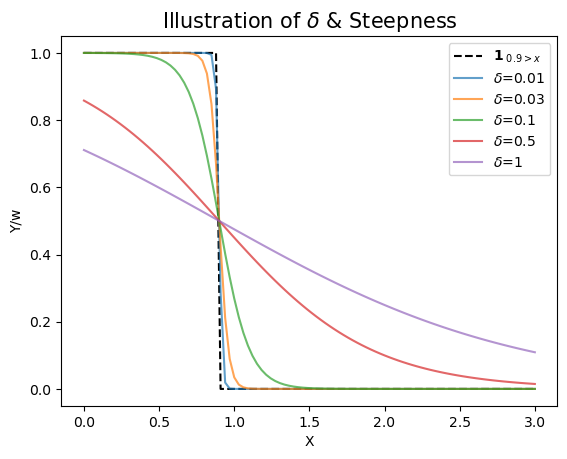

# Multi-Period Compliance Mean Field Game with Deep FBSDE Solver
---

This is an research report giving big pictures about the problem we aim to solve, the key methods/algorithms we propose, the main results we get, as well as comparisons between different methods and consequent results. 

:bulb: See [_Report-StepwiseDetail_](../FinalReports/Report-StepwiseDetail.md) for more math and algorithm details; see _README_ files for more code instructions. 

---

## Abstract 

The aim of this work is to extend the single-period compliance model in [[1]]("https://doi.org/10.48550/arXiv.2110.01127") to multi-period, proposing several tricks to improve the numeric stability of the deep solver for FBSDEs with jumps. First by reproducing the aformentioned research by Campbell, Steven, et al. (2021), then by considering an additional period to the original model, we make comparisons between long/short-term perspectives when it comes to multi-peirod production decision-making in renewable electricity certificate markets, as well as between different numeric tricks when it comes to algorithm stability. Meanwhile, some practical takeaways on parameter-tuning are recorded. 

## 1. Problem Overview

Conventional numerical solvers are hard pressed to solve PA-MFG with market-clearing conditions, which may be faced with the "curse of dimentionality" (Bellman 1957)[^1]. Thus in their study [[1]]("https://doi.org/10.48550/arXiv.2110.01127"), Professor Campbell and his fellows proposed an actor-critic approach to optimization, where the agents form a Nash equilibria according to the principal’s penalty function, and the principal evaluates the resulting equilibria. And they applies this approach to a stylized PA problem arising in Renewable Energy Certificate (REC) markets, where agents may _work_ overtime (or _rent_ capacity), _trade_ RECs, and _expand_ their long-term capacity to navigate the market at maximum profit. Here we only discuss the agents' problem in the multi-agent-multi-period scenario. 

### 1.1. REC Market Basics

Closely related to carbon cap-and-trade (C&T) markets, REC markets are a type of market-based emmissions regulation policies, which are motivating real-world applications of FBSDEs in modeling PA-MFG.

In RES markets, a regulator plays the role of principle, setting a floor on the amount of energy generated from renewable resources (aka. green energy) for each firm (based on a percentage of their total production), and providing certificates for each MWh of green energy generated and delivered to the grid. These certificates can be further traded by individual or companies, i.e. agents, to: 1) reduce costs or the greenhouse gas (GHG) emissions impact of their operations; and 2) earn profits from the extra inventories instead of wasting. Since the certificates are traded assets, energy suppliers can trade off between producing clean electricity themselves, and purchasing the certificates on the market. In all, such policies have played an important role in funding clean energy development, particularly in past years when the cost of green power production was not as competitive with the cost of fossil fuel power. 

To ensure compliance, each firm must surrender RECs totaling the floor at the end of a compliance period, with a monetary penalty paid for each lacking certificate. And in practice, these systems regulate multiple consecutive and disjoint compliance periods, which are linked together through a mechanism called _banking_, where unused allowances in current period can be carried on to the next period (or multiple future periods). Thus, as an extension to the single-period framework [[1]]("https://doi.org/10.48550/arXiv.2110.01127"), we now consider a 2-period model in this report.[^2]. 

### 1.2. REC Market Modeling with FBSDEs

Let's consider 2 subpopulations here. Before jumping into the 2-period scenario, we first reproduce the single-period case following steps in [[1]]("https://doi.org/10.48550/arXiv.2110.01127"). We denote the period end as $T$, which can be thought of "the end of the world". Referring to the probabilistic method in [[2]](https://arxiv.org/abs/1210.5780) (R. Carmona, F. Delarue, 2012), one can show that, for agent $i$ in subpopulation $k$, the optimal solution to its problem in a _single_ period is exactly the solution to the following coupled FBSDEs:

$$
\begin{aligned}
    &\quad\begin{cases}
        dX_t^{i} &=(h^{k}+g_t^{i}+\Gamma_t^{i}+C_t^{i})dt + \sigma^{k}dW_t^{k}&,  &X_0^{i} \sim \mathcal{N}(v^k,\eta^k)\\
        dC_t^{i} &= a_t^{i}dt &,  &C_0^{i}=0 \\ 
        dY_t^{i} &= Z_t^{k}dW_t^{k}&,  &Y_{T}^{i}=w*\mathbf{1}_{X_{T}^i<K}, \\
    \end{cases} \\
    \\
    &\textit{where}: ~\\
    &\quad\quad\quad Y_t^i := \Bbb{E} \left[w\mathbf{1}_{X_{T}^i< K}|\mathcal{F}_t \right] = w\Bbb{P}\left(X_{T}^i< K ~|~ \mathcal {F}_t\right)\\
    &\quad\quad\quad S_t = \frac{\sum\limits_{k \in \mathcal{k}} {(\frac{\pi^k}{\gamma^k}\mathbb{E}\big[ Y_t^i ~|~ i \in \mathfrak{N}^k; \mathcal{F}_t \big])} }{\sum\limits_{k \in \mathcal{K}}{(\pi^k/\gamma^k)}} \\
    &\quad\quad\quad g_t^k = \frac{Y_t^k}{\zeta^k}\\
    &\quad\quad\quad \Gamma_t^{k} =\frac{Y_t^{k}-S_t}{\gamma^{k}} \\
\end{aligned}
$$

Now consider the 2-agent-2-period MFG with market-clearing conditions. Let's denote the 2 compliance periods $[0,T_1]$ and $(T_1,T_2]$ as $\mathfrak{T_1}$ and $\mathfrak{T_2}$, respectively. Here we think of $T_2$ as "the end of the world", after which there are no costs occurs and all agents forfeit any remaining RECs. Similarly, one can prove that the optimal operation for agent $i$ in sub-population $k~(\forall~i \in \mathfrak{N}_k,~k\in\lbrace{1,2\rbrace})$ can be modeled with following coupled FBSDEs:

$$
\begin{cases}
    dX_t^{i} &=(h^{k}+g_t^{i}+\Gamma_t^{i}+C_t^{i})dt + \sigma^{k}dW_t^{k} - \min\left(X_{T_1}^i,K\right)\mathbf{1}_{t=T_1}&,  &X_0^{i} = \zeta^{i} \sim \mathcal{N}(v^k,\eta^k)\\
    dC_t^{i} &= a_t^{i}dt &,  &C_0^{k}=0 \\ 
    dV_t^{i} &= Z_t^{V,k}dW_t^{i}&,  &V_{T_1}^{i}=w*\mathbf{1}_{X^i_{T_1}<K} \\
    dU_t^{i} &= Z_t^{U,k}dW_t^{i}&,  &U_{T_1}^{i}=1*Y_{T_1}^i\mathbf{1}_{X^i_{T_1}>K}\\
    dY_t^{i} &= Z_t^{Y,k}dW_t^{i}&,  &Y_{T_2}^{i}=w*\mathbf{1}_{X^i_{T_2}<K}~~,
\end{cases} \\
~~\\
\begin{aligned}
    \textit{where} &\textit{ the optimal controls are given by:}\\
    & g_t^{i} = \frac{V_t^{i}+U_t^{i}}{\zeta^{k}} ~\mathbf{1}_{t\in [0,T_1]}
                + \frac{Y_t^{i}}{\zeta^{k}} ~\mathbf{1}_{t\in (T_1,T_2]} \\
    & \Gamma_t^{i} =\  \frac{V_t^{i}+U_t^{i}-S_t}{\gamma^{k}} ~\mathbf{1}_{t\in [0,T_1]}
                    + \frac{Y_t^{i}-S_t}{\gamma^{k}} ~\mathbf{1}_{t\in (T_1,T_2]} \\
    & a_t^{i} =\frac{(T_1-t)(V_t^{i}+U_t^{i})+(T_2-T_1)Y^i_t}{\beta^{k}} ~\mathbf{1}_{t\in [0,T_1]}
                + \frac{(T_2-t)Y_t^{i}}{\beta^{k}} ~\mathbf{1}_{t\in (T_1,T_2]} \\
    & S_t = \frac{\sum\limits_{k \in \mathcal{k}} {\frac{\pi^k}{\gamma^k}\mathbb{E}\big[ V_t^i +U_t^i ~|~ i \in \mathfrak{N}^k; \mathcal{F}_t \big]}}{\sum\limits_{k \in \mathcal{K}}{(\pi^k/\gamma^k)}} 
            ~\mathbf{1}_{t\in [0,T_1]} +
            \frac{\sum\limits_{k \in \mathcal{k}} {\frac{\pi^k}{\gamma^k}\mathbb{E}\big[ Y_t^i ~|~ i \in \mathfrak{N}^k; \mathcal{F}_t \big]}}{\sum\limits_{k \in \mathcal{K}}{(\pi^k/\gamma^k)}} 
            ~\mathbf{1}_{t\in (T_1,T_2]} 
\end{aligned}
$$

The key notations/parameters are interpreted as follows: 

- $k \in \mathcal{K}$: a sub-population of agents, within which all individuals are assumed to have identical preferences and similar initial conditions/capacities, yet across which are distinct. The sub-population is annotated by superscript $[\cdot]^{k}$. Here we only discuss $k=1,2$.

- $i \in \mathfrak{N}$: an individual agent belonging to the sub-population $\mathfrak{N}^k$, annotated by superscript $[\cdot]^{i}$.

- $X_t := (X_t)_{t\in\mathfrak{T_1} \cup \mathfrak{T_2}}$: the current inventories in stock. For some key time points:
    - at $t=0$, there may be some stochastics in the initial inventories, which are assumed to be normally distributed. $X_0^{i} \sim \mathcal{N}(v^k, \eta^k) ,~ \forall k \in \mathcal{K},~\forall i \in \mathfrak{N}^k$.
    - at $t=T_1$, the terminal RECs pre-submission are $X_{T_1}$ carried over from the first period. Shortly after forfeiting $\min\Big(K,X^i_{T_1}\Big)$, the remaining inventories in stock are $ReLU\Big(X^i_{T_1}-K\Big)$, which are treated as new initial values for the second period.
    - at $t=T_2$, the terminal RECs pre-submission are $X^i_{T_2}$.

- $I_t := (I_t)_{t\in\mathfrak{T_1} \cup \mathfrak{T_2}}$: the integrated invetory generation. We introduce this process for continuous differentiablity at $T_1$. And $X_t$ has the same initial conditions as $I_t$. Clearly, we have:

    $$
    X_t=
    \begin{cases}
        & I_t\quad,                  \quad&& t \in [0,T_1]\\
        & I_t- \min(I_{T_1},K), \quad&& t \in (T_1,T_2]\\
    \end{cases} 
    \quad\text{or}\quad
    X_t=
    \begin{cases}
        & I_t\quad,                                           \quad&& t \in [0,T_1]\\
        & I_t-I_{T_1}+(I_{T_1}-K)_+\quad, \quad&& t \in (T_1,T_2]\\
    \end{cases} 
    $$

- $K$: the quota that agents must meet at the end of each compliance period. Fixed to $K=0.9$[^3].

- $P(\cdot)$: the generic penalty function approximated by _**single-knot penalty functions**_ [^4] : $$P(x)=w(0.9-x)_+ \Rightarrow\partial_{x}P(x) = - w\mathbf{1}_{x<K}.$$ Further, by tuning the weight $w$, we can see the relation between the penalty level (controled by $w$) and the agents' behaviour, as well as its market impact.

- $h$: the baseline generation rate at which agents generate with zero marginal cost. 

- $C_t := (C_t)_{t\in\mathfrak{T_1} \cup \mathfrak{T_2}}$: incremental REC capacity of agents, i.e. the increase of baseline generation rate over time, accumulated by investing in expansion plans - for instance, by installing more solar panels. [^5]

- $a_t := (a_t)_{t\in\mathfrak{T_1} \cup \mathfrak{T_2}}$: the control of expansion rate, representing long-term REC capacity added per unit time. Note that it could be made even more realistic by incorporating a _delay_ between the decision to expand ($a_t$) and the increase to the baseline rate $h$.

- $g_t := (g_t)_{t\in\mathfrak{T_1} \cup \mathfrak{T_2}}$: the control of overtime-generation rate, i.e. the extra capacity achieved by working extra hours and/or renting short-term REC generation capacity at an assumed quadratic cost - specifically, overhour bonus and/or rental fees.

- $\Gamma_t := (\Gamma_t)_{t\in\mathfrak{T_1} \cup \mathfrak{T_2}}$: the control of trading rate, with negative[^6] values being the amount sold whereas postive purchased per unit time.

- $S_t := (S_t)_{t\in\mathfrak{T_1} \cup \mathfrak{T_2}}$: the equilibrium REC price obtained endogenounsly through market-clearing condition: 
$$\lim\limits_{N \to \inf}{\frac{1}{N} \sum\limits_{i\in\mathfrak{N}}{\Gamma^i_t}}=0$$

- $\zeta,~\gamma,~\beta$: scalar cost parameters which are identical for agents within the same sub-population. 

- $\pi$: the proportion of each sub-population: $\pi^k=\frac{|\mathfrak{N}^k|}{\sum\limits_{j \in \mathcal{K}}{|\mathfrak{N}^j|}}.$

And their values are given in the following table:

|        |$\pi^k$ | $h^k$ | $\sigma^k$ | $\zeta^k$ | $\gamma^k$ | $v^k$ | $\eta^k$ | $\beta^k$ |
| :---:  | :----: | :---: | :--------: | :-------: | :--------: | :---: | :------: | :--------:|
|   k=1  | 0.25   | 0.2   |  0.1       |   1.75    |   1.25     |  0.6  |  0.1     | 1.0       |
|   k=2  | 0.75   | 0.5   |  0.15      |   1.25    |   1.75     |  0.2  |  0.1     | 1.0       |


The framework above can be extended to more realistic models with more than 2 sub-populations and compliance periods, with penalty approximated by multi-knot functions.

## 2. Algorithm And Numeric Tricks

### 2.1. Algorithms: Joint-Optimization Vs. Separate-Optimization

Links to [_1.2._](#12-rec-market-modeling-with-fbsdes)

To solve the said FBSDEs in [_1.2._](#12-rec-market-modeling-with-fbsdes), we implement the __*"shooting method"*__ with _**Deep Solvers**_ [(Han, J., Long, J., 2020)](https://doi.org/10.1186/s41546-020-00047-w)[^9], discretizing the SDEs in a fine time grid and parameterizing the co-adjoint processes and initial values with neural nets. Let $\mathfrak{T}=\lbrace{t_0,~...~, t_m \rbrace}$ be a dicrete set of points with $t_0=0$ and $T_m=T$, where m is the number of time steps. Here the step size $dt=(t_i-t_{i-1})$ is a constant and $dt=T/m$. The smaller the value of h, the closer our discretized paths will be to the continuous-time paths we wish to simulate. Certainly, this will be at the expense of greater computational effort. While there are a number of discretization schemes available, the simplest and most common scheme is the _Euler scheme_, which is intuitive and easy to implement. In particular, it satisfies the _practical decision-making process_ - make decisions for the next point of time conditioned on the current information. 

The aforementioned __*"shooting method"*__ is implemented by _stepwise approximations_: starting from the initial conditions and _"shoot"_ for the "correct" terminal conditions - the "correctness" of terminal approximations will be evaluated by computing the aggragated average forward loss/error over the whole population against corresponding targets (denoted as $\mathcal{L}$). For instance, for the single-period case, theaggragated average forward MSE after m iterations is computed as:
$$
\mathcal{L}(\theta^{(m)})= \sum_{i\in\mathfrak{N}}(Y_{T}^i-w\mathbf{1}_{X_{T}^i<K})^2,
$$ and for the 2-period case:

$$
\mathcal{L}(\theta^{(m)})= \sum_{i\in\mathfrak{N}}(V_{T_1}^i-w\mathbf{1}_{X_{T_1}^i<K})^2 + \sum_{i\in\mathfrak{N}}(U_{T_1}^i-Y_{T_1}^i\mathbf{1}_{X_{T_1}^i>K})^2 + \sum_{i\in\mathfrak{N}}(Y_{T_2}^i-w\mathbf{1}_{X_{T_2}^i<K})^2.
$$

The algorithm takes major steps as follows: 

> i) start from the neural nets for initial values (i.e. $Y_0^i$ etc.); 
> ii) compute the process values at every time step; 
> iii) get approximations to terminal conditions and compute $\mathcal{L}$; 
> iv) compute gradients of $\mathcal{L}$ against parameters(weights and biases, denoted as $\theta^{(m)}$) in the neural nets (i.e. $Y_0^i$ and $Z_t^k$ etc.) and take gradient steps to determine the next sets of parameters.

Alternatively, the above steps can be more explicitly displayed by the following pseudocodes.

```python
# Main Algorithm
if __name__ == "__main__":
    ## Define global parameters and initialize processes for each sub-pop. 
    init_x1, init_c1, dB1 = ...  ### same for pop2
    learning_rate = ...  ### learning rate
    forward_losses = []  ### list of average forward losses
    MaxBatch= ...  ### number of batches
    OptimSteps= ...  ### number of optimization iterations per batch
    single_batch = True  ### whether train on a single batch 

    ## Ininitialize neural nets, optimizers, and schedulers.
    ...

    ## Training loop
    for batch in [0,MaxBatch):
        sumloss=0
        for iter in [0,OptimSteps):
             loss = get_foward_loss()  ### perform the stepwise approximation and get average loss over a batch of samples at current iteration
             loss.backward()  ### compute and record gradients
             optimizer.zero_grad()  
             optimizer.step()  ### take gradient steps and update model parameters (weights and biases)
             schedular.step()  ### adjust learning rate
             sumloss = sumloss + loss.detach().numpy() 
        aveloss = sumloss / OptimSteps  ### average loss for current batch over all iterations
        forward_losses.append(aveloss)
    
        if not single_batch:
            ... ### Generate another batch with new initial processes and models. 
    
    ## Visualize the results and model performances:
    ### FwdLoss, Inventory_And_Price, Decomposition_Inventory, Key_Processes, Terminal_Convergence.
    plot_results(WrappedTrainingResults)
```

As benchmarks to jointly-optimized-2-period model, we first run 1-period algorithm for each period, i.e. minimize the agents' costs in either period separately. Intuitively, the former algorithm can be interpreted as a long-term perspective, considering the future compliance in the current period and thus planning ahead by investing more in increasing their capacities, even when at the first period end. And the latter one can be seen as a short-sighted approach, caring only for the current quota. These 2 distinctive perspectives can make a huge difference in not only the agents' own positions, but also the market prices. 

The only differences between 2 algorithms lie in the _stepwise approximation_ when computing forward losses and recording approximated paths. Specifically, as is shown in [_1.2._](#12-rec-market-modeling-with-fbsdes), there are more additional processes (e.g. $V_t^i$) in jointly-optimized-2-period case. Yet in general, the _stepwise approximation_ algorithm can be roughly displayed as the following psuedocaodes: 

```python
# Shooting - Stepwise Approximation
def get_foward_loss():
    '''
    Perform the stepwise approximation for a single iteration. 
    The annotations for pop1 and pop2 might be omitted.
    '''
    x=x0; c=c0; y=y0_model(x0); ## initial values for both pops (@ t==0)
    for j in [1,NT2]:  ## time steps
        ## update the processes at each time step by the discretized FBSDEs
        y = y + zy_models[j-1]*db[:,j] ### update probability of defualting conditioned on present (@ t==j)
        s = weighted mean y  ### market price
        g, gamma, a = ... ### overtime-generation, trading, and expansion rates 
        c = c + ...  ### update accumulative increments of baseline rate
        x = x + ...  ### update current inventory level

        if j == NT1:
            x_t1, y_t1, ... = x, y, ... ### record/freeze some processes 
            x = nn.ReLU()(x-K)  # @ t==NT1: submit min(K,x_t1) inventoreis

    loss = Loss(y,target(x)) + ...  ## sumed-up loss for all terminal conditions for both pops
    return loss 
``` 

### 2.2. Numeric Tricks

The trickiest problem we are facing is the indicator functions in _terminal conditions_, and natrually one would recall __sigmoid approximation__ for increasing continutiy and differentiability:

$$\mathbf{1}_{0.9>x} \approx \sigma(0.9-x), ~\textit{where the sigmoid function}~\sigma(u)=\frac{1}{1+e^{-u/\delta}}.$$  

In particular, the parameter $\delta$ controls the steepness of $\sigma(\cdot)$ and usually is a small positive number - the smaller $\delta$ is, the more closely it approximates the step of indicator function. On the other hand, the ordinary NN models may learn $V_t^i,U_t^i,Y_t^i \notin [0,1]$ (let's fix $w=1$ for now), which is meaningless as they represent the _probabilities_ of defualting (i.e. missing the quota). And instead of using `tensor.clamp` to forcefully clamp values within $[0,1]$ only, we combine it with the __clamp trick__ to restrict values while maintaining differentiablity. (Same applies to $V_t^i, U_t^i$.)



*Smaller $\delta$ leads to closer approximation*

Nonetheless, both the sigmoid approximation and the clamp trick pose huge challenges to the numeric stability. For the sigmoid function, when $\delta$ is too small, there is a great potential for numerical overflow - the exponents could be tremendous especially when $X_t$ is far greater than 0.9, such that `torch.exp(u)==inf` when $u \ge 7.1$. This will raise errors/warnings[^7] in PyTorch. For the clamp trick to work, we must ensure the initial values strictly fall in $(0,1)$. Thus we propose __logit trick__ to map the range $[0,1] \to \mathbb{R}$, which also avoids working with large exponents:

$$
\tilde{Y} := w*\text{logit} (Y/w) = w*\ln\left(\frac{Y/w}{1-Y/w}\right)=f(Y)~.
$$Then apply $\textit{It}\hat{o}  \textit{'s formula}$ (with superscript $[\cdot]^i$ omiited):
$$
\begin{aligned} 
    d \tilde{Y}_t &= (w/2-Y_t)Z_t^2dt + wZ_tdB_t~.\\
\end{aligned}
$$ 

Correspondingly, we use [BCEWithLogitsLoss](https://pytorch.org/docs/stable/generated/torch.nn.BCEWithLogitsLoss.html) as the loss function, which combines a Sigmoid layer and the BCELoss in one single class. This version is more numerically stable than using a plain Sigmoid followed by a BCELoss as, by combining the operations into one layer, it takes advantage of the log-sum-exp trick for numerical stability.

Worth mentioning, we experimented with multiple combinations of tricks and loss functions, paired with different optimizers and schedulers. Eventually we chose [Adamax](https://pytorch.org/docs/stable/generated/torch.optim.Adamax.html) and [StepLR](https://pytorch.org/docs/stable/generated/torch.optim.lr_scheduler.StepLR.html) due to their relatively better and more stable performance for all cases in general. Specifically, there are 4 valid combinations of tricks and loss functions[^9]:

```python
{target_type: 'indicator', trick: 'logit', loss_type: 'BCEWithLogitsLoss'}  ## combo 1
{target_type: 'indicator', trick: 'clamp', loss_type: 'BCELoss'}            ## combo 2
{target_type: 'indicator', trick: 'clamp', loss_type: 'MSELoss'}            ## combo 3
{target_type: 'sigmoid'  , trick: 'clamp', loss_type: 'MSELoss'}            ## combo 4
```
:bulb: More details can be found in the [README](../2Period/Joint_Optim_2Prdx1/README.md) file of 2-agent-2-period scenario. 

## 3. Results

To evaluate and visualize the algorithm performances, we define a well-wrapped class `plot_results`(:bulb:See more details in [README](../2Period/Joint_Optim_2Prdx1/README.md)), which prodeuces the following plotted results:

- __Agents' behaviours and market impacts__
    - Learnt optimal control processes 
    - Decomposed inventory accumulation pocesses 
    - Inventory levels during 2 compliance periods
    - Terminal inventories ready-to-submit
    - Market-clearing prices 
- __Algorithm convergency and learning loss__
    - Average forward losses against number of epochs trained
    - Learnt terminal conditions vs. targtes

And here are some example diagramas by algorithms with either perspectives. 

### 3.1. Jointly Optimized 2-Agent-2-Period


### 3.2. Separately Optimized 2-Agent-2-Period


   
### 3.3. Comparisons And Analyses

#### 3.3.1. Joint Vs Separate Optimization
Upon comparing the shown results from 2 different perspectives, one can get very instructive and enlighting implications. 

By planning ahead in the __first period__ out of a long-term view, agents tend to invest more in expansion even at the end of the first period, whereas when only dedicated to meeting the current target, all agents reduce the expansion rate to zero since there's no point investing in delayed payoffs. Similarly, the short-sighted agents will trade more actively and might work more overtime at the first period end in sought of immediate paybacks. Consequently, almost of these agents unawaring of the upcoming second compliance period will end up "just" meet the quota of 0.9 at $T_1$, since any extra inventory would be regarded "useless" - yet find themselves having to start over from almost scratch in order to meet the second quota. This can be seen from the first columns of inventory histograms and the inventory level plots. 

Therefore in the __second period__, agents starting from 0 inventory will either try very hard to make up for expansion (examplified by the green "pop1"), or rely heavily on overhours and trading (examplified by the red "pop2"), which pushes the market price even higher in the second period. However, both populations would ultimately realize the quota is almost impossible to meet and give up at all. This is shown by a great proportion of $Y_{T_2}^i=w$. Contrarily, only until the true "end of the world" (i.e. $T_2$) approaches, those who have maintained a reasonable level of stocks start to gradually reduce expansion and sell any extra inventories. And since most of them have already accumulated a relatively high baseline rate, there's less need for them to work overtime or purchase inventories than in the first period (shown by the decreased slopes of the accumulated generation plots) - thus the market price goes down. 

#### 3.3.2. Sub-Population 1 Vs 2

Then let's take a closer look at either case, analizing the differences made by distinctive preferences and initial conditions across sub-populations. Starting at generally lower initial level ($v^1>v^2$) yet blessed with greater baseline rate ($h^1<h^2$), "pop2" wouldn't worry as much as the green guys "pop1" in terms of expansion, and find working overtime or trading more rewarding. Even further, the red guys would be more interested in overtimes than in trading since it's "cheaper" per unit inventory, which is the opposite for the green guys (i.e. $\zeta^1>\gamma^1, \zeta^2<\gamma^2$). 

However, regardless of agents' perspectives (long/short-term), the explicit initial advantage in inventory level and the implicit disavantage in baseline capacity makes the green guys "lazier", i.e. less motivated to working extra-hours. Consequently, in the second complience period, they are more likely to find themselves hard pressed to meet the quota and have to purchase from the red guys, which is indicated by the trends and signs (positive for buying and vice versa) of accumulated trading amount. 

#### 3.3.3. Model Performance

And both algorithms produce descending loss plots and learnt terminal conditions that almost overlapping with their targets (black dots) given $X_{T_1}^i, X_{T_2}^i$, which suggests desiredly converging and stable of model performance. Worth mentioning, since _sigmoid targets_ with _MSELoss_ have greatest differentibility, combined with small $w$ (e.g. 0.25) narrowing down the step from 0 to $w$, models set up as such would produce rather good-looking results. Certainly, there might be other parameter and model settings leading to greater convergence and stability, which are open for experimenting. 

# 4. Conclusions And Takeaways

From the results and analysis above, one can take away some instructive implications and apply not only to the REC markets, but also in her/his daily life.

>- Always plan ahead and condiser for the future.
>- Always do slightly more than required and maintain a reasonable level of backups.
>- Don't be blinded by the apparent advatages/achievements, instead care for the growth rate and capacity - that's what you can carry to the future for sure. 
>- When the majority gets lazy for short-sighted, the market gets worse - where any individual will be affected more or less. 


---
# References:
[[1]](https://doi.org/10.48550/arXiv.2110.01127) 
[[2]](https://arxiv.org/abs/1210.5780)


[^1]: Bellman, R. E.: Dynamic Programming. Princeton University Press, USA (1957).
[^2]: At a finite set of joint points, the posiible lack of differentiability will not have any significant affects.
[^3]: The choice of knot point is associated with $h^{k}$ and total time span $T_1$, $T_2$. A good target (or quota) should be __"attainable"__ - neither too easy nor too hard to achieve. Specifically, even if agents do nothing at all, they will have an initial amount plus a baseline generation of inventories - for instance, $0.2*1 + 0.6=0.8$ for agents in sub-population 1 at the first period end. Similarly, for sub-population 2, all agents will also have a _"garanteed"_ level of 0.8 for delivery. Thus a target reasonably higher than that, i.e. 0.9, would be regard __"attainable"__. 
[^4]: See [_Report-StepwiseDetail_](../FinalReports/Report-StepwiseDetail.md) for more math details.
[^5]: The incremental capacity over baseline can be carried forward to the future periods. 
[^6]: While trading rate may be positive or negative, expansion and overtime-generation rates must be positive.
[^7]: Examples of [RuntimeError](https://discuss.pytorch.org/t/second-order-derivative-with-nan-value-runtimeerror-function-sigmoidbackwardbackward0-returned-nan-values-in-its-0th-output/173260) and [RuntimeWarning](https://discuss.pytorch.org/t/output-overflow-and-unstablity-when-use-model-eval/3668) on PyTorch Forums. 
[^8]: The indicator target with MSELoss and BCELoss are benchmark models. 
[^9]: Han, J., Long, J. Convergence of the deep BSDE method for coupled FBSDEs. Probab Uncertain Quant Risk 5, 5 (2020).