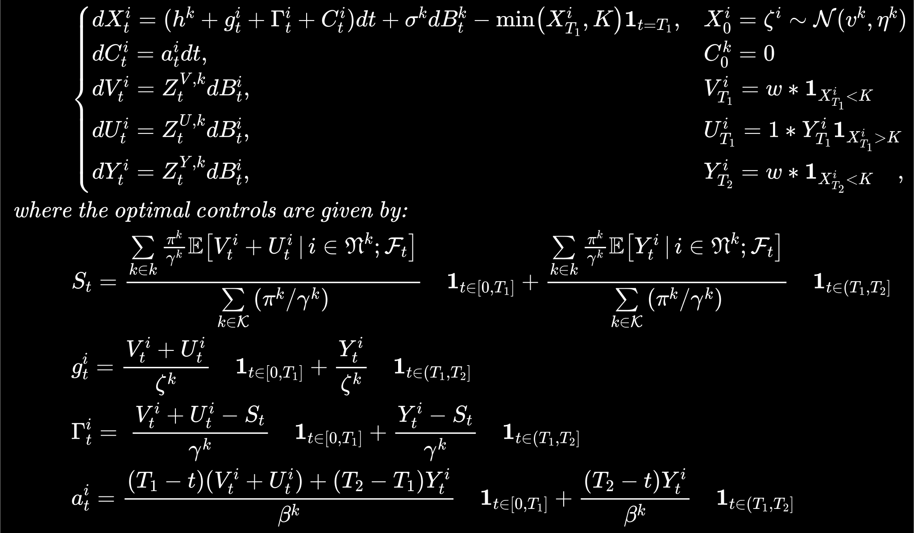

# Multi-Period Compliance Mean Field Game with Deep FBSDE Solver
---

This is an research report giving big pictures about the problem we aim to solve, the key methods/algorithms we propose, the main results we get, as well as comparisons between different methods and consequent results. 

:bulb: See [_Report-StepwiseDetail_](../FinalReports/Report-StepwiseDetail.md) for more math and algorithm details; see _README_ files for more code instructions. 

---

## Abstract 

The aim of this work is to extend the single-period compliance model in [[1]]("https://doi.org/10.48550/arXiv.2110.01127") to multi-period, proposing several tricks to improve the numeric stability of the deep solver for FBSDEs with jumps. First by reproducing the aformentioned research by Campbell, Steven, et al. (2021), then by considering an additional period to the original model, we make comparisons between long/short-term perspectives when it comes to multi-peirod production decision-making in renewable electricity certificate markets, as well as between different numeric tricks when it comes to algorithm stability. Meanwhile, some practical takeaways on parameter-tuning are recorded. 

## 1. Problem Overview

Conventional numerical solvers are hard pressed to solve PA-MFG with market-clearing conditions, which may be faced with the "curse of dimentionality" (Bellman 1957)[^1]. Thus in their study [[1]]("https://doi.org/10.48550/arXiv.2110.01127"), Professor Campbell and his fellows proposed an actor-critic approach to optimization, where the agents form a Nash equilibria according to the principal’s penalty function, and the principal evaluates the resulting equilibria. And they applies this approach to a stylized PA problem arising in Renewable Energy Certificate (REC) markets, where agents may _work_ overtime (or _rent_ capacity), _ trade_ RECs, and _expand_ their long-term capacity to navigate the market at maximum profit. Here we only discuss the agents' problem in the multi-agent-multi-period scenario. 

### 1.1. REC Market Basics

Closely related to carbon cap-and-trade (C&T) markets, REC markets are a type of market-based emmissions regulation policies, which are motivating real-world applications of FBSDEs in modeling PA-MFG.

In RES markets, a regulator plays the role of principle, setting a floor on the amount of energy generated from renewable resources (aka. green energy) for each firm (based on a percentage of their total production), and providing certificates for each MWh of green energy generated and delivered to the grid. These certificates can be further traded by individual or companies, i.e. agents, to: 1) reduce costs or the greenhouse gas (GHG) emissions impact of their operations; and 2) earn profits from the extra inventories instead of wasting. Since the certificates are traded assets, energy suppliers can trade off between producing clean electricity themselves, and purchasing the certificates on the market. In all, such policies have played an important role in funding clean energy development, particularly in past years when the cost of green power production was not as competitive with the cost of fossil fuel power. 

To ensure compliance, each firm must surrender RECs totaling the floor at the end of a compliance period, with a monetary penalty paid for each lacking certificate. And in practice, these systems regulate multiple consecutive and disjoint compliance periods, which are linked together through a mechanism called _banking _, where unused allowances in current period can be carried on to the next period (or multiple future periods). Thus, as an extension to the single-period framework [[1]]("https://doi.org/10.48550/arXiv.2110.01127"), we now consider a 2-period model in this report.[^2]. 

### 1.2. REC Market Modeling with FBSDEs

Let's consider 2 subpopulations here. Before jumping into the 2-period scenario, we first reproduce the single-period case following steps in [[1]]("https://doi.org/10.48550/arXiv.2110.01127"). We denote the period end as $T$, which can be thought of "the end of the world". Referring to the probabilistic method in [[2]](https://arxiv.org/abs/1210.5780) (R. Carmona, F. Delarue, 2012), one can show that, for agent $i$ in subpopulation $k$, the optimal solution to its problem in a _single_ period is exactly the solution to the following coupled FBSDEs:

<!-- $$
\begin{alignat}{2}
    &\begin{cases}
        dX _ t^{i} = (h^{k} + g _ t^{i} + \Gamma _ t^{i} + C _ t^{i})dt + \sigma^{k}dB _ t^{k},  &X _0^{i} \sim \mathcal{N}(v^k,\eta^k)  \\
        dC _ t^{i} = a _ t^{i}dt, &C _ 0^{i}=0  \\
        dY _ t^{i} = Z _ t^{k}dB _ t^{k}, &Y _ {T}^{i} = w\mathbf{1} _ {X _ {T}^i<K},  \\
    \end{cases}\\
    \textit{where:}&\\
        &Y _ t^i = \mathbb{E} \left[w\mathbf{1} _ {X _ {T}^i< K}|\mathcal{F} _ t \right] = w\mathbb{P}\left(X _ {T}^i< K \,|\,\mathcal {F} _ t\right)  \\
        &S _ t = \frac{\sum\limits _ {k \in \mathcal{K}} {\left(\frac{\pi^k}{\gamma^k}\mathbb{E}\left[ Y _ t^i \,|\,i \in \mathfrak{N}^k; \mathcal{F} _ t \right]\right)} }{\sum\limits _ {k \in \mathcal{K}}{\left(\frac{\pi^k}{\gamma^k}\right)}}  \\
        &g _ t^k = \frac{Y _ t^k}{\zeta^k}  \\
        &\Gamma _ t^{k} = \frac{Y _ t^{k}-S _ t}{\gamma^{k}} 
\end{alignat}
$$ -->

<svg xmlns="http://www.w3.org/2000/svg" width="64.92ex" height="48.832ex" viewBox="0 -11041.9 28694.7 21583.9" xmlns:xlink="http://www.w3.org/1999/xlink" aria-hidden="true" style=""><defs><path id="MJX-55-TEX-S4-23A7" d="M712 899L718 893V876V865Q718 854 704 846Q627 793 577 710T510 525Q510 524 509 521Q505 493 504 349Q504 345 504 334Q504 277 504 240Q504 -2 503 -4Q502 -8 494 -9T444 -10Q392 -10 390 -9Q387 -8 386 -5Q384 5 384 230Q384 262 384 312T383 382Q383 481 392 535T434 656Q510 806 664 892L677 899H712Z"></path><path id="MJX-55-TEX-S4-23A9" d="M718 -893L712 -899H677L666 -893Q542 -825 468 -714T385 -476Q384 -466 384 -282Q384 3 385 5L389 9Q392 10 444 10Q486 10 494 9T503 4Q504 2 504 -239V-310V-366Q504 -470 508 -513T530 -609Q546 -657 569 -698T617 -767T661 -812T699 -843T717 -856T718 -876V-893Z"></path><path id="MJX-55-TEX-S4-23A8" d="M389 1159Q391 1160 455 1160Q496 1160 498 1159Q501 1158 502 1155Q504 1145 504 924Q504 691 503 682Q494 549 425 439T243 259L229 250L243 241Q349 175 421 66T503 -182Q504 -191 504 -424Q504 -600 504 -629T499 -659H498Q496 -660 444 -660T390 -659Q387 -658 386 -655Q384 -645 384 -425V-282Q384 -176 377 -116T342 10Q325 54 301 92T255 155T214 196T183 222T171 232Q170 233 170 250T171 268Q171 269 191 284T240 331T300 407T354 524T383 679Q384 691 384 925Q384 1152 385 1155L389 1159Z"></path><path id="MJX-55-TEX-S4-23AA" d="M384 150V266Q384 304 389 309Q391 310 455 310Q496 310 498 309Q502 308 503 298Q504 283 504 150Q504 32 504 12T499 -9H498Q496 -10 444 -10T390 -9Q386 -8 385 2Q384 17 384 150Z"></path><path id="MJX-55-TEX-I-1D451" d="M366 683Q367 683 438 688T511 694Q523 694 523 686Q523 679 450 384T375 83T374 68Q374 26 402 26Q411 27 422 35Q443 55 463 131Q469 151 473 152Q475 153 483 153H487H491Q506 153 506 145Q506 140 503 129Q490 79 473 48T445 8T417 -8Q409 -10 393 -10Q359 -10 336 5T306 36L300 51Q299 52 296 50Q294 48 292 46Q233 -10 172 -10Q117 -10 75 30T33 157Q33 205 53 255T101 341Q148 398 195 420T280 442Q336 442 364 400Q369 394 369 396Q370 400 396 505T424 616Q424 629 417 632T378 637H357Q351 643 351 645T353 664Q358 683 366 683ZM352 326Q329 405 277 405Q242 405 210 374T160 293Q131 214 119 129Q119 126 119 118T118 106Q118 61 136 44T179 26Q233 26 290 98L298 109L352 326Z"></path><path id="MJX-55-TEX-I-1D44B" d="M42 0H40Q26 0 26 11Q26 15 29 27Q33 41 36 43T55 46Q141 49 190 98Q200 108 306 224T411 342Q302 620 297 625Q288 636 234 637H206Q200 643 200 645T202 664Q206 677 212 683H226Q260 681 347 681Q380 681 408 681T453 682T473 682Q490 682 490 671Q490 670 488 658Q484 643 481 640T465 637Q434 634 411 620L488 426L541 485Q646 598 646 610Q646 628 622 635Q617 635 609 637Q594 637 594 648Q594 650 596 664Q600 677 606 683H618Q619 683 643 683T697 681T738 680Q828 680 837 683H845Q852 676 852 672Q850 647 840 637H824Q790 636 763 628T722 611T698 593L687 584Q687 585 592 480L505 384Q505 383 536 304T601 142T638 56Q648 47 699 46Q734 46 734 37Q734 35 732 23Q728 7 725 4T711 1Q708 1 678 1T589 2Q528 2 496 2T461 1Q444 1 444 10Q444 11 446 25Q448 35 450 39T455 44T464 46T480 47T506 54Q523 62 523 64Q522 64 476 181L429 299Q241 95 236 84Q232 76 232 72Q232 53 261 47Q262 47 267 47T273 46Q276 46 277 46T280 45T283 42T284 35Q284 26 282 19Q279 6 276 4T261 1Q258 1 243 1T201 2T142 2Q64 2 42 0Z"></path><path id="MJX-55-TEX-I-1D456" d="M184 600Q184 624 203 642T247 661Q265 661 277 649T290 619Q290 596 270 577T226 557Q211 557 198 567T184 600ZM21 287Q21 295 30 318T54 369T98 420T158 442Q197 442 223 419T250 357Q250 340 236 301T196 196T154 83Q149 61 149 51Q149 26 166 26Q175 26 185 29T208 43T235 78T260 137Q263 149 265 151T282 153Q302 153 302 143Q302 135 293 112T268 61T223 11T161 -11Q129 -11 102 10T74 74Q74 91 79 106T122 220Q160 321 166 341T173 380Q173 404 156 404H154Q124 404 99 371T61 287Q60 286 59 284T58 281T56 279T53 278T49 278T41 278H27Q21 284 21 287Z"></path><path id="MJX-55-TEX-I-1D461" d="M26 385Q19 392 19 395Q19 399 22 411T27 425Q29 430 36 430T87 431H140L159 511Q162 522 166 540T173 566T179 586T187 603T197 615T211 624T229 626Q247 625 254 615T261 596Q261 589 252 549T232 470L222 433Q222 431 272 431H323Q330 424 330 420Q330 398 317 385H210L174 240Q135 80 135 68Q135 26 162 26Q197 26 230 60T283 144Q285 150 288 151T303 153H307Q322 153 322 145Q322 142 319 133Q314 117 301 95T267 48T216 6T155 -11Q125 -11 98 4T59 56Q57 64 57 83V101L92 241Q127 382 128 383Q128 385 77 385H26Z"></path><path id="MJX-55-TEX-N-3D" d="M56 347Q56 360 70 367H707Q722 359 722 347Q722 336 708 328L390 327H72Q56 332 56 347ZM56 153Q56 168 72 173H708Q722 163 722 153Q722 140 707 133H70Q56 140 56 153Z"></path><path id="MJX-55-TEX-N-28" d="M94 250Q94 319 104 381T127 488T164 576T202 643T244 695T277 729T302 750H315H319Q333 750 333 741Q333 738 316 720T275 667T226 581T184 443T167 250T184 58T225 -81T274 -167T316 -220T333 -241Q333 -250 318 -250H315H302L274 -226Q180 -141 137 -14T94 250Z"></path><path id="MJX-55-TEX-I-210E" d="M137 683Q138 683 209 688T282 694Q294 694 294 685Q294 674 258 534Q220 386 220 383Q220 381 227 388Q288 442 357 442Q411 442 444 415T478 336Q478 285 440 178T402 50Q403 36 407 31T422 26Q450 26 474 56T513 138Q516 149 519 151T535 153Q555 153 555 145Q555 144 551 130Q535 71 500 33Q466 -10 419 -10H414Q367 -10 346 17T325 74Q325 90 361 192T398 345Q398 404 354 404H349Q266 404 205 306L198 293L164 158Q132 28 127 16Q114 -11 83 -11Q69 -11 59 -2T48 16Q48 30 121 320L195 616Q195 629 188 632T149 637H128Q122 643 122 645T124 664Q129 683 137 683Z"></path><path id="MJX-55-TEX-I-1D458" d="M121 647Q121 657 125 670T137 683Q138 683 209 688T282 694Q294 694 294 686Q294 679 244 477Q194 279 194 272Q213 282 223 291Q247 309 292 354T362 415Q402 442 438 442Q468 442 485 423T503 369Q503 344 496 327T477 302T456 291T438 288Q418 288 406 299T394 328Q394 353 410 369T442 390L458 393Q446 405 434 405H430Q398 402 367 380T294 316T228 255Q230 254 243 252T267 246T293 238T320 224T342 206T359 180T365 147Q365 130 360 106T354 66Q354 26 381 26Q429 26 459 145Q461 153 479 153H483Q499 153 499 144Q499 139 496 130Q455 -11 378 -11Q333 -11 305 15T277 90Q277 108 280 121T283 145Q283 167 269 183T234 206T200 217T182 220H180Q168 178 159 139T145 81T136 44T129 20T122 7T111 -2Q98 -11 83 -11Q66 -11 57 -1T48 16Q48 26 85 176T158 471L195 616Q196 629 188 632T149 637H144Q134 637 131 637T124 640T121 647Z"></path><path id="MJX-55-TEX-N-2B" d="M56 237T56 250T70 270H369V420L370 570Q380 583 389 583Q402 583 409 568V270H707Q722 262 722 250T707 230H409V-68Q401 -82 391 -82H389H387Q375 -82 369 -68V230H70Q56 237 56 250Z"></path><path id="MJX-55-TEX-I-1D454" d="M311 43Q296 30 267 15T206 0Q143 0 105 45T66 160Q66 265 143 353T314 442Q361 442 401 394L404 398Q406 401 409 404T418 412T431 419T447 422Q461 422 470 413T480 394Q480 379 423 152T363 -80Q345 -134 286 -169T151 -205Q10 -205 10 -137Q10 -111 28 -91T74 -71Q89 -71 102 -80T116 -111Q116 -121 114 -130T107 -144T99 -154T92 -162L90 -164H91Q101 -167 151 -167Q189 -167 211 -155Q234 -144 254 -122T282 -75Q288 -56 298 -13Q311 35 311 43ZM384 328L380 339Q377 350 375 354T369 368T359 382T346 393T328 402T306 405Q262 405 221 352Q191 313 171 233T151 117Q151 38 213 38Q269 38 323 108L331 118L384 328Z"></path><path id="MJX-55-TEX-N-393" d="M128 619Q121 626 117 628T101 631T58 634H25V680H554V676Q556 670 568 560T582 444V440H542V444Q542 445 538 478T523 545T492 598Q454 634 349 634H334Q264 634 249 633T233 621Q232 618 232 339L233 61Q240 54 245 52T270 48T333 46H360V0H348Q324 3 182 3Q51 3 36 0H25V46H58Q100 47 109 49T128 61V619Z"></path><path id="MJX-55-TEX-I-1D436" d="M50 252Q50 367 117 473T286 641T490 704Q580 704 633 653Q642 643 648 636T656 626L657 623Q660 623 684 649Q691 655 699 663T715 679T725 690L740 705H746Q760 705 760 698Q760 694 728 561Q692 422 692 421Q690 416 687 415T669 413H653Q647 419 647 422Q647 423 648 429T650 449T651 481Q651 552 619 605T510 659Q484 659 454 652T382 628T299 572T226 479Q194 422 175 346T156 222Q156 108 232 58Q280 24 350 24Q441 24 512 92T606 240Q610 253 612 255T628 257Q648 257 648 248Q648 243 647 239Q618 132 523 55T319 -22Q206 -22 128 53T50 252Z"></path><path id="MJX-55-TEX-N-29" d="M60 749L64 750Q69 750 74 750H86L114 726Q208 641 251 514T294 250Q294 182 284 119T261 12T224 -76T186 -143T145 -194T113 -227T90 -246Q87 -249 86 -250H74Q66 -250 63 -250T58 -247T55 -238Q56 -237 66 -225Q221 -64 221 250T66 725Q56 737 55 738Q55 746 60 749Z"></path><path id="MJX-55-TEX-I-1D70E" d="M184 -11Q116 -11 74 34T31 147Q31 247 104 333T274 430Q275 431 414 431H552Q553 430 555 429T559 427T562 425T565 422T567 420T569 416T570 412T571 407T572 401Q572 357 507 357Q500 357 490 357T476 358H416L421 348Q439 310 439 263Q439 153 359 71T184 -11ZM361 278Q361 358 276 358Q152 358 115 184Q114 180 114 178Q106 141 106 117Q106 67 131 47T188 26Q242 26 287 73Q316 103 334 153T356 233T361 278Z"></path><path id="MJX-55-TEX-I-1D435" d="M231 637Q204 637 199 638T194 649Q194 676 205 682Q206 683 335 683Q594 683 608 681Q671 671 713 636T756 544Q756 480 698 429T565 360L555 357Q619 348 660 311T702 219Q702 146 630 78T453 1Q446 0 242 0Q42 0 39 2Q35 5 35 10Q35 17 37 24Q42 43 47 45Q51 46 62 46H68Q95 46 128 49Q142 52 147 61Q150 65 219 339T288 628Q288 635 231 637ZM649 544Q649 574 634 600T585 634Q578 636 493 637Q473 637 451 637T416 636H403Q388 635 384 626Q382 622 352 506Q352 503 351 500L320 374H401Q482 374 494 376Q554 386 601 434T649 544ZM595 229Q595 273 572 302T512 336Q506 337 429 337Q311 337 310 336Q310 334 293 263T258 122L240 52Q240 48 252 48T333 46Q422 46 429 47Q491 54 543 105T595 229Z"></path><path id="MJX-55-TEX-N-2C" d="M78 35T78 60T94 103T137 121Q165 121 187 96T210 8Q210 -27 201 -60T180 -117T154 -158T130 -185T117 -194Q113 -194 104 -185T95 -172Q95 -168 106 -156T131 -126T157 -76T173 -3V9L172 8Q170 7 167 6T161 3T152 1T140 0Q113 0 96 17Z"></path><path id="MJX-55-TEX-N-30" d="M96 585Q152 666 249 666Q297 666 345 640T423 548Q460 465 460 320Q460 165 417 83Q397 41 362 16T301 -15T250 -22Q224 -22 198 -16T137 16T82 83Q39 165 39 320Q39 494 96 585ZM321 597Q291 629 250 629Q208 629 178 597Q153 571 145 525T137 333Q137 175 145 125T181 46Q209 16 250 16Q290 16 318 46Q347 76 354 130T362 333Q362 478 354 524T321 597Z"></path><path id="MJX-55-TEX-N-223C" d="M55 166Q55 241 101 304T222 367Q260 367 296 349T362 304T421 252T484 208T554 189Q616 189 655 236T694 338Q694 350 698 358T708 367Q722 367 722 334Q722 260 677 197T562 134H554Q517 134 481 152T414 196T355 248T292 293T223 311Q179 311 145 286Q109 257 96 218T80 156T69 133Q55 133 55 166Z"></path><path id="MJX-55-TEX-C-4E" d="M343 705Q358 705 358 698Q360 696 370 658T411 524T484 319Q536 174 590 82L595 73L615 152Q646 274 683 407Q729 571 752 637T799 727Q852 780 937 788Q939 788 947 788T958 789H962Q979 789 979 765Q979 722 951 692Q942 683 924 683Q888 681 859 672T818 654T803 639Q784 608 708 322T631 15Q631 14 630 15Q630 17 629 15Q628 14 628 12Q621 -4 601 -17T560 -31Q550 -31 546 -28T530 -7Q484 67 458 123T398 272Q352 392 314 514L306 535V534Q306 533 296 488T272 379T234 239T185 100T127 -7T61 -50Q34 -50 4 -34T-27 8Q-27 33 -12 61T18 90Q21 90 36 77T87 57H92Q109 57 123 78T162 173Q206 299 232 417T265 599T276 667Q284 681 304 693T343 705Z"></path><path id="MJX-55-TEX-I-1D463" d="M173 380Q173 405 154 405Q130 405 104 376T61 287Q60 286 59 284T58 281T56 279T53 278T49 278T41 278H27Q21 284 21 287Q21 294 29 316T53 368T97 419T160 441Q202 441 225 417T249 361Q249 344 246 335Q246 329 231 291T200 202T182 113Q182 86 187 69Q200 26 250 26Q287 26 319 60T369 139T398 222T409 277Q409 300 401 317T383 343T365 361T357 383Q357 405 376 424T417 443Q436 443 451 425T467 367Q467 340 455 284T418 159T347 40T241 -11Q177 -11 139 22Q102 54 102 117Q102 148 110 181T151 298Q173 362 173 380Z"></path><path id="MJX-55-TEX-I-1D702" d="M21 287Q22 290 23 295T28 317T38 348T53 381T73 411T99 433T132 442Q156 442 175 435T205 417T221 395T229 376L231 369Q231 367 232 367L243 378Q304 442 382 442Q436 442 469 415T503 336V326Q503 302 439 53Q381 -182 377 -189Q364 -216 332 -216Q319 -216 310 -208T299 -186Q299 -177 358 57L420 307Q423 322 423 345Q423 404 379 404H374Q288 404 229 303L222 291L189 157Q156 26 151 16Q138 -11 108 -11Q95 -11 87 -5T76 7T74 17Q74 30 114 189T154 366Q154 405 128 405Q107 405 92 377T68 316T57 280Q55 278 41 278H27Q21 284 21 287Z"></path><path id="MJX-55-TEX-I-1D44E" d="M33 157Q33 258 109 349T280 441Q331 441 370 392Q386 422 416 422Q429 422 439 414T449 394Q449 381 412 234T374 68Q374 43 381 35T402 26Q411 27 422 35Q443 55 463 131Q469 151 473 152Q475 153 483 153H487Q506 153 506 144Q506 138 501 117T481 63T449 13Q436 0 417 -8Q409 -10 393 -10Q359 -10 336 5T306 36L300 51Q299 52 296 50Q294 48 292 46Q233 -10 172 -10Q117 -10 75 30T33 157ZM351 328Q351 334 346 350T323 385T277 405Q242 405 210 374T160 293Q131 214 119 129Q119 126 119 118T118 106Q118 61 136 44T179 26Q217 26 254 59T298 110Q300 114 325 217T351 328Z"></path><path id="MJX-55-TEX-I-1D44C" d="M66 637Q54 637 49 637T39 638T32 641T30 647T33 664T42 682Q44 683 56 683Q104 680 165 680Q288 680 306 683H316Q322 677 322 674T320 656Q316 643 310 637H298Q242 637 242 624Q242 619 292 477T343 333L346 336Q350 340 358 349T379 373T411 410T454 461Q546 568 561 587T577 618Q577 634 545 637Q528 637 528 647Q528 649 530 661Q533 676 535 679T549 683Q551 683 578 682T657 680Q684 680 713 681T746 682Q763 682 763 673Q763 669 760 657T755 643Q753 637 734 637Q662 632 617 587Q608 578 477 424L348 273L322 169Q295 62 295 57Q295 46 363 46Q379 46 384 45T390 35Q390 33 388 23Q384 6 382 4T366 1Q361 1 324 1T232 2Q170 2 138 2T102 1Q84 1 84 9Q84 14 87 24Q88 27 89 30T90 35T91 39T93 42T96 44T101 45T107 45T116 46T129 46Q168 47 180 50T198 63Q201 68 227 171L252 274L129 623Q128 624 127 625T125 627T122 629T118 631T113 633T105 634T96 635T83 636T66 637Z"></path><path id="MJX-55-TEX-I-1D44D" d="M58 8Q58 23 64 35Q64 36 329 334T596 635L586 637Q575 637 512 637H500H476Q442 637 420 635T365 624T311 598T266 548T228 469Q227 466 226 463T224 458T223 453T222 450L221 448Q218 443 202 443Q185 443 182 453L214 561Q228 606 241 651Q249 679 253 681Q256 683 487 683H718Q723 678 723 675Q723 673 717 649Q189 54 188 52L185 49H274Q369 50 377 51Q452 60 500 100T579 247Q587 272 590 277T603 282H607Q628 282 628 271Q547 5 541 2Q538 0 300 0H124Q58 0 58 8Z"></path><path id="MJX-55-TEX-I-1D447" d="M40 437Q21 437 21 445Q21 450 37 501T71 602L88 651Q93 669 101 677H569H659Q691 677 697 676T704 667Q704 661 687 553T668 444Q668 437 649 437Q640 437 637 437T631 442L629 445Q629 451 635 490T641 551Q641 586 628 604T573 629Q568 630 515 631Q469 631 457 630T439 622Q438 621 368 343T298 60Q298 48 386 46Q418 46 427 45T436 36Q436 31 433 22Q429 4 424 1L422 0Q419 0 415 0Q410 0 363 1T228 2Q99 2 64 0H49Q43 6 43 9T45 27Q49 40 55 46H83H94Q174 46 189 55Q190 56 191 56Q196 59 201 76T241 233Q258 301 269 344Q339 619 339 625Q339 630 310 630H279Q212 630 191 624Q146 614 121 583T67 467Q60 445 57 441T43 437H40Z"></path><path id="MJX-55-TEX-I-1D464" d="M580 385Q580 406 599 424T641 443Q659 443 674 425T690 368Q690 339 671 253Q656 197 644 161T609 80T554 12T482 -11Q438 -11 404 5T355 48Q354 47 352 44Q311 -11 252 -11Q226 -11 202 -5T155 14T118 53T104 116Q104 170 138 262T173 379Q173 380 173 381Q173 390 173 393T169 400T158 404H154Q131 404 112 385T82 344T65 302T57 280Q55 278 41 278H27Q21 284 21 287Q21 293 29 315T52 366T96 418T161 441Q204 441 227 416T250 358Q250 340 217 250T184 111Q184 65 205 46T258 26Q301 26 334 87L339 96V119Q339 122 339 128T340 136T341 143T342 152T345 165T348 182T354 206T362 238T373 281Q402 395 406 404Q419 431 449 431Q468 431 475 421T483 402Q483 389 454 274T422 142Q420 131 420 107V100Q420 85 423 71T442 42T487 26Q558 26 600 148Q609 171 620 213T632 273Q632 306 619 325T593 357T580 385Z"></path><path id="MJX-55-TEX-B-1D7CF" d="M481 0L294 3Q136 3 109 0H96V62H227V304Q227 546 225 546Q169 529 97 529H80V591H97Q231 591 308 647L319 655H333Q355 655 359 644Q361 640 361 351V62H494V0H481Z"></path><path id="MJX-55-TEX-N-3C" d="M694 -11T694 -19T688 -33T678 -40Q671 -40 524 29T234 166L90 235Q83 240 83 250Q83 261 91 266Q664 540 678 540Q681 540 687 534T694 519T687 505Q686 504 417 376L151 250L417 124Q686 -4 687 -5Q694 -11 694 -19Z"></path><path id="MJX-55-TEX-I-1D43E" d="M285 628Q285 635 228 637Q205 637 198 638T191 647Q191 649 193 661Q199 681 203 682Q205 683 214 683H219Q260 681 355 681Q389 681 418 681T463 682T483 682Q500 682 500 674Q500 669 497 660Q496 658 496 654T495 648T493 644T490 641T486 639T479 638T470 637T456 637Q416 636 405 634T387 623L306 305Q307 305 490 449T678 597Q692 611 692 620Q692 635 667 637Q651 637 651 648Q651 650 654 662T659 677Q662 682 676 682Q680 682 711 681T791 680Q814 680 839 681T869 682Q889 682 889 672Q889 650 881 642Q878 637 862 637Q787 632 726 586Q710 576 656 534T556 455L509 418L518 396Q527 374 546 329T581 244Q656 67 661 61Q663 59 666 57Q680 47 717 46H738Q744 38 744 37T741 19Q737 6 731 0H720Q680 3 625 3Q503 3 488 0H478Q472 6 472 9T474 27Q478 40 480 43T491 46H494Q544 46 544 71Q544 75 517 141T485 216L427 354L359 301L291 248L268 155Q245 63 245 58Q245 51 253 49T303 46H334Q340 37 340 35Q340 19 333 5Q328 0 317 0Q314 0 280 1T180 2Q118 2 85 2T49 1Q31 1 31 11Q31 13 34 25Q38 41 42 43T65 46Q92 46 125 49Q139 52 144 61Q147 65 216 339T285 628Z"></path><path id="MJX-55-TEX-MI-77" d="M591 386Q591 407 610 425T649 443Q670 443 683 423T696 371Q696 327 672 232T621 85Q575 -11 493 -11Q469 -11 449 -6T418 8T398 24T386 38L382 43Q347 -10 293 -10H286Q221 -10 186 21T150 115Q150 164 185 262T221 384Q221 405 206 405Q177 405 157 375T128 313T116 279Q115 278 97 278H81Q75 284 75 287T79 304T93 342T119 388T158 425T210 441H218Q243 441 268 421T293 357Q292 336 260 246T227 108Q227 26 292 26H295Q332 26 361 93L366 103V119Q366 122 367 133T369 150Q372 167 401 282T433 404Q446 431 477 431Q507 431 509 402Q509 396 500 358T474 254T446 140Q444 126 444 104V92Q444 66 459 46T502 26H505Q527 28 545 43T577 88T602 149T623 226Q633 265 633 290Q632 324 612 349T591 386Z"></path><path id="MJX-55-TEX-MI-68" d="M398 44Q398 26 414 26Q431 26 451 43Q477 71 496 136Q499 148 501 150T515 153H521Q531 153 534 153T541 150T544 143Q544 133 534 105T496 41T432 -8Q424 -10 408 -10Q370 -10 348 12T326 72Q326 93 342 135Q397 288 397 349Q397 367 396 372Q386 405 357 405Q283 405 228 310Q217 290 212 274T180 152Q153 42 148 26T135 3Q121 -11 102 -11Q89 -11 80 -3T69 19L216 616Q216 629 209 632T170 637H149Q143 643 143 645T145 664Q150 683 158 683Q163 683 223 688T300 694Q312 694 312 685Q312 674 277 539Q241 395 241 393Q242 394 249 399T259 407T271 415T285 424T300 431T318 437T338 440T362 442Q423 442 449 410T475 338Q475 290 437 178T398 44Z"></path><path id="MJX-55-TEX-MI-65" d="M107 166Q107 230 131 283T193 369T270 420T345 441Q346 441 352 441T361 442H364Q409 442 439 418T470 355Q470 270 366 239Q308 223 218 223H205Q189 164 189 125Q189 83 206 55T261 27Q309 27 353 50T426 109Q436 121 440 121T453 111T466 97Q469 92 455 77Q424 41 372 16T258 -10Q184 -10 146 41T107 166ZM416 333T416 354T401 390T360 405Q322 405 292 384T246 336T223 288T215 261Q215 260 240 260Q262 261 276 262T314 266T353 275T384 291T408 317Z"></path><path id="MJX-55-TEX-MI-72" d="M81 278Q75 284 75 289Q77 301 89 339Q122 442 183 442Q219 442 241 425T271 384L283 396Q327 442 384 442Q424 442 454 421T484 362Q484 327 464 312T424 296Q407 296 396 305T385 331Q385 352 394 365T414 384T424 390Q409 405 378 405Q322 405 276 315L268 300L234 161Q200 25 196 16Q182 -11 152 -11T120 18Q120 23 159 181Q199 343 199 346Q202 360 202 372Q202 405 182 405Q164 405 150 377T128 316T117 280Q115 278 98 278H81Z"></path><path id="MJX-55-TEX-MI-3A" d="M184 358Q184 385 206 408T258 431Q279 431 293 418T308 383Q308 354 284 332T233 310Q212 310 198 324T184 358ZM107 50Q107 76 129 98T181 121Q203 121 217 108T231 72Q231 47 210 24T156 0Q135 0 121 13T107 50Z"></path><path id="MJX-55-TEX-D-1D53C" d="M12 666Q12 675 24 683H582Q590 680 593 672V588Q593 514 591 502T575 490Q567 490 563 495T555 517Q552 556 517 590Q486 623 445 634T340 648H282Q266 636 264 620T260 492V370H277Q329 375 358 391T404 439Q420 480 420 506Q420 529 436 529Q445 529 451 521Q455 517 455 361Q455 333 455 298T456 253Q456 217 453 207T437 197Q420 196 420 217Q420 240 406 270Q377 328 284 335H260V201Q261 174 261 134Q262 73 264 61T278 38Q281 36 282 35H331Q400 35 449 50Q571 93 602 179Q605 203 622 203Q629 203 634 197T640 183Q638 181 624 95T604 3L600 -1H24Q12 5 12 16Q12 35 51 35Q92 38 97 52Q102 60 102 341T97 632Q91 645 51 648Q12 648 12 666ZM137 341Q137 131 136 89T130 37Q129 36 129 35H235Q233 41 231 48L226 61V623L231 635L235 648H129Q132 641 133 638T135 603T137 517T137 341ZM557 603V648H504Q504 646 515 639Q527 634 542 619L557 603ZM420 317V397L406 383Q394 370 380 363L366 355Q373 350 382 346Q400 333 409 328L420 317ZM582 61L586 88Q585 88 582 83Q557 61 526 46L511 37L542 35H577Q577 36 578 39T580 49T582 61Z"></path><path id="MJX-55-TEX-S3-5B" d="M247 -949V1450H516V1388H309V-887H516V-949H247Z"></path><path id="MJX-55-TEX-N-7C" d="M139 -249H137Q125 -249 119 -235V251L120 737Q130 750 139 750Q152 750 159 735V-235Q151 -249 141 -249H139Z"></path><path id="MJX-55-TEX-C-46" d="M199 579Q181 579 181 590Q181 598 188 611T212 639T260 666T335 682Q336 682 349 682T383 682T431 682T493 683T561 683Q776 682 784 681Q826 673 829 647Q829 620 797 600T744 580Q728 580 728 595Q729 607 713 610Q698 613 598 614H500L499 610Q499 598 467 486T428 367Q428 365 551 365H674Q683 360 684 355Q687 346 677 329Q666 312 642 299T598 285Q586 285 582 296H402L394 277Q386 258 373 229T346 167T315 102T286 51Q265 22 225 -5T133 -32Q108 -32 87 -25T54 -7T33 15T21 35T18 47Q18 60 44 80T98 103Q108 103 111 101T119 88Q130 66 150 54T179 39T195 37Q199 37 203 43Q217 67 245 125T318 300T391 532Q393 543 398 564T406 598T409 613T339 614H269Q229 579 199 579Z"></path><path id="MJX-55-TEX-S3-5D" d="M11 1388V1450H280V-949H11V-887H218V1388H11Z"></path><path id="MJX-55-TEX-D-2119" d="M16 666Q16 675 28 683H195Q334 683 370 682T437 672Q511 657 554 611T597 495Q597 343 404 309Q402 308 401 308Q381 303 319 303H261V181Q261 157 262 120Q262 60 267 50T304 36Q310 35 313 35Q352 35 352 17Q352 10 346 3L339 -1H28Q16 5 16 16Q16 35 53 35Q68 36 75 37T87 42T95 52Q98 61 98 341T95 630Q91 640 83 643T53 648Q16 648 16 666ZM235 35Q228 46 227 84Q226 129 226 337V621L230 635L237 648H128Q128 647 133 632Q136 620 136 341Q136 64 133 50L128 35H235ZM301 341H313Q339 341 354 344T389 362T417 410T426 498Q426 586 401 616T322 647Q301 647 293 643Q271 637 264 621Q261 617 261 479V341H301ZM429 350Q431 350 443 353T476 367T515 391T548 432T562 490Q562 550 524 592Q507 607 484 619Q481 621 448 635L433 639L439 621Q462 578 462 506Q462 448 454 413T437 366T428 350H429Z"></path><path id="MJX-55-TEX-LO-28" d="M180 96T180 250T205 541T266 770T353 944T444 1069T527 1150H555Q561 1144 561 1141Q561 1137 545 1120T504 1072T447 995T386 878T330 721T288 513T272 251Q272 133 280 56Q293 -87 326 -209T399 -405T475 -531T536 -609T561 -640Q561 -643 555 -649H527Q483 -612 443 -568T353 -443T266 -270T205 -41Z"></path><path id="MJX-55-TEX-LO-29" d="M35 1138Q35 1150 51 1150H56H69Q113 1113 153 1069T243 944T330 771T391 541T416 250T391 -40T330 -270T243 -443T152 -568T69 -649H56Q43 -649 39 -647T35 -637Q65 -607 110 -548Q283 -316 316 56Q324 133 324 251Q324 368 316 445Q278 877 48 1123Q36 1137 35 1138Z"></path><path id="MJX-55-TEX-I-1D446" d="M308 24Q367 24 416 76T466 197Q466 260 414 284Q308 311 278 321T236 341Q176 383 176 462Q176 523 208 573T273 648Q302 673 343 688T407 704H418H425Q521 704 564 640Q565 640 577 653T603 682T623 704Q624 704 627 704T632 705Q645 705 645 698T617 577T585 459T569 456Q549 456 549 465Q549 471 550 475Q550 478 551 494T553 520Q553 554 544 579T526 616T501 641Q465 662 419 662Q362 662 313 616T263 510Q263 480 278 458T319 427Q323 425 389 408T456 390Q490 379 522 342T554 242Q554 216 546 186Q541 164 528 137T492 78T426 18T332 -20Q320 -22 298 -22Q199 -22 144 33L134 44L106 13Q83 -14 78 -18T65 -22Q52 -22 52 -14Q52 -11 110 221Q112 227 130 227H143Q149 221 149 216Q149 214 148 207T144 186T142 153Q144 114 160 87T203 47T255 29T308 24Z"></path><path id="MJX-55-TEX-SO-2211" d="M61 748Q64 750 489 750H913L954 640Q965 609 976 579T993 533T999 516H979L959 517Q936 579 886 621T777 682Q724 700 655 705T436 710H319Q183 710 183 709Q186 706 348 484T511 259Q517 250 513 244L490 216Q466 188 420 134T330 27L149 -187Q149 -188 362 -188Q388 -188 436 -188T506 -189Q679 -189 778 -162T936 -43Q946 -27 959 6H999L913 -249L489 -250Q65 -250 62 -248Q56 -246 56 -239Q56 -234 118 -161Q186 -81 245 -11L428 206Q428 207 242 462L57 717L56 728Q56 744 61 748Z"></path><path id="MJX-55-TEX-N-2208" d="M84 250Q84 372 166 450T360 539Q361 539 377 539T419 540T469 540H568Q583 532 583 520Q583 511 570 501L466 500Q355 499 329 494Q280 482 242 458T183 409T147 354T129 306T124 272V270H568Q583 262 583 250T568 230H124V228Q124 207 134 177T167 112T231 48T328 7Q355 1 466 0H570Q583 -10 583 -20Q583 -32 568 -40H471Q464 -40 446 -40T417 -41Q262 -41 172 45Q84 127 84 250Z"></path><path id="MJX-55-TEX-C-4B" d="M194 618Q193 618 182 613T156 601T131 594Q113 594 113 605Q113 623 144 644Q154 650 205 676T267 703Q277 705 279 705Q295 705 295 691Q295 569 250 397Q225 306 197 217T151 81T128 25Q120 8 94 -7T47 -22Q32 -22 32 -10L64 76Q95 163 133 295T185 530Q198 611 194 618ZM331 429Q331 383 364 290T449 117T542 36Q574 36 607 51T652 103Q660 124 677 133T709 143Q727 143 727 128Q727 119 723 111Q704 56 639 17T497 -22H493Q463 -22 425 16Q401 40 382 71Q335 138 296 243T256 399Q256 434 288 473Q342 540 471 622T670 705Q691 704 703 696Q732 678 732 644Q732 613 714 600T677 586Q671 586 667 587T660 592T657 604V619Q657 647 629 647Q623 647 620 646Q576 635 495 583T365 482Q331 448 331 429Z"></path><path id="MJX-55-TEX-S3-28" d="M701 -940Q701 -943 695 -949H664Q662 -947 636 -922T591 -879T537 -818T475 -737T412 -636T350 -511T295 -362T250 -186T221 17T209 251Q209 962 573 1361Q596 1386 616 1405T649 1437T664 1450H695Q701 1444 701 1441Q701 1436 681 1415T629 1356T557 1261T476 1118T400 927T340 675T308 359Q306 321 306 250Q306 -139 400 -430T690 -924Q701 -936 701 -940Z"></path><path id="MJX-55-TEX-I-1D70B" d="M132 -11Q98 -11 98 22V33L111 61Q186 219 220 334L228 358H196Q158 358 142 355T103 336Q92 329 81 318T62 297T53 285Q51 284 38 284Q19 284 19 294Q19 300 38 329T93 391T164 429Q171 431 389 431Q549 431 553 430Q573 423 573 402Q573 371 541 360Q535 358 472 358H408L405 341Q393 269 393 222Q393 170 402 129T421 65T431 37Q431 20 417 5T381 -10Q370 -10 363 -7T347 17T331 77Q330 86 330 121Q330 170 339 226T357 318T367 358H269L268 354Q268 351 249 275T206 114T175 17Q164 -11 132 -11Z"></path><path id="MJX-55-TEX-I-1D6FE" d="M31 249Q11 249 11 258Q11 275 26 304T66 365T129 418T206 441Q233 441 239 440Q287 429 318 386T371 255Q385 195 385 170Q385 166 386 166L398 193Q418 244 443 300T486 391T508 430Q510 431 524 431H537Q543 425 543 422Q543 418 522 378T463 251T391 71Q385 55 378 6T357 -100Q341 -165 330 -190T303 -216Q286 -216 286 -188Q286 -138 340 32L346 51L347 69Q348 79 348 100Q348 257 291 317Q251 355 196 355Q148 355 108 329T51 260Q49 251 47 251Q45 249 31 249Z"></path><path id="MJX-55-TEX-LO-5B" d="M224 -649V1150H455V1099H275V-598H455V-649H224Z"></path><path id="MJX-55-TEX-F-1D511" d="M112 334Q112 356 70 410T27 497Q27 553 94 619T229 685Q230 685 236 685T246 686Q303 686 349 654Q373 636 392 607T419 558L426 538L454 576Q474 604 486 618T520 651T569 678T633 686Q668 684 687 673T713 651T730 609Q730 608 732 600T736 588T741 578T747 568T754 561T765 555T779 553Q789 553 817 562Q819 557 819 555V547L790 526Q743 492 730 479T712 447Q697 369 697 281Q697 166 726 108Q741 76 755 68Q759 66 767 66Q789 66 825 93V82Q825 71 822 70Q821 69 763 27T701 -18L692 -25L668 15Q662 25 650 45T635 70L627 85V107Q627 122 626 162T624 285Q624 381 632 398Q638 409 651 425T675 454T696 477T707 489H696Q683 490 679 492T669 507T653 551Q642 588 627 608T584 628Q572 628 560 625T538 616T519 602T502 586T486 568T473 549T463 532T454 517T448 504L445 497Q437 480 437 474Q437 472 439 461T444 421T446 348Q446 205 405 124Q396 105 392 100T368 78Q312 32 278 9T235 -18T214 -22Q191 -22 170 -10T139 12T129 25T160 66T192 105Q193 102 194 98T200 83T213 64T233 49T261 42Q303 42 339 90Q373 134 373 268Q373 397 339 493T235 618Q215 628 191 628Q155 628 126 604T97 548Q97 524 120 493T168 431T192 381Q192 346 164 318T86 260L70 250L54 266L63 272Q112 300 112 334Z"></path><path id="MJX-55-TEX-N-3B" d="M78 370Q78 394 95 412T138 430Q162 430 180 414T199 371Q199 346 182 328T139 310T96 327T78 370ZM78 60Q78 85 94 103T137 121Q202 121 202 8Q202 -44 183 -94T144 -169T118 -194Q115 -194 106 -186T95 -174Q94 -171 107 -155T137 -107T160 -38Q161 -32 162 -22T165 -4T165 4Q165 5 161 4T142 0Q110 0 94 18T78 60Z"></path><path id="MJX-55-TEX-LO-5D" d="M16 1099V1150H247V-649H16V-598H196V1099H16Z"></path><path id="MJX-55-TEX-S3-29" d="M34 1438Q34 1446 37 1448T50 1450H56H71Q73 1448 99 1423T144 1380T198 1319T260 1238T323 1137T385 1013T440 864T485 688T514 485T526 251Q526 134 519 53Q472 -519 162 -860Q139 -885 119 -904T86 -936T71 -949H56Q43 -949 39 -947T34 -937Q88 -883 140 -813Q428 -430 428 251Q428 453 402 628T338 922T245 1146T145 1309T46 1425Q44 1427 42 1429T39 1433T36 1436L34 1438Z"></path><path id="MJX-55-TEX-I-1D701" d="M296 643Q298 704 324 704Q342 704 342 687Q342 682 339 664T336 633Q336 623 337 618T338 611Q339 612 341 612Q343 614 354 616T374 618L384 619H394Q471 619 471 586Q467 548 386 546H372Q338 546 320 564L311 558Q235 506 175 398T114 190Q114 171 116 155T125 127T137 104T153 86T171 72T192 61T213 53T235 46T256 39L322 16Q389 -10 389 -80Q389 -119 364 -154T300 -202Q292 -204 274 -204Q247 -204 225 -196Q210 -192 193 -182T172 -167Q167 -159 173 -148Q180 -139 191 -139Q195 -139 221 -153T283 -168Q298 -166 310 -152T322 -117Q322 -91 302 -75T250 -51T183 -29T116 4T65 62T44 160Q44 287 121 410T293 590L302 595Q296 613 296 643Z"></path><path id="MJX-55-TEX-N-2212" d="M84 237T84 250T98 270H679Q694 262 694 250T679 230H98Q84 237 84 250Z"></path></defs><g stroke="currentColor" fill="currentColor" stroke-width="0" transform="matrix(1 0 0 -1 0 0)"><g data-mml-node="math"><g data-mml-node="mtable"><g data-mml-node="mtr" transform="translate(0, 8207.7)"><g data-mml-node="mtd" transform="translate(2824, 0)"></g><g data-mml-node="mtd" transform="translate(2824, 0)"><g data-mml-node="mrow"><g data-mml-node="mo"><use xlink:href="#MJX-55-TEX-S4-23A7" transform="translate(0, 1935.3)"></use><use xlink:href="#MJX-55-TEX-S4-23A9" transform="translate(0, -1435.3)"></use><use xlink:href="#MJX-55-TEX-S4-23A8" transform="translate(0, 0)"></use><svg width="889" height="965.3" y="1060" x="0" viewBox="0 170.1 889 965.3"><use xlink:href="#MJX-55-TEX-S4-23AA" transform="scale(1, 4.747)"></use></svg><svg width="889" height="965.3" y="-1525.3" x="0" viewBox="0 170.1 889 965.3"><use xlink:href="#MJX-55-TEX-S4-23AA" transform="scale(1, 4.747)"></use></svg></g><g data-mml-node="mtable" transform="translate(889, 0)"><g data-mml-node="mtr" transform="translate(0, 1857.4)"><g data-mml-node="mtd"><g data-mml-node="mi"><use xlink:href="#MJX-55-TEX-I-1D451"></use></g><g data-mml-node="msubsup" transform="translate(520, 0)"><g data-mml-node="mi"><use xlink:href="#MJX-55-TEX-I-1D44B"></use></g><g data-mml-node="TeXAtom" transform="translate(903.2, 363.3) scale(0.884)" data-mjx-texclass="ORD"><g data-mml-node="mi"><use xlink:href="#MJX-55-TEX-I-1D456"></use></g></g><g data-mml-node="mi" transform="translate(828, -379.8) scale(0.884)"><use xlink:href="#MJX-55-TEX-I-1D461"></use></g></g><g data-mml-node="mo" transform="translate(2056, 0)"><use xlink:href="#MJX-55-TEX-N-3D"></use></g><g data-mml-node="mo" transform="translate(3111.7, 0)"><use xlink:href="#MJX-55-TEX-N-28"></use></g><g data-mml-node="msup" transform="translate(3500.7, 0)"><g data-mml-node="mi"><use xlink:href="#MJX-55-TEX-I-210E"></use></g><g data-mml-node="TeXAtom" transform="translate(576, 363) scale(0.884)" data-mjx-texclass="ORD"><g data-mml-node="mi"><use xlink:href="#MJX-55-TEX-I-1D458"></use></g></g></g><g data-mml-node="mo" transform="translate(4809.5, 0)"><use xlink:href="#MJX-55-TEX-N-2B"></use></g><g data-mml-node="msubsup" transform="translate(5809.7, 0)"><g data-mml-node="mi"><use xlink:href="#MJX-55-TEX-I-1D454"></use></g><g data-mml-node="TeXAtom" transform="translate(477, 363.3) scale(0.884)" data-mjx-texclass="ORD"><g data-mml-node="mi"><use xlink:href="#MJX-55-TEX-I-1D456"></use></g></g><g data-mml-node="mi" transform="translate(477, -379.8) scale(0.884)"><use xlink:href="#MJX-55-TEX-I-1D461"></use></g></g><g data-mml-node="mo" transform="translate(6878.1, 0)"><use xlink:href="#MJX-55-TEX-N-2B"></use></g><g data-mml-node="msubsup" transform="translate(7878.3, 0)"><g data-mml-node="mi"><use xlink:href="#MJX-55-TEX-N-393"></use></g><g data-mml-node="TeXAtom" transform="translate(625, 363.3) scale(0.884)" data-mjx-texclass="ORD"><g data-mml-node="mi"><use xlink:href="#MJX-55-TEX-I-1D456"></use></g></g><g data-mml-node="mi" transform="translate(625, -379.8) scale(0.884)"><use xlink:href="#MJX-55-TEX-I-1D461"></use></g></g><g data-mml-node="mo" transform="translate(9094.7, 0)"><use xlink:href="#MJX-55-TEX-N-2B"></use></g><g data-mml-node="msubsup" transform="translate(10094.9, 0)"><g data-mml-node="mi"><use xlink:href="#MJX-55-TEX-I-1D436"></use></g><g data-mml-node="TeXAtom" transform="translate(812.2, 363.3) scale(0.884)" data-mjx-texclass="ORD"><g data-mml-node="mi"><use xlink:href="#MJX-55-TEX-I-1D456"></use></g></g><g data-mml-node="mi" transform="translate(715, -379.8) scale(0.884)"><use xlink:href="#MJX-55-TEX-I-1D461"></use></g></g><g data-mml-node="mo" transform="translate(11262.1, 0)"><use xlink:href="#MJX-55-TEX-N-29"></use></g><g data-mml-node="mi" transform="translate(11651.1, 0)"><use xlink:href="#MJX-55-TEX-I-1D451"></use></g><g data-mml-node="mi" transform="translate(12171.1, 0)"><use xlink:href="#MJX-55-TEX-I-1D461"></use></g><g data-mml-node="mo" transform="translate(12754.3, 0)"><use xlink:href="#MJX-55-TEX-N-2B"></use></g><g data-mml-node="msup" transform="translate(13754.6, 0)"><g data-mml-node="mi"><use xlink:href="#MJX-55-TEX-I-1D70E"></use></g><g data-mml-node="TeXAtom" transform="translate(571, 363) scale(0.884)" data-mjx-texclass="ORD"><g data-mml-node="mi"><use xlink:href="#MJX-55-TEX-I-1D458"></use></g></g></g><g data-mml-node="mi" transform="translate(14836.1, 0)"><use xlink:href="#MJX-55-TEX-I-1D451"></use></g><g data-mml-node="msubsup" transform="translate(15356.1, 0)"><g data-mml-node="mi"><use xlink:href="#MJX-55-TEX-I-1D435"></use></g><g data-mml-node="TeXAtom" transform="translate(759, 363.3) scale(0.884)" data-mjx-texclass="ORD"><g data-mml-node="mi"><use xlink:href="#MJX-55-TEX-I-1D458"></use></g></g><g data-mml-node="mi" transform="translate(759, -379.8) scale(0.884)"><use xlink:href="#MJX-55-TEX-I-1D461"></use></g></g><g data-mml-node="mo" transform="translate(16625.7, 0)"><use xlink:href="#MJX-55-TEX-N-2C"></use></g></g><g data-mml-node="mtd" transform="translate(17903.7, 0)"><g data-mml-node="msubsup"><g data-mml-node="mi"><use xlink:href="#MJX-55-TEX-I-1D44B"></use></g><g data-mml-node="TeXAtom" transform="translate(903.2, 363.3) scale(0.884)" data-mjx-texclass="ORD"><g data-mml-node="mi"><use xlink:href="#MJX-55-TEX-I-1D456"></use></g></g><g data-mml-node="mn" transform="translate(828, -415.1) scale(0.884)"><use xlink:href="#MJX-55-TEX-N-30"></use></g></g><g data-mml-node="mo" transform="translate(1597.8, 0)"><use xlink:href="#MJX-55-TEX-N-223C"></use></g><g data-mml-node="TeXAtom" data-mjx-texclass="ORD" transform="translate(2653.6, 0)"><g data-mml-node="mi"><use xlink:href="#MJX-55-TEX-C-4E"></use></g></g><g data-mml-node="mo" transform="translate(3632.6, 0)"><use xlink:href="#MJX-55-TEX-N-28"></use></g><g data-mml-node="msup" transform="translate(4021.6, 0)"><g data-mml-node="mi"><use xlink:href="#MJX-55-TEX-I-1D463"></use></g><g data-mml-node="mi" transform="translate(485, 363) scale(0.884)"><use xlink:href="#MJX-55-TEX-I-1D458"></use></g></g><g data-mml-node="mo" transform="translate(5017.1, 0)"><use xlink:href="#MJX-55-TEX-N-2C"></use></g><g data-mml-node="msup" transform="translate(5461.8, 0)"><g data-mml-node="mi"><use xlink:href="#MJX-55-TEX-I-1D702"></use></g><g data-mml-node="mi" transform="translate(497, 363) scale(0.884)"><use xlink:href="#MJX-55-TEX-I-1D458"></use></g></g><g data-mml-node="mo" transform="translate(6469.4, 0)"><use xlink:href="#MJX-55-TEX-N-29"></use></g></g></g><g data-mml-node="mtr" transform="translate(0, 275.2)"><g data-mml-node="mtd"><g data-mml-node="mi"><use xlink:href="#MJX-55-TEX-I-1D451"></use></g><g data-mml-node="msubsup" transform="translate(520, 0)"><g data-mml-node="mi"><use xlink:href="#MJX-55-TEX-I-1D436"></use></g><g data-mml-node="TeXAtom" transform="translate(812.2, 363.3) scale(0.884)" data-mjx-texclass="ORD"><g data-mml-node="mi"><use xlink:href="#MJX-55-TEX-I-1D456"></use></g></g><g data-mml-node="mi" transform="translate(715, -379.8) scale(0.884)"><use xlink:href="#MJX-55-TEX-I-1D461"></use></g></g><g data-mml-node="mo" transform="translate(1965, 0)"><use xlink:href="#MJX-55-TEX-N-3D"></use></g><g data-mml-node="msubsup" transform="translate(3020.8, 0)"><g data-mml-node="mi"><use xlink:href="#MJX-55-TEX-I-1D44E"></use></g><g data-mml-node="TeXAtom" transform="translate(529, 363.3) scale(0.884)" data-mjx-texclass="ORD"><g data-mml-node="mi"><use xlink:href="#MJX-55-TEX-I-1D456"></use></g></g><g data-mml-node="mi" transform="translate(529, -379.8) scale(0.884)"><use xlink:href="#MJX-55-TEX-I-1D461"></use></g></g><g data-mml-node="mi" transform="translate(3918.9, 0)"><use xlink:href="#MJX-55-TEX-I-1D451"></use></g><g data-mml-node="mi" transform="translate(4438.9, 0)"><use xlink:href="#MJX-55-TEX-I-1D461"></use></g><g data-mml-node="mo" transform="translate(4799.9, 0)"><use xlink:href="#MJX-55-TEX-N-2C"></use></g></g><g data-mml-node="mtd" transform="translate(17903.7, 0)"><g data-mml-node="msubsup"><g data-mml-node="mi"><use xlink:href="#MJX-55-TEX-I-1D436"></use></g><g data-mml-node="TeXAtom" transform="translate(812.2, 363.3) scale(0.884)" data-mjx-texclass="ORD"><g data-mml-node="mi"><use xlink:href="#MJX-55-TEX-I-1D456"></use></g></g><g data-mml-node="mn" transform="translate(715, -415.1) scale(0.884)"><use xlink:href="#MJX-55-TEX-N-30"></use></g></g><g data-mml-node="mo" transform="translate(1484.8, 0)"><use xlink:href="#MJX-55-TEX-N-3D"></use></g><g data-mml-node="mn" transform="translate(2540.6, 0)"><use xlink:href="#MJX-55-TEX-N-30"></use></g></g></g><g data-mml-node="mtr" transform="translate(0, -1336.2)"><g data-mml-node="mtd"><g data-mml-node="mi"><use xlink:href="#MJX-55-TEX-I-1D451"></use></g><g data-mml-node="msubsup" transform="translate(520, 0)"><g data-mml-node="mi"><use xlink:href="#MJX-55-TEX-I-1D44C"></use></g><g data-mml-node="TeXAtom" transform="translate(822.1, 363.3) scale(0.884)" data-mjx-texclass="ORD"><g data-mml-node="mi"><use xlink:href="#MJX-55-TEX-I-1D456"></use></g></g><g data-mml-node="mi" transform="translate(581, -379.8) scale(0.884)"><use xlink:href="#MJX-55-TEX-I-1D461"></use></g></g><g data-mml-node="mo" transform="translate(1974.9, 0)"><use xlink:href="#MJX-55-TEX-N-3D"></use></g><g data-mml-node="msubsup" transform="translate(3030.6, 0)"><g data-mml-node="mi"><use xlink:href="#MJX-55-TEX-I-1D44D"></use></g><g data-mml-node="TeXAtom" transform="translate(775, 363.3) scale(0.884)" data-mjx-texclass="ORD"><g data-mml-node="mi"><use xlink:href="#MJX-55-TEX-I-1D458"></use></g></g><g data-mml-node="mi" transform="translate(683, -379.8) scale(0.884)"><use xlink:href="#MJX-55-TEX-I-1D461"></use></g></g><g data-mml-node="mi" transform="translate(4316.2, 0)"><use xlink:href="#MJX-55-TEX-I-1D451"></use></g><g data-mml-node="msubsup" transform="translate(4836.2, 0)"><g data-mml-node="mi"><use xlink:href="#MJX-55-TEX-I-1D435"></use></g><g data-mml-node="TeXAtom" transform="translate(759, 363.3) scale(0.884)" data-mjx-texclass="ORD"><g data-mml-node="mi"><use xlink:href="#MJX-55-TEX-I-1D458"></use></g></g><g data-mml-node="mi" transform="translate(759, -379.8) scale(0.884)"><use xlink:href="#MJX-55-TEX-I-1D461"></use></g></g><g data-mml-node="mo" transform="translate(6105.8, 0)"><use xlink:href="#MJX-55-TEX-N-2C"></use></g></g><g data-mml-node="mtd" transform="translate(17903.7, 0)"><g data-mml-node="msubsup"><g data-mml-node="mi"><use xlink:href="#MJX-55-TEX-I-1D44C"></use></g><g data-mml-node="TeXAtom" transform="translate(822.1, 363.3) scale(0.884)" data-mjx-texclass="ORD"><g data-mml-node="mi"><use xlink:href="#MJX-55-TEX-I-1D456"></use></g></g><g data-mml-node="TeXAtom" transform="translate(581, -424.9) scale(0.884)" data-mjx-texclass="ORD"><g data-mml-node="mi"><use xlink:href="#MJX-55-TEX-I-1D447"></use></g></g></g><g data-mml-node="mo" transform="translate(1531.1, 0)"><use xlink:href="#MJX-55-TEX-N-3D"></use></g><g data-mml-node="mi" transform="translate(2586.9, 0)"><use xlink:href="#MJX-55-TEX-I-1D464"></use></g><g data-mml-node="msub" transform="translate(3302.9, 0)"><g data-mml-node="TeXAtom" data-mjx-texclass="ORD"><g data-mml-node="mn"><use xlink:href="#MJX-55-TEX-B-1D7CF"></use></g></g><g data-mml-node="TeXAtom" transform="translate(575, -553) scale(0.884)" data-mjx-texclass="ORD"><g data-mml-node="msubsup"><g data-mml-node="mi"><use xlink:href="#MJX-55-TEX-I-1D44B"></use></g><g data-mml-node="mi" transform="translate(903.2, 364.6)"><use xlink:href="#MJX-55-TEX-I-1D456"></use></g><g data-mml-node="TeXAtom" data-mjx-texclass="ORD" transform="translate(828, -503.4)"><g data-mml-node="mi"><use xlink:href="#MJX-55-TEX-I-1D447"></use></g></g></g><g data-mml-node="mo" transform="translate(1582, 0)"><use xlink:href="#MJX-55-TEX-N-3C"></use></g><g data-mml-node="mi" transform="translate(2360, 0)"><use xlink:href="#MJX-55-TEX-I-1D43E"></use></g></g></g><g data-mml-node="mo" transform="translate(6800, 0)"><use xlink:href="#MJX-55-TEX-N-2C"></use></g></g></g></g><g data-mml-node="mo" transform="translate(25870.7, 0)"></g></g></g></g><g data-mml-node="mtr" transform="translate(0, 4823.4)"><g data-mml-node="mtd"><g data-mml-node="TeXAtom" data-mjx-texclass="ORD"><g data-mml-node="mtext"><use xlink:href="#MJX-55-TEX-MI-77"></use><use xlink:href="#MJX-55-TEX-MI-68" transform="translate(664, 0)"></use><use xlink:href="#MJX-55-TEX-MI-65" transform="translate(1175, 0)"></use><use xlink:href="#MJX-55-TEX-MI-72" transform="translate(1635, 0)"></use><use xlink:href="#MJX-55-TEX-MI-65" transform="translate(2057, 0)"></use><use xlink:href="#MJX-55-TEX-MI-3A" transform="translate(2517, 0)"></use></g></g></g><g data-mml-node="mtd" transform="translate(2824, 0)"></g></g><g data-mml-node="mtr" transform="translate(0, 2823.9)"><g data-mml-node="mtd" transform="translate(2824, 0)"></g><g data-mml-node="mtd" transform="translate(2824, 0)"><g data-mml-node="msubsup"><g data-mml-node="mi"><use xlink:href="#MJX-55-TEX-I-1D44C"></use></g><g data-mml-node="mi" transform="translate(822.1, 413) scale(0.884)"><use xlink:href="#MJX-55-TEX-I-1D456"></use></g><g data-mml-node="mi" transform="translate(581, -330.1) scale(0.884)"><use xlink:href="#MJX-55-TEX-I-1D461"></use></g></g><g data-mml-node="mo" transform="translate(1454.9, 0)"><use xlink:href="#MJX-55-TEX-N-3D"></use></g><g data-mml-node="TeXAtom" data-mjx-texclass="ORD" transform="translate(2510.6, 0)"><g data-mml-node="mi"><use xlink:href="#MJX-55-TEX-D-1D53C"></use></g></g><g data-mml-node="mrow" transform="translate(3177.6, 0)"><g data-mml-node="mo"><use xlink:href="#MJX-55-TEX-S3-5B"></use></g><g data-mml-node="mi" transform="translate(528, 0)"><use xlink:href="#MJX-55-TEX-I-1D464"></use></g><g data-mml-node="msub" transform="translate(1244, 0)"><g data-mml-node="TeXAtom" data-mjx-texclass="ORD"><g data-mml-node="mn"><use xlink:href="#MJX-55-TEX-B-1D7CF"></use></g></g><g data-mml-node="TeXAtom" transform="translate(575, -553) scale(0.884)" data-mjx-texclass="ORD"><g data-mml-node="msubsup"><g data-mml-node="mi"><use xlink:href="#MJX-55-TEX-I-1D44B"></use></g><g data-mml-node="mi" transform="translate(903.2, 364.6)"><use xlink:href="#MJX-55-TEX-I-1D456"></use></g><g data-mml-node="TeXAtom" data-mjx-texclass="ORD" transform="translate(828, -503.4)"><g data-mml-node="mi"><use xlink:href="#MJX-55-TEX-I-1D447"></use></g></g></g><g data-mml-node="mo" transform="translate(1582, 0)"><use xlink:href="#MJX-55-TEX-N-3C"></use></g><g data-mml-node="mi" transform="translate(2360, 0)"><use xlink:href="#MJX-55-TEX-I-1D43E"></use></g></g></g><g data-mml-node="mo" transform="translate(4741.1, 0)"><use xlink:href="#MJX-55-TEX-N-7C"></use></g><g data-mml-node="msub" transform="translate(5019.1, 0)"><g data-mml-node="TeXAtom" data-mjx-texclass="ORD"><g data-mml-node="mi"><use xlink:href="#MJX-55-TEX-C-46"></use></g></g><g data-mml-node="mi" transform="translate(719, -199.8) scale(0.884)"><use xlink:href="#MJX-55-TEX-I-1D461"></use></g></g><g data-mml-node="mo" transform="translate(6107.2, 0)"><use xlink:href="#MJX-55-TEX-S3-5D"></use></g></g><g data-mml-node="mo" transform="translate(10090.7, 0)"><use xlink:href="#MJX-55-TEX-N-3D"></use></g><g data-mml-node="mi" transform="translate(11146.4, 0)"><use xlink:href="#MJX-55-TEX-I-1D464"></use></g><g data-mml-node="TeXAtom" data-mjx-texclass="ORD" transform="translate(11862.4, 0)"><g data-mml-node="mi"><use xlink:href="#MJX-55-TEX-D-2119"></use></g></g><g data-mml-node="mrow" transform="translate(12473.4, 0)"><g data-mml-node="mo"><use xlink:href="#MJX-55-TEX-LO-28"></use></g><g data-mml-node="msubsup" transform="translate(597, 0)"><g data-mml-node="mi"><use xlink:href="#MJX-55-TEX-I-1D44B"></use></g><g data-mml-node="mi" transform="translate(903.2, 413) scale(0.884)"><use xlink:href="#MJX-55-TEX-I-1D456"></use></g><g data-mml-node="TeXAtom" transform="translate(828, -375.2) scale(0.884)" data-mjx-texclass="ORD"><g data-mml-node="mi"><use xlink:href="#MJX-55-TEX-I-1D447"></use></g></g></g><g data-mml-node="mo" transform="translate(2375.1, 0)"><use xlink:href="#MJX-55-TEX-N-3C"></use></g><g data-mml-node="mi" transform="translate(3430.9, 0)"><use xlink:href="#MJX-55-TEX-I-1D43E"></use></g><g data-mml-node="mstyle" transform="translate(4319.9, 0)"><g data-mml-node="mspace"></g></g><g data-mml-node="mo" transform="translate(4486.6, 0)"><use xlink:href="#MJX-55-TEX-N-7C"></use></g><g data-mml-node="mstyle" transform="translate(4764.6, 0)"><g data-mml-node="mspace"></g></g><g data-mml-node="msub" transform="translate(4931.2, 0)"><g data-mml-node="TeXAtom" data-mjx-texclass="ORD"><g data-mml-node="mi"><use xlink:href="#MJX-55-TEX-C-46"></use></g></g><g data-mml-node="mi" transform="translate(719, -199.8) scale(0.884)"><use xlink:href="#MJX-55-TEX-I-1D461"></use></g></g><g data-mml-node="mo" transform="translate(6019.3, 0)"><use xlink:href="#MJX-55-TEX-LO-29"></use></g></g></g></g><g data-mml-node="mtr" transform="translate(0, -1559.2)"><g data-mml-node="mtd" transform="translate(2824, 0)"></g><g data-mml-node="mtd" transform="translate(2824, 0)"><g data-mml-node="msub"><g data-mml-node="mi"><use xlink:href="#MJX-55-TEX-I-1D446"></use></g><g data-mml-node="mi" transform="translate(613, -199.8) scale(0.884)"><use xlink:href="#MJX-55-TEX-I-1D461"></use></g></g><g data-mml-node="mo" transform="translate(1259.9, 0)"><use xlink:href="#MJX-55-TEX-N-3D"></use></g><g data-mml-node="mfrac" transform="translate(2315.7, 0)"><g data-mml-node="mrow" transform="translate(220, 1635.6)"><g data-mml-node="munder"><g data-mml-node="mo" transform="translate(333.9, 0)"><use xlink:href="#MJX-55-TEX-SO-2211"></use></g><g data-mml-node="TeXAtom" transform="translate(0, -1040.2) scale(0.884)" data-mjx-texclass="ORD"><g data-mml-node="mi"><use xlink:href="#MJX-55-TEX-I-1D458"></use></g><g data-mml-node="mo" transform="translate(521, 0)"><use xlink:href="#MJX-55-TEX-N-2208"></use></g><g data-mml-node="TeXAtom" data-mjx-texclass="ORD" transform="translate(1188, 0)"><g data-mml-node="mi"><use xlink:href="#MJX-55-TEX-C-4B"></use></g></g></g></g><g data-mml-node="TeXAtom" data-mjx-texclass="ORD" transform="translate(1890.5, 0)"><g data-mml-node="mrow"><g data-mml-node="mo"><use xlink:href="#MJX-55-TEX-S3-28"></use></g><g data-mml-node="mfrac" transform="translate(736, 0)"><g data-mml-node="msup" transform="translate(230.7, 394) scale(0.884)"><g data-mml-node="mi"><use xlink:href="#MJX-55-TEX-I-1D70B"></use></g><g data-mml-node="mi" transform="translate(570, 363)"><use xlink:href="#MJX-55-TEX-I-1D458"></use></g></g><g data-mml-node="msup" transform="translate(220, -709) scale(0.884)"><g data-mml-node="mi"><use xlink:href="#MJX-55-TEX-I-1D6FE"></use></g><g data-mml-node="mi" transform="translate(594.3, 289)"><use xlink:href="#MJX-55-TEX-I-1D458"></use></g></g><rect width="1230.1" height="60" x="120" y="220"></rect></g><g data-mml-node="TeXAtom" data-mjx-texclass="ORD" transform="translate(2206.1, 0)"><g data-mml-node="mi"><use xlink:href="#MJX-55-TEX-D-1D53C"></use></g></g><g data-mml-node="mrow" transform="translate(2873.1, 0)"><g data-mml-node="mo"><use xlink:href="#MJX-55-TEX-LO-5B"></use></g><g data-mml-node="msubsup" transform="translate(472, 0)"><g data-mml-node="mi"><use xlink:href="#MJX-55-TEX-I-1D44C"></use></g><g data-mml-node="mi" transform="translate(822.1, 363.3) scale(0.884)"><use xlink:href="#MJX-55-TEX-I-1D456"></use></g><g data-mml-node="mi" transform="translate(581, -379.8) scale(0.884)"><use xlink:href="#MJX-55-TEX-I-1D461"></use></g></g><g data-mml-node="mstyle" transform="translate(1649.1, 0)"><g data-mml-node="mspace"></g></g><g data-mml-node="mo" transform="translate(1815.7, 0)"><use xlink:href="#MJX-55-TEX-N-7C"></use></g><g data-mml-node="mstyle" transform="translate(2093.7, 0)"><g data-mml-node="mspace"></g></g><g data-mml-node="mi" transform="translate(2260.4, 0)"><use xlink:href="#MJX-55-TEX-I-1D456"></use></g><g data-mml-node="mo" transform="translate(2883.2, 0)"><use xlink:href="#MJX-55-TEX-N-2208"></use></g><g data-mml-node="msup" transform="translate(3828, 0)"><g data-mml-node="TeXAtom" data-mjx-texclass="ORD"><g data-mml-node="mi"><use xlink:href="#MJX-55-TEX-F-1D511"></use></g></g><g data-mml-node="mi" transform="translate(832, 363) scale(0.884)"><use xlink:href="#MJX-55-TEX-I-1D458"></use></g></g><g data-mml-node="mo" transform="translate(5170.5, 0)"><use xlink:href="#MJX-55-TEX-N-3B"></use></g><g data-mml-node="msub" transform="translate(5615.2, 0)"><g data-mml-node="TeXAtom" data-mjx-texclass="ORD"><g data-mml-node="mi"><use xlink:href="#MJX-55-TEX-C-46"></use></g></g><g data-mml-node="mi" transform="translate(719, -199.8) scale(0.884)"><use xlink:href="#MJX-55-TEX-I-1D461"></use></g></g><g data-mml-node="mo" transform="translate(6703.3, 0)"><use xlink:href="#MJX-55-TEX-LO-5D"></use></g></g><g data-mml-node="mo" transform="translate(10048.4, 0)"><use xlink:href="#MJX-55-TEX-S3-29"></use></g></g></g></g><g data-mml-node="mrow" transform="translate(4141.2, -1409.5)"><g data-mml-node="munder"><g data-mml-node="mo" transform="translate(333.9, 0)"><use xlink:href="#MJX-55-TEX-SO-2211"></use></g><g data-mml-node="TeXAtom" transform="translate(0, -1040.2) scale(0.884)" data-mjx-texclass="ORD"><g data-mml-node="mi"><use xlink:href="#MJX-55-TEX-I-1D458"></use></g><g data-mml-node="mo" transform="translate(521, 0)"><use xlink:href="#MJX-55-TEX-N-2208"></use></g><g data-mml-node="TeXAtom" data-mjx-texclass="ORD" transform="translate(1188, 0)"><g data-mml-node="mi"><use xlink:href="#MJX-55-TEX-C-4B"></use></g></g></g></g><g data-mml-node="TeXAtom" data-mjx-texclass="ORD" transform="translate(1890.5, 0)"><g data-mml-node="mrow"><g data-mml-node="mo"><use xlink:href="#MJX-55-TEX-S3-28"></use></g><g data-mml-node="mfrac" transform="translate(736, 0)"><g data-mml-node="msup" transform="translate(230.7, 394) scale(0.884)"><g data-mml-node="mi"><use xlink:href="#MJX-55-TEX-I-1D70B"></use></g><g data-mml-node="mi" transform="translate(570, 289)"><use xlink:href="#MJX-55-TEX-I-1D458"></use></g></g><g data-mml-node="msup" transform="translate(220, -709) scale(0.884)"><g data-mml-node="mi"><use xlink:href="#MJX-55-TEX-I-1D6FE"></use></g><g data-mml-node="mi" transform="translate(594.3, 289)"><use xlink:href="#MJX-55-TEX-I-1D458"></use></g></g><rect width="1230.1" height="60" x="120" y="220"></rect></g><g data-mml-node="mo" transform="translate(2206.1, 0)"><use xlink:href="#MJX-55-TEX-S3-29"></use></g></g></g></g><rect width="12874.9" height="60" x="120" y="220"></rect></g></g></g><g data-mml-node="mtr" transform="translate(0, -6270.6)"><g data-mml-node="mtd" transform="translate(2824, 0)"></g><g data-mml-node="mtd" transform="translate(2824, 0)"><g data-mml-node="msubsup"><g data-mml-node="mi"><use xlink:href="#MJX-55-TEX-I-1D454"></use></g><g data-mml-node="mi" transform="translate(477, 413) scale(0.884)"><use xlink:href="#MJX-55-TEX-I-1D458"></use></g><g data-mml-node="mi" transform="translate(477, -330.1) scale(0.884)"><use xlink:href="#MJX-55-TEX-I-1D461"></use></g></g><g data-mml-node="mo" transform="translate(1265.3, 0)"><use xlink:href="#MJX-55-TEX-N-3D"></use></g><g data-mml-node="mfrac" transform="translate(2321.1, 0)"><g data-mml-node="msubsup" transform="translate(220, 849.5)"><g data-mml-node="mi"><use xlink:href="#MJX-55-TEX-I-1D44C"></use></g><g data-mml-node="mi" transform="translate(822.1, 363.3) scale(0.884)"><use xlink:href="#MJX-55-TEX-I-1D458"></use></g><g data-mml-node="mi" transform="translate(581, -379.8) scale(0.884)"><use xlink:href="#MJX-55-TEX-I-1D461"></use></g></g><g data-mml-node="msup" transform="translate(369.7, -862.5)"><g data-mml-node="mi"><use xlink:href="#MJX-55-TEX-I-1D701"></use></g><g data-mml-node="mi" transform="translate(522.6, 289) scale(0.884)"><use xlink:href="#MJX-55-TEX-I-1D458"></use></g></g><rect width="1532.7" height="60" x="120" y="220"></rect></g></g></g><g data-mml-node="mtr" transform="translate(0, -9463.4)"><g data-mml-node="mtd" transform="translate(2824, 0)"></g><g data-mml-node="mtd" transform="translate(2824, 0)"><g data-mml-node="msubsup"><g data-mml-node="mi"><use xlink:href="#MJX-55-TEX-N-393"></use></g><g data-mml-node="TeXAtom" transform="translate(625, 413) scale(0.884)" data-mjx-texclass="ORD"><g data-mml-node="mi"><use xlink:href="#MJX-55-TEX-I-1D458"></use></g></g><g data-mml-node="mi" transform="translate(625, -330.1) scale(0.884)"><use xlink:href="#MJX-55-TEX-I-1D461"></use></g></g><g data-mml-node="mo" transform="translate(1413.3, 0)"><use xlink:href="#MJX-55-TEX-N-3D"></use></g><g data-mml-node="mfrac" transform="translate(2469.1, 0)"><g data-mml-node="mrow" transform="translate(220, 849.5)"><g data-mml-node="msubsup"><g data-mml-node="mi"><use xlink:href="#MJX-55-TEX-I-1D44C"></use></g><g data-mml-node="TeXAtom" transform="translate(822.1, 363.3) scale(0.884)" data-mjx-texclass="ORD"><g data-mml-node="mi"><use xlink:href="#MJX-55-TEX-I-1D458"></use></g></g><g data-mml-node="mi" transform="translate(581, -379.8) scale(0.884)"><use xlink:href="#MJX-55-TEX-I-1D461"></use></g></g><g data-mml-node="mo" transform="translate(1554.9, 0)"><use xlink:href="#MJX-55-TEX-N-2212"></use></g><g data-mml-node="msub" transform="translate(2555.1, 0)"><g data-mml-node="mi"><use xlink:href="#MJX-55-TEX-I-1D446"></use></g><g data-mml-node="mi" transform="translate(613, -199.8) scale(0.884)"><use xlink:href="#MJX-55-TEX-I-1D461"></use></g></g></g><g data-mml-node="msup" transform="translate(1436.2, -862.5)"><g data-mml-node="mi"><use xlink:href="#MJX-55-TEX-I-1D6FE"></use></g><g data-mml-node="TeXAtom" transform="translate(594.3, 289) scale(0.884)" data-mjx-texclass="ORD"><g data-mml-node="mi"><use xlink:href="#MJX-55-TEX-I-1D458"></use></g></g></g><rect width="3737.2" height="60" x="120" y="220"></rect></g></g></g></g></g></g></svg>

Now consider the 2-agent-2-period MFG with market-clearing conditions. Let's denote the 2 compliance periods $[0,T _ 1]$ and $\mathopen{(}T _ 1,T _ 2 \mathclose{]}$ as $\mathfrak{T _ 1}$ and $\mathfrak{T _ 2}$, respectively. Here we think of $T _ 2$ as "the end of the world", after which there are no costs occurs and all agents forfeit any remaining RECs. Similarly, one can prove that the optimal operation for agent $i$ in sub-population $k\,(\forall i \in \mathfrak{N} _ k, k\in\lbrace{1,2\rbrace})$ can be modeled with following coupled FBSDEs:

<!-- $$
\begin{alignat}{2}
    &\begin{cases}
        dX _ t^{i} =(h^{k}+g _ t^{i}+\Gamma _ t^{i}+C _ t^{i})dt + \sigma^{k}dB _ t^{k} - \min\left(X _ {T _ 1}^i,K\right)\mathbf{1} _ {t=T _ 1},  &X _0^{i} = \zeta^{i} \sim \mathcal{N}(v^k,\eta^k)\\
        dC_ t^{i} = a _ t^{i}dt ,  &C_0^{k}=0 \\ 
        dV _ t^{i} = Z _ t^{V,k}dB _ t^{i},  &V _ {T _ 1}^{i}=w * \mathbf{1} _ {X^i _ {T _ 1}<K} \\
        dU _ t^{i} = Z _ t^{U,k}dB _ t^{i},  &U _ {T _ 1}^{i}=1 * Y _ {T _ 1}^i\mathbf{1} _ {X^i _ {T _ 1}>K}\\
        dY _ t^{i} = Z _ t^{Y,k}dB _ t^{i},  &Y _ {T _ 2}^{i}=w * \mathbf{1} _ {X^i _ {T _ 2}<K}\quad,
    \end{cases} \\
    \textit{where} &\textit{ the optimal controls are given by:}\\
    & S _ t = \frac{\sum\limits _ {k \in \mathcal{k}} {\frac{\pi^k}{\gamma^k}\mathbb{E}\big[ V _ t^i +U _ t^i \,|\,i \in \mathfrak{N}^k; \mathcal{F} _ t \big]}}{\sum\limits _ {k \in \mathcal{K}}{(\pi^k/\gamma^k)}} 
            \quad\mathbf{1} _ {t\in [0,T _ 1]} +
            \frac{\sum\limits _ {k \in \mathcal{k}} {\frac{\pi^k}{\gamma^k}\mathbb{E}\big[ Y _ t^i \,|\,i \in \mathfrak{N}^k; \mathcal{F} _ t \big]}}{\sum\limits _ {k \in \mathcal{K}}{(\pi^k/\gamma^k)}} 
            \quad\mathbf{1} _ {t\in \mathopen{(} T _ 1,T _ 2 \mathclose{]} } \\
    & g _ t^{i} = \frac{V _ t^{i}+U _ t^{i}}{\zeta^{k}} \quad\mathbf{1} _ {t\in [0,T _ 1]}
                + \frac{Y _ t^{i}}{\zeta^{k}} \quad\mathbf{1} _ {t\in \mathopen{(} T _ 1,T _ 2 \mathclose{]} } \\
    & \Gamma _ t^{i} =\  \frac{V _ t^{i}+U _ t^{i}-S _ t}{\gamma^{k}} \quad\mathbf{1} _ {t\in [0,T _ 1]}
                    + \frac{Y _ t^{i}-S _ t}{\gamma^{k}} \quad\mathbf{1} _ {t\in \mathopen{(} T _ 1,T _ 2 \mathclose{]} } \\
    & a _ t^{i} =\frac{(T _ 1-t)(V _ t^{i}+U _ t^{i})+(T _ 2-T _ 1)Y^i _ t}{\beta^{k}} \quad\mathbf{1} _ {t\in [0,T _ 1]}
                + \frac{(T _ 2-t)Y _ t^{i}}{\beta^{k}} \quad\mathbf{1} _ {t\in \mathopen{(} T _ 1,T _ 2 \mathclose{]} } \\
\end{alignat}
$$ -->

The key notations/parameters are interpreted as follows: 

- $k \in \mathcal{K}$: a sub-population of agents, within which all individuals are assumed to have identical preferences and similar initial conditions/capacities, yet across which are distinct. The sub-population is annotated by superscript $[\cdot]^{k}$. Here we only discuss $k=1,2$.

- $i \in \mathfrak{N}$: an individual agent belonging to the sub-population $\mathfrak{N}^k$, annotated by superscript $[\cdot]^{i}$.

- $X _ t := (X _ t) _ {t\in\mathfrak{T _ 1} \cup \mathfrak{T _ 2}}$: the current inventories in stock. For some key time points:
    - at $t=0$, there may be some stochastics in the initial inventories, which are assumed to be normally distributed. $X _0^{i} \sim \mathcal{N}(v^k, \eta^k) ,\quad \forall k \in \mathcal{K},\quad\forall i \in \mathfrak{N}^k$.
    - at $t=T _ 1$, the terminal RECs pre-submission are $X _ {T _ 1}$ carried over from the first period. Shortly after forfeiting $\min\Big(K,X^i _ {T _ 1}\Big)$, the remaining inventories in stock are $ReLU\Big(X^i _ {T _ 1}-K\Big)$, which are treated as new initial values for the second period.
    - at $t=T _ 2$, the terminal RECs pre-submission are $X^i _ {T _ 2}$.

- $I _ t := (I _ t) _ {t\in\mathfrak{T _ 1} \cup \mathfrak{T _ 2}}$: the integrated invetory generation. We introduce this process for continuous differentiablity at $T _ 1$. And $X _ t$ has the same initial conditions as $I _ t$. Clearly, we have:

    $$
    X _ t=
    \begin{cases}
        & I _ t\quad,                  \quad&& t \in [0,T _ 1]\\
        & I _ t- \min(I _ {T _ 1},K), \quad&& t \in (T _ 1,T _ 2]\\
    \end{cases} 
    \quad\text{or}\quad
    X _ t=
    \begin{cases}
        & I _ t\quad,                                           \quad&& t \in [0,T _ 1]\\
        & I _ t-I _ {T _ 1}+(I _ {T _ 1}-K) _ +\quad, \quad&& t \in (T _ 1,T _ 2]\\
    \end{cases} 
    $$

- $K$: the quota that agents must meet at the end of each compliance period. Fixed to $K=0.9$[^3].

- $P(\cdot)$: the generic penalty function approximated by _**single-knot penalty functions**_ [^4] : $$P(x)=w(0.9-x) _ + \Rightarrow\partial _ {x}P(x) = - w\mathbf{1} _ {x<K}.$$ Further, by tuning the weight $w$, we can see the relation between the penalty level (controled by $w$) and the agents' behaviour, as well as its market impact.

- $h$: the baseline generation rate at which agents generate with zero marginal cost. 

- $C _ t := (C _ t) _ {t\in\mathfrak{T _ 1} \cup \mathfrak{T _ 2}}$: incremental REC capacity of agents, i.e. the increase of baseline generation rate over time, accumulated by investing in expansion plans - for instance, by installing more solar panels. [^5]

- $a _ t := (a _ t) _ {t\in\mathfrak{T _ 1} \cup \mathfrak{T _ 2}}$: the control of expansion rate, representing long-term REC capacity added per unit time. Note that it could be made even more realistic by incorporating a _delaY _ between the decision to expand ($a _ t$) and the increase to the baseline rate $h$.

- $g _ t := (g _ t) _ {t\in\mathfrak{T _ 1} \cup \mathfrak{T _ 2}}$: the control of overtime-generation rate, i.e. the extra capacity achieved by working extra hours and/or renting short-term REC generation capacity at an assumed quadratic cost - specifically, overhour bonus and/or rental fees.

- $\Gamma _ t := (\Gamma _ t) _ {t\in\mathfrak{T _ 1} \cup \mathfrak{T _ 2}}$: the control of trading rate, with negative[^6] values being the amount sold whereas postive purchased per unit time.

- $S _ t := (S _ t) _ {t\in\mathfrak{T _ 1} \cup \mathfrak{T _ 2}}$: the equilibrium REC price obtained endogenounsly through market-clearing condition: 
$$\lim\limits _ {N \to \inf}{\frac{1}{N} \sum\limits _ {i\in\mathfrak{N}}{\Gamma^i _ t}}=0$$

- $\zeta,\quad\gamma,\quad\beta$: scalar cost parameters which are identical for agents within the same sub-population. 

- $\pi$: the proportion of each sub-population: $\pi^k=\frac{|\mathfrak{N}^k|}{\sum\limits _ {j \in \mathcal{K}}{|\mathfrak{N}^j|}}.$

And their values are given in the following table:

|        |$\pi^k$ | $h^k$ | $\sigma^k$ | $\zeta^k$ | $\gamma^k$ | $v^k$ | $\eta^k$ | $\beta^k$ |
| :---:  | :----: | :---: | :--------: | :-------: | :--------: | :---: | :------: | :--------:|
|   k=1  | 0.25   | 0.2   |  0.1       |   1.75    |   1.25     |  0.6  |  0.1     | 1.0       |
|   k=2  | 0.75   | 0.5   |  0.15      |   1.25    |   1.75     |  0.2  |  0.1     | 1.0       |


The framework above can be extended to more realistic models with more than 2 sub-populations and compliance periods, with penalty approximated by multi-knot functions.

## 2. Algorithm And Numeric Tricks

### 2.1. Algorithms: Joint-Optimization Vs. Separate-Optimization

Links to [_1.2._](#12-rec-market-modeling-with-fbsdes)

To solve the said FBSDEs in [_1.2._](#12-rec-market-modeling-with-fbsdes), we implement the __*"shooting method"*__ with _**Deep Solvers**_ [(Han, J., Long, J., 2020)](https://doi.org/10.1186/s41546-020-00047-w)[^9], discretizing the SDEs in a fine time grid and parameterizing the co-adjoint processes and initial values with neural nets. Let $\mathfrak{T}=\lbrace{T _ 0,\quad...\quad, T _ m \rbrace}$ be a dicrete set of points with $T _ 0=0$ and $T _ m=T$, where m is the number of time steps. Here the step size $dt=(T _ i-T _ {i-1})$ is a constant and $dt=T/m$. The smaller the value of h, the closer our discretized paths will be to the continuous-time paths we wish to simulate. Certainly, this will be at the expense of greater computational effort. While there are a number of discretization schemes available, the simplest and most common scheme is the _Euler scheme_, which is intuitive and easy to implement. In particular, it satisfies the _practical decision-making process_ - make decisions for the next point of time conditioned on the current information. 

The aforementioned __*"shooting method"*__ is implemented by _stepwise approximations_: starting from the initial conditions and _"shoot"_ for the "correct" terminal conditions - the "correctness" of terminal approximations will be evaluated by computing the aggragated average forward loss/error over the whole population against corresponding targets (denoted as $\mathcal{L}$). For instance, for the single-period case, theaggragated average forward MSE after m iterations is computed as:
$$
\mathcal{L}(\theta^{(m)})= \sum _ {i\in\mathfrak{N}}(Y _ {T}^i-w\mathbf{1} _ {X _ {T}^i<K})^2,
$$ and for the 2-period case:

$$
\mathcal{L}(\theta^{(m)})= \sum _ {i\in\mathfrak{N}}(V _ {T _ 1}^i-w\mathbf{1} _ {X _ {T _ 1}^i<K})^2 + \sum _ {i\in\mathfrak{N}}(U _ {T _ 1}^i-Y _ {T _ 1}^i\mathbf{1} _ {X _ {T _ 1}^i>K})^2 + \sum _ {i\in\mathfrak{N}}(Y _ {T _ 2}^i-w\mathbf{1} _ {X _ {T _ 2}^i<K})^2.
$$

The algorithm takes major steps as follows: 

> i) start from the neural nets for initial values (i.e. $Y _ 0^i$ etc.); 
>
> ii) compute the process values at every time step; 
>
> iii) get approximations to terminal conditions and compute $\mathcal{L}$; 
>
> iv) compute gradients of $\mathcal{L}$ against parameters(weights and biases, denoted as $\theta^{(m)}$) in the neural nets (i.e. $Y _ 0^i$ and $Z _ t^k$ etc.) and take gradient steps to determine the next sets of parameters.

Alternatively, the above steps can be more explicitly displayed by the following pseudocodes.

```python
# Main Algorithm
if __name__ == "__main__":
    ## Define global parameters and initialize processes for each sub-pop. 
    init_x1, init_c1, dB1 = ...  ### same for pop2
    learning _rate = ...  ### learning rate
    forward_losses = []  ### list of average forward losses
    MaxBatch= ...  ### number of batches
    OptimSteps= ...  ### number of optimization iterations per batch
    single_batch = True  ### whether train on a single batch 

    ## Ininitialize neural nets, optimizers, and schedulers.
    ...

    ## Training loop
    for batch in [0,MaxBatch):
        sumloss=0
        for iter in [0,OptimSteps):
             loss = get_foward_loss()  ### perform the stepwise approximation and get average loss over a batch of samples at current iteration
             loss.backward()  ### compute and record gradients
             optimizer.zero_grad()  
             optimizer.step()  ### take gradient steps and update model parameters (weights and biases)
             schedular.step()  ### adjust learning rate
             sumloss = sumloss + loss.detach().numpy() 
        aveloss = sumloss / OptimSteps  ### average loss for current batch over all iterations
        forward_losses.append(aveloss)
    
        if not single_batch:
            ... ### Generate another batch with new initial processes and models. 
    
    ## Visualize the results and model performances:
    ### FwdLoss, InventorY _And_Price, Decomposition_Inventory, KeY _Processes, Terminal_Convergence.
    plot_results(WrappedTrainingResults)
```

As benchmarks to jointly-optimized-2-period model, we first run 1-period algorithm for each period, i.e. minimize the agents' costs in either period separately. Intuitively, the former algorithm can be interpreted as a long-term perspective, considering the future compliance in the current period and thus planning ahead by investing more in increasing their capacities, even when at the first period end. And the latter one can be seen as a short-sighted approach, caring only for the current quota. These 2 distinctive perspectives can make a huge difference in not only the agents' own positions, but also the market prices. 

The only differences between 2 algorithms lie in the _stepwise approximation_ when computing forward losses and recording approximated paths. Specifically, as is shown in [_1.2._](#12-rec-market-modeling-with-fbsdes), there are more additional processes (e.g. $V _ t^i$) in jointly-optimized-2-period case. Yet in general, the _stepwise approximation_ algorithm can be roughly displayed as the following psuedocaodes: 

```python
# Shooting - Stepwise Approximation
def get_foward_loss():
    '''
    Perform the stepwise approximation for a single iteration. 
    The annotations for pop1 and pop2 might be omitted.
    '''
    x=x0; c=c0; y=y0_model(x0); ## initial values for both pops (@ t==0)
    for j in [1,NT2]:  ## time steps
        ## update the processes at each time step by the discretized FBSDEs
        y = y + zY _models[j-1]*db[:,j] ### update probability of defualting conditioned on present (@ t==j)
        s = weighted mean y  ### market price
        g, gamma, a = ... ### overtime-generation, trading, and expansion rates 
        c = c + ...  ### update accumulative increments of baseline rate
        x = x + ...  ### update current inventory level

        if j == NT1:
            X _t1, Y_t1, ... = x, y, ... ### record/freeze some processes 
            x = nn.ReLU()(x-K)  # @ t==NT1: submit min(K,X _t1) inventoreis

    loss = Loss(y,target(x)) + ...  ## sumed-up loss for all terminal conditions for both pops
    return loss 
``` 

### 2.2. Numeric Tricks

The trickiest problem we are facing is the indicator functions in _ terminal conditions_, and natrually one would recall __sigmoid approximation__ for increasing continutiy and differentiability:

$$\mathbf{1} _ {0.9>x} \approx \sigma(0.9-x), \quad\textit{where the sigmoid function}\quad\sigma(u)=\frac{1}{1+e^{-u/\delta}}.$$  

In particular, the parameter $\delta$ controls the steepness of $\sigma(\cdot)$ and usually is a small positive number - the smaller $\delta$ is, the more closely it approximates the step of indicator function. On the other hand, the ordinary NN models may learn $V _ t^i,U _ t^i,Y _ t^i \notin [0,1]$ (let's fix $w=1$ for now), which is meaningless as they represent the _probabilities_ of defualting (i.e. missing the quota). And instead of using `tensor.clamp` to forcefully clamp values within $[0,1]$ only, we combine it with the __clamp trick__ to restrict values while maintaining differentiablity. (Same applies to $V _ t^i, U _ t^i$.)


*Smaller $\delta$ leads to closer approximation*

Nonetheless, both the sigmoid approximation and the clamp trick pose huge challenges to the numeric stability. For the sigmoid function, when $\delta$ is too small, there is a great potential for numerical overflow - the exponents could be tremendous especially when $X _ t$ is far greater than 0.9, such that `torch.exp(u)==inf` when $u \ge 7.1$. This will raise errors/warnings[^7] in PyTorch. For the clamp trick to work, we must ensure the initial values strictly fall in $(0,1)$. Thus we propose __logit trick__ to map the range $[0,1] \to \mathbb{R}$, which also avoids working with large exponents:

$$
\tilde{Y} := w * \text{logit} (Y/w) = w * \ln\left(\frac{Y/w}{1-Y/w}\right)=f(Y)\quad.
$$Then apply $\textit{It}\hat{o}  \textit{'s formula}$ (with superscript $[\cdot]^i$ omiited):
$$
\begin{aligned} 
    d \tilde{Y} _ t &= (w/2-Y _ t)Z _ t^2dt + wZ _ tdB _ t\quad.\\
\end{aligned}
$$ 

Correspondingly, we use [BCEWithLogitsLoss](https://pytorch.org/docs/stable/generated/torch.nn.BCEWithLogitsLoss.html) as the loss function, which combines a Sigmoid layer and the BCELoss in one single class. This version is more numerically stable than using a plain Sigmoid followed by a BCELoss as, by combining the operations into one layer, it takes advantage of the log-sum-exp trick for numerical stability.

Worth mentioning, we experimented with multiple combinations of tricks and loss functions, paired with different optimizers and schedulers. Eventually we chose [Adamax](https://pytorch.org/docs/stable/generated/torch.optim.Adamax.html) and [StepLR](https://pytorch.org/docs/stable/generated/torch.optim.lr_scheduler.StepLR.html) due to their relatively better and more stable performance for all cases in general. Specifically, there are 4 valid combinations of tricks and loss functions[^9]:

```python
{targeT_type: 'indicator', trick: 'logit', loss_type: 'BCEWithLogitsLoss'}  ## combo 1
{targeT_type: 'indicator', trick: 'clamp', loss_type: 'BCELoss'}            ## combo 2
{targeT_type: 'indicator', trick: 'clamp', loss_type: 'MSELoss'}            ## combo 3
{targeT_type: 'sigmoid'  , trick: 'clamp', loss_type: 'MSELoss'}            ## combo 4
```
:bulb: More details can be found in the [README](../2Period/Joint_Optim_2Prdx1/README.md) file of 2-agent-2-period scenario. 

## 3. Results

To evaluate and visualize the algorithm performances, we define a well-wrapped class `plot_results`(:bulb:See more details in [README](../2Period/Joint_Optim_2Prdx1/README.md)), which prodeuces the following plotted results:

- __Agents' behaviours and market impacts__
    - Learnt optimal control processes 
    - Decomposed inventory accumulation pocesses 
    - Inventory levels during 2 compliance periods
    - Terminal inventories ready-to-submit
    - Market-clearing prices 
- __Algorithm convergency and learning loss__
    - Average forward losses against number of epochs trained
    - Learnt terminal conditions vs. targtes

And here are some example diagramas by algorithms with either perspectives. 

### 3.1. Jointly Optimized 2-Agent-2-Period


### 3.2. Separately Optimized 2-Agent-2-Period


   
### 3.3. Comparisons And Analyses

#### 3.3.1. Joint Vs Separate Optimization
Upon comparing the shown results from 2 different perspectives, one can get very instructive and enlighting implications. 

By planning ahead in the __first period__ out of a long-term view, agents tend to invest more in expansion even at the end of the first period, whereas when only dedicated to meeting the current target, all agents reduce the expansion rate to zero since there's no point investing in delayed payoffs. Similarly, the short-sighted agents will trade more actively and might work more overtime at the first period end in sought of immediate paybacks. Consequently, almost of these agents unawaring of the upcoming second compliance period will end up "just" meet the quota of 0.9 at $T _ 1$, since any extra inventory would be regarded "useless" - yet find themselves having to start over from almost scratch in order to meet the second quota. This can be seen from the first columns of inventory histograms and the inventory level plots. 

Therefore in the __second period__, agents starting from 0 inventory will either try very hard to make up for expansion (examplified by the green "pop1"), or rely heavily on overhours and trading (examplified by the red "pop2"), which pushes the market price even higher in the second period. However, both populations would ultimately realize the quota is almost impossible to meet and give up at all. This is shown by a great proportion of $Y _ {T _ 2}^i=w$. Contrarily, only until the true "end of the world" (i.e. $T _ 2$) approaches, those who have maintained a reasonable level of stocks start to gradually reduce expansion and sell any extra inventories. And since most of them have already accumulated a relatively high baseline rate, there's less need for them to work overtime or purchase inventories than in the first period (shown by the decreased slopes of the accumulated generation plots) - thus the market price goes down. 

#### 3.3.2. Sub-Population 1 Vs 2

Then let's take a closer look at either case, analizing the differences made by distinctive preferences and initial conditions across sub-populations. Starting at generally lower initial level ($v^1>v^2$) yet blessed with greater baseline rate ($h^1<h^2$), "pop2" wouldn't worry as much as the green guys "pop1" in terms of expansion, and find working overtime or trading more rewarding. Even further, the red guys would be more interested in overtimes than in trading since it's "cheaper" per unit inventory, which is the opposite for the green guys (i.e. $\zeta^1>\gamma^1, \zeta^2<\gamma^2$). 

However, regardless of agents' perspectives (long/short-term), the explicit initial advantage in inventory level and the implicit disavantage in baseline capacity makes the green guys "lazier", i.e. less motivated to working extra-hours. Consequently, in the second complience period, they are more likely to find themselves hard pressed to meet the quota and have to purchase from the red guys, which is indicated by the trends and signs (positive for buying and vice versa) of accumulated trading amount. 

#### 3.3.3. Model Performance

And both algorithms produce descending loss plots and learnt terminal conditions that almost overlapping with their targets (black dots) given $X _ {T _ 1}^i, X _ {T _ 2}^i$, which suggests desiredly converging and stable of model performance. Worth mentioning, since _sigmoid targets_ with _MSELoss_ have greatest differentibility, combined with small $w$ (e.g. 0.25) narrowing down the step from 0 to $w$, models set up as such would produce rather good-looking results. Certainly, there might be other parameter and model settings leading to greater convergence and stability, which are open for experimenting. 

# 4. Conclusions And Takeaways

From the results and analysis above, one can take away some instructive implications and apply not only to the REC markets, but also in her/his daily life.

>- Always plan ahead and condiser for the future.
>- Always do slightly more than required and maintain a reasonable level of backups.
>- Don't be blinded by the apparent advatages/achievements, instead care for the growth rate and capacity - that's what you can carry to the future for sure. 
>- When the majority gets lazy for short-sighted, the market gets worse - where any individual will be affected more or less. 


---
# References:
[[1]](https://doi.org/10.48550/arXiv.2110.01127) 
[[2]](https://arxiv.org/abs/1210.5780)


[^1]: Bellman, R. E.: Dynamic Programming. Princeton University Press, USA (1957).
[^2]: At a finite set of joint points, the posiible lack of differentiability will not have any significant affects.
[^3]: The choice of knot point is associated with $h^{k}$ and total time span $T _ 1$, $T _ 2$. A good target (or quota) should be __"attainable"__ - neither too easy nor too hard to achieve. Specifically, even if agents do nothing at all, they will have an initial amount plus a baseline generation of inventories - for instance, $0.2 * 1 + 0.6=0.8$ for agents in sub-population 1 at the first period end. Similarly, for sub-population 2, all agents will also have a _"garanteed"_ level of 0.8 for delivery. Thus a target reasonably higher than that, i.e. 0.9, would be regard __"attainable"__. 
[^4]: See [_Report-StepwiseDetail_](../FinalReports/Report-StepwiseDetail.md) for more math details.
[^5]: The incremental capacity over baseline can be carried forward to the future periods. 
[^6]: While trading rate may be positive or negative, expansion and overtime-generation rates must be positive.
[^7]: Examples of [RuntimeError](https://discuss.pytorch.org/t/second-order-derivative-with-nan-value-runtimeerror-function-sigmoidbackwardbackward0-returned-nan-values-in-its-0th-output/173260) and [RuntimeWarning](https://discuss.pytorch.org/t/output-overflow-and-unstablity-when-use-model-eval/3668) on PyTorch Forums. 
[^8]: The indicator target with MSELoss and BCELoss are benchmark models. 
[^9]: Han, J., Long, J. Convergence of the deep BSDE method for coupled FBSDEs. Probab Uncertain Quant Risk 5, 5 (2020).