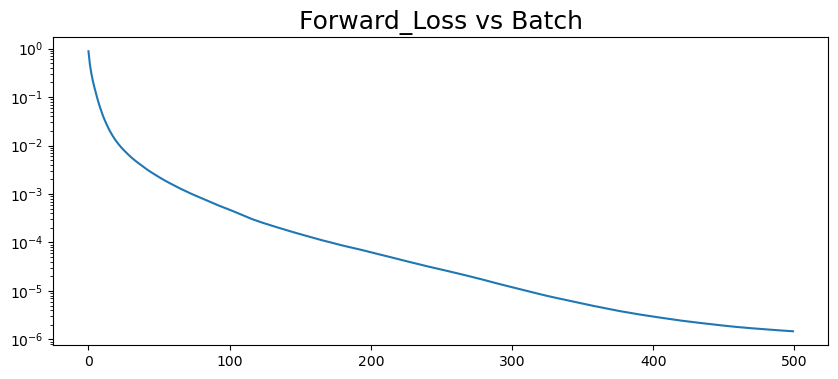
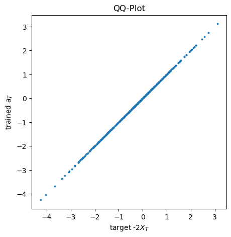

# Principle-Agent Mean Field Game In Renewable Energy Certificate Market (PA-MFG in REC Markets)
---
Conventional numerical solvers are hard pressed to solve PA-MFG with market-clearing conditions, which may be faced with the "curse of dimentionality". Thus in their study [[1]]("https://doi.org/10.48550/arXiv.2110.01127"), Professor Campbell and his fellows proposed an actor-critic approach to optimization, where the agents form a Nash equilibria according to the principal’s penalty function, and the principal evaluates the resulting equilibria. And they applies this approach to a stylized PA problem arising in Renewable Energy Certificate (REC) markets, where agents may _work_ overtime (or _rent_ capacity), _trade_ RECs, and _expand_ their long-term capacity to navigate the market at maximum profit.

And beyond the origianl study, in the summer of 2024, we further complicated the topic, i.e. extending from 1-period scenario to 2-period scenarios, providing insteresting insights into how "planning ahead" would make a difference in the agents' performance and the markets. 

In this report, we will go throgh the following parts, yet with more weights put on `part 4`, the extended topic to [[1]]("https://doi.org/10.48550/arXiv.2110.01127").

> `Part 1` __FBSDE: Modeling of The PA Problem in REC Markets__
>>    `1.1` REC Market Basics
>>    `1.2` REC Market Modeling: Solving PA Problem Through FBSDE
> `Part 2` __Multi-Step NN Solver: Single-Agent Market in A Single Period__
>>    `2.1` A Simply Example: Smooth Penalty Function
>>    `2.2` Approximation by Linear Combos of Call/Put Functions And Tricks: Improve The Numerical Stability And Convergency  
>>
> `Part 3` __2(multi)-Agent Market in A Single Period__ 
> 
> `Part 4` __2(multi)-Agent Market in 2(multi)-Period__  
>>    `4.1` Joint Optimization: Planning Ahead 
>>    `4.2` Separate Optimization: Considering Present Only 
>>    `4.3` Comparison: Long/Short-Sighted Performances And Market Impacts

---

## `Part 1` FBSDE: Modeling of The PA Problem in REC Markets 

### `1.1` REC Market Basics

Closely related to carbon cap-and-trade (C&T) markets, REC markets are a type of market-based emmissions regulation policies, which are motivating real-world applications of FBSDE in modeling PA-MFG.

In RES markets, a regulator plays the role of principle, setting a floor on the amount of energy generated from renewable resources (aka. green energy) for each firm (based on a percentage of their total production), and providing certificates for each MWh of green energy generated and delivered to the grid. These certificates can be further traded by individual or companies, i.e. agents, to: 1) reduce costs or the greenhouse gas (GHG) emissions impact of their operations; and 2) earn profits from the extra inventories instead of wasting. Since the certificates are traded assets, energy suppliers can trade off between producing clean electricity themselves, and purchasing the certificates on the market. In all, such policies have played an important role in funding clean energy development, particularly in past years when the cost of green power production was not as competitive with the cost of fossil fuel power. 

To ensure compliance, however, each firm must surrender RECs totaling the floor at the end of a compliance period, with a monetary penalty paid for each lacking certificate. And in practice, these systems regulate multiple consecutive and disjoint compliance periods, which are linked together through a mechanism called _banking_, where unused allowances in current period can be carried on to the next period (or multiple future periods). Thus, as an extension to the single-period framework [[1]]("https://doi.org/10.48550/arXiv.2110.01127"), we now consider a 2-period model in this report.[^1]. 

### `1.2` REC Market Modeling: Solving PA Problem Through FBSDE

As is specified above, the 2 compliance periods $[0,T_1]$ and $(T_1,T_2]$ can be denoted as $\mathfrak{T_1}$ and $\mathfrak{T_2}$, respectively. And $T_2$ can be thought of as 'the end of the world', after when there are no costs occurs and all agents forfeit any remaining RECs. Other key notations/parameters used are as follows:

- $i \in \mathfrak{N}$: an individual agent belonging to the whole population $\mathfrak{N}$, annotated by superscript $\cdot^{i}$.

- $k \in \mathcal{K}$: a sub-population of agents, within which all individuals are assumed to have identical preferences and similar initial conditions/capacities, yet across which are distinct. The sub-population is annotated by superscript $\cdot^{k}$.

- $I_t := (I_t)_{t\in\mathfrak{T_1} \cup \mathfrak{T_2}}$: the inventories in stock. For some key time points:
    - at $t=0$, there may be some stochastics in the initial inventories, which yet are assumed to be normally distributed. For a specific sub-population $k \in \mathcal{K}$, $I_0^{k} \sim \mathcal{N}(v^k, \eta^k)$.
    - at $t=T_1$, the terminal RECs pre-submission are $I_{T_1}$ carried over from the first period. After forfeiting a minimum amount of $\min\Big(K,I^i_{T_1}\Big)$ inventories, the leftover amounts in stock are: $ReLU\Big(I^i_{T_1}-K\Big)$, which are treated as new initial values for the second period.
    - at $t=T_2$, the terminal RECs pre-submission are $I_{T_2}$.

- $X_t := (X_t)_{t\in\mathfrak{T_1} \cup \mathfrak{T_2}}$: accumulative invetory generation. We introduce this process for continuous differentiablity, which is NOT satisfied by $I$ at $T_1$. And $X_t$ has the same initial conditions as $I_t$. Clearly, we have:

    $$
    I_t=
    \begin{cases}
        & X_t~,                  ~~&& t \in [0,T_1]\\
        & X_t- \min(X_{T_1},K), ~~ && t \in (T_1,T_2]\\
    \end{cases} 
    ~~\text{or}~~ 
    I_t=
    \begin{cases}
        & X_t~,                                           ~~&& t \in [0,T_1]\\
        & X_t- \text{ReLU}(X_{T_1}-K)+(X_{T_2}-X_{T_1})~, ~~&& t \in (T_1,T_2]\\
    \end{cases} 
    $$

- $K$: the quota that agents must meet at the end of each period. Any lacking RECs below this floor will be subjected to monetary penalties.

- $P(\cdot)$: a generic penalty function chosen by the regulator, which is assumed continuously differentiable for simplicity. 

- $h$: the baseline generation rate at which agents generate with zero marginal cost. 

- $C_t := (C)_{t\in\mathfrak{T_1} \cup \mathfrak{T_2}}$: incremental REC capacity of agents, i.e. the increase of baseline generation rate over time, accumulated by investing in expansion plans - for instance, by installing more solar panels[^2]. 

- $a_t := (a)_{t\in\mathfrak{T_1} \cup \mathfrak{T_2}}$: the control of expansion rate, representing long-term REC capacity added per unit time. Note that it could be made even more realistic by incorporating a _delay_ between the decision to expand ($a_t$) and the increase to the baseline rate ($h$).

- $g_t := (g)_{t\in\mathfrak{T_1} \cup \mathfrak{T_2}}$: the control of overtime-generation rate, i.e. the extra capacity achieved by working extra hours and/or renting short-term REC generation capacity at an assumed quadratic cost - specifically, overhour bonus and/or rental fee.

- $\Gamma_t := (\Gamma)_{t\in\mathfrak{T_1} \cup \mathfrak{T_2}}$: the control of trading rate, with negative[^3] values being the amount sold whereas postive purchased per unit time.

- $S_t := (S)_{t\in\mathfrak{T_1} \cup \mathfrak{T_2}}$: the equilibrium REC price obtained endogenounsly through market-clearing condition: 
$$\lim\limits_{N \to \inf}{\frac{1}{N} \sum\limits_{i\in\mathfrak{N}}{\Gamma^i_t}}=0$$

- $\zeta,~\gamma,~\beta$: scalar cost parameters which are identical for agents within the same sub-population. 

And their values are given in the following table:

|        |$\pi_k$ | $h^k$ | $\sigma^k$ | $\zeta^k$ | $\gamma^k$ | $v^k$ | $\eta^k$ | $\beta^k$ |
| :---:  | :----: | :---: | :--------: | :-------: | :--------: | :---: | :------: | :--------:|
|   k=1  | 0.25   | 0.2   |  0.1       |   1.75    |   1.25     |  0.6  |  0.1     | 1.0       |
|   k=2  | 0.75   | 0.5   |  0.15      |   1.25    |   1.75     |  0.2  |  0.1     | 1.0       |

We consider the agents' problem with $N \to \inf$ agents in total, which implies that all agents are minor entities, having no market impact individually. We work on the filtered probability space $(\Omega,~\mathcal{F},~(\mathcal{F}_{t\in \mathfrak{T}}),~\mathbb{P})$. All processes are assumed to be $\mathcal{F}$-adapted and all controls are associated with quadratic costs. So for agent $i$ in sub-population $k$, the total cost that it seeks to minimize in 2 compliance periods is:

$$
\mathcal{J}^i=\mathbb{E}\Big[
        \Big(
            \int_0^{T_2}{
                \frac{\zeta ^k}{2} (g^i_{\tau})^2 + \frac{\gamma ^k}{2} (\Gamma^i_{\tau})^2 + \frac{\beta ^k}{2} (a^i_{\tau})^2 + S_{\tau}\Gamma_{\tau}
                d\tau} + 
            P\Big(I^i_{T_1}\Big) + 
            P\Big(I^i_{T_2}\Big)
            \Big)
        \Big] ~.
$$

Here, agent $i$ needs to keep track of both its inventories in stock and incremental capacity over time: _(for differentiablity at $T_1$, we will use accumulative generation $X_t$ here)_
$$
\begin{cases}
d X_t^i &= \left(h^k+g_t^i + \Gamma_t^i+ C_t^i \right)dt + \sigma dW_t &&&,~~X_0^i \sim \mathcal{N}\left(v^k, \eta^k\right)\\
dC_t^i &= a_t^i dt &&&,~~C_0^i=0
\end{cases}
$$

Before moving on, we fisrt formulate an assumption: any continuous function $P:\mathbb{R} \to \mathbb{P}$ can be approximated by the linear combination of call/put option payoffs (i.e. shifted and/or scaled ReLU functions):

$$
P(x)=\Phi_0+\sum_{j=1}^{n}{w_j\left(x-K_j\right)_+}~,~~\textit{or}~~P(x)=\Phi_0+\sum_{j=1}^{n}{w_j\left(K_j-x \right)_+}~,
$$

for _weights_ $\Phi_0 \in \mathbb{R},~w_j \in \mathbb{R}_+$ and _knot points_[^5] $K_j \in \mathbb{R}_+ $. Thus any given penalty structure $P$ can be modeled by a multi-knot function. _In future topics/steps_, we will consider a richer class of penalty functions from the principle's perspective, searching for the optimal penalty structure. Yet in this report, we only discuss a simplified case - _**single-knot penalty functions**_ - first fixing the non-compliance function $P$ to a single-knot function with knot $K=0.9$[^6] and intercept $\Phi_0=0$. Then, by tuning the weight $w$, we can see the relation between the penalty level (controled by $w$) and the agents' behaviour, as well as its market impact, i.e.: $P(x)=w(0.9-x)_+ ~, ~~ w=0.25,~0.5,~0.75,~1.0 $ . [^7] Then we proceed into the following intuitive partial proof of the optimization problem above. 

__*Partial Proof*__ Intuitively, we partially differentiate the objective cost function $\mathcal{J}^i( g^i, \Gamma^i, a^i; X^i_{T_1}, X^i_{T_2})$ w.r.t. each control ($g^i$, $\Gamma^i$, $a^i$) in an arbitrary perturbation direction $\eta$, in order to find the optimal controls where the partial derivatives equal to zero. So we first get the partial derivates of $X^i$ w.r.t controls  $g^i,~ \Gamma^i,~ a^i$. For a fixed control $g$, we consider an adapted process $\eta = (\eta_t)_{t≥0}$ and perturb $g$ by $\epsilon> 0$ in the direction of $\eta$: $g+ \epsilon \eta$. Differentiate $I$(or $X$, equivalently, in essense)[^8] in the direction $\eta$:

$$
\begin{aligned}
    \partial_{g} X_t=\partial_{g} I_t &= \int_0^t {\eta_s ds}\\
    \partial_{\Gamma} X_t=\partial_{\Gamma} I_t &= \int_0^t {\eta_s ds}\\
    \partial_{a} X_t=\partial_{a} I_t &= \int_0^t {\partial_{a} C_s ds} = \int_0^t {\int_0^s {\eta_v dv} ds}
\end{aligned}
$$

Then, differentiate $\mathcal{J}$ w.r.t. $g$ in the direction $\eta$ (same goes for $\Gamma$ and $a$):

$$
\begin{aligned}
    \partial_g\mathcal{J}(g;\Gamma,a,\eta,X_{T_1},X_{T_2}) 
    &= \Bbb{E}\left[
        \int_0^{T_2}{\zeta g_t \eta_t}~dt-w\mathbf{1}_{\scriptstyle {X_{T_1}<K}}\partial_g X_{T_1}-w\mathbf{1}_{\scriptstyle {X_{T_2}-X_{T_1}+(X_{T_1}-K)_+ < K}}\left(\partial_g X_{T_2}-\partial_g X_{T_1}+\mathbf{1}_{\scriptstyle {X_{T_1}>K}}\partial_g X_{T_1}\right)
        \right]\\
    &= \Bbb{E} \Biggl[
        \int_0^{T_1}{\left( \zeta g_t -w \mathbf{1}_{\scriptstyle {X_{T_1}<K}}-w \mathbf{1}_{\scriptstyle {X_{T_2}-X_{T_1}+(X_{T_1}-K)_+ < K}}\right)\eta_t }dt\\
    &~~~~~~~~+ \int_{T_1}^{T_2}{\left( \zeta g_t -w \mathbf{1}_{\scriptstyle {X_{T_2}-X_{T_1}+(X_{T_1}-K)_+ < K}}\right)\eta_t }dt 
    \Biggr]\\
    &=\Bbb{E} \Biggl[\int_0^{T_1}{\left( \zeta g_t -w\Bbb E\left[\mathbf{1}_{\scriptstyle {X_{T_1}<K}}|\mathcal F_t\right] -w\Bbb E\left[\mathbf{1}_{\scriptstyle {X_{T_2}-X_{T_1}+(X_{T_1}-K)_+ < K}}|\mathcal{F}_t\right] \right)\eta_t }dt \\
    &~~~~~~~~+ \int_{T_1}^{T_2}{\left( \zeta g_t -w\Bbb E\left[\mathbf{1}_{\scriptstyle {X_{T_2}-X_{T_1}+(X_{T_1}-K)_+ < K}}|\mathcal{F}_t\right]\right)\eta_t }dt \Biggr]\\
    &= \Bbb{E} \Biggl[\int_0^{T_1}{\left( \zeta g_t -w\Bbb P\left(X_{T_1}<K|\mathcal F_t\right) -w\Bbb P\left(X_{T_2}-X_{T_1}+(X_{T_1}-K)_+ < K|\mathcal{F}_t\right) \right)\eta_t }dt\\
    &~~~~~~~~+ \int_{T_1}^{T_2}{\left( \zeta g_t -w\Bbb P\left(X_{T_2}-X_{T_1}+(X_{T_1}-K)_+ < K|\mathcal{F}_t \right) \right)\eta_t }dt \Biggr]\\
\end{aligned}
$$ 

The optimal $g$ will make $\mathcal{J}\equiv 0$ for any $\eta$. Therefore we get the first order condition of control $g$:

$$
\begin{aligned}
    g_t &= \frac{w \left[\Bbb P \left( X_{T_1}<K|\mathcal F_t \right) + \Bbb P\left(X_{T_2}-X_{T_1}+\left(X_{T_1}-K\right)_+ < K|\mathcal{F}_t\right)\right]}{\zeta}~\mathbf{1}_{t \in [0,T_1]} \\
    &~~~~+~~ \frac{w\Bbb {P}\left(X_{T_2}-X_{T_1}+(X_{T_1}-K)_+ < K|\mathcal{F}_t \right)}{\zeta}~\mathbf{1}_{t \in (T_1,T_2]}\\
    &:=\frac{V_t+U_t}{\zeta}~\mathbf{1}_{t \in [0,T_1]} + \frac{Y_t}{\zeta}~\mathbf{1}_{t \in (T_1,T_2]}~~,~~ \textit{where}\\
    & \\
    V_t &:= \Bbb{E} \left[w \mathbb I_{\scriptstyle {X_{T_1}<K}}|\mathcal F_t \right] = w\Bbb{P}\left( X_{T_1}<K |\mathcal F_t\right)\\
    U_t &:= \Bbb{E} \left[w\mathbb I_{\scriptstyle {X_{T_1}>K,~X_{T_2}-X_{T_1}+(X_{T_1}-K)_+ < K}}|\mathcal F_t \right] = w\Bbb{P}\left( X_{T_1}>K,~X_{T_2} < 2K|\mathcal F_t\right)\\
    Y_t &:= \Bbb{E} \left[w\mathbb I_{\scriptstyle {X_{T_2}-X_{T_1}+(X_{T_1}-K)_+ < K}}|\mathcal F_t \right] = w\Bbb{P}\left( X_{T_2}-X_{T_1}+(X_{T_1}-K)_+ < K|\mathcal F_t\right)\\
\end{aligned}
$$

Similarly, we find the other 2 optimal controls by taking the partial derivatives of $\mathcal{J}$ w.r.t. $\Gamma$ and $a$:

$$
\begin{aligned}
    \Gamma_t &=\frac{V_t+U_t-S_t}{\gamma}~\mathbf{1}_{t \in [0,T_1]} + \frac{Y_t-S_t}{\gamma}~\mathbf{1}_{t \in (T_1,T_2]}\\
    a_t &=\frac{\left(T_1-t\right)\left(V_t+U_t\right)+\left(T_2-T_1\right)Y_t}{\beta}~\mathbf{1}_{t \in [0,T_1]} + \frac{\left(T_2-t\right)Y_t}{\beta}~\mathbf{1}_{t \in (T_1,T_2]}\\
\end{aligned}
$$

Then, by enforcing the Equilibrium Market Clearing Condition ar optimality:

$$
\lim_{N\rightarrow \infty}{\frac{1}{N}\sum\limits_{i=1}^{N}\Gamma^{(i)}}=\lim_{N\rightarrow \infty}
{
    \frac{1}{N}\sum\limits_{i=1}^{N}{
        \frac{1}{\gamma}\left[
            \left(V_t^{(i)}+U_t^{(i)}-S_t\right)~\mathbf{1}_{t \in [0,T_1]} +\left(Y_t^{(i)}-S_t\right)~\mathbf{1}_{t \in (T_1,T_2]}
            \right]
        }
    }\equiv0  ~~, 
$$

we get the market clearing price:

$$S_t = \Bbb{E}\left[V_t+U_t\right] ~\mathbf{1}_{t \in [0,T_1]} + \Bbb{E}\left[Y_t\right] ~\mathbf{1}_{t \in (T_1,T_2]}$$

Putting all these together and extending them to the 2-population scenario (i.e. $k=1,2$ ), we can model the agents' problem by the following FBSDEs:

$$
\begin{cases}
    dX_t^{k} &=(h^{k}+g_t^{k}+\Gamma_t^{k}+C_t^{k})dt + \sigma^{k}dW_t^{k}&,  &X_0^{k} \sim \zeta^{k}\\
    dC_t^{k} &= a_t^{k}dt &,  &C_0^{k}=0 \\ 
    dV_t^{k} &= Z_t^{V,k}dW_t^{k}&,  &V_{T_1}^{k}=w*\mathbf{1}_{X_{T_1}<K} \\
    dU_t^{k} &= Z_t^{U,k}dW_t^{k}&,  &U_{T_1}^{k}=1*Y_{T_1}\mathbf{1}_{X_{T_1}>K}\\
    dY_t^{k} &= Z_t^{Y,k}dW_t^{k}&,  &Y_{T_2}^{k}=w*\mathbf{1}_{X_{T_2}-X_{T_1}+(X_{T_1}-K)_+<K}
\end{cases} \\
$$

, where the optimal controls are given by:

$$
\begin{aligned}
& g_t^{k} = \frac{V_t^{k}+U_t^{k}}{\zeta^{k}} ~\mathbf{1}_{t\in [0,T_1]}
            + \frac{Y_t^{k}}{\zeta^{k}} ~\mathbf{1}_{t\in (T_1,T_2]} \\
& \Gamma_t^{k} =\  \frac{V_t^{k}+U_t^{k}-S_t}{\gamma^{k}} ~\mathbf{1}_{t\in [0,T_1]}
                 + \frac{Y_t^{k}-S^t}{\gamma^{k}} ~\mathbf{1}_{t\in (T_1,T_2]} \\
& a_t^{k} =\frac{(T_1-t)(V_t^{k}+U_t^{k})+(T_2-T_1)Y_t}{\beta^{k}} ~\mathbf{1}_{t\in [0,T_1]}
            + \frac{(T_2-t)Y_t^{k}}{\beta^{k}} ~\mathbf{1}_{t\in (T_1,T_2]} \\
& S_t =\Biggl(
                \frac{\frac{\pi_1}{\gamma_1}}{\frac{\pi_1}{\gamma_1}+\frac{\pi_2}{\gamma_2}}\mathbb{E}[V_t^{1}+U_t^{1}]+\frac{\frac{\pi_2}{\gamma_2}}{\frac{\pi_1}{\gamma_1}+\frac{\pi_2}{\gamma_2}}\mathbb{E}[V_t^{2}+U_t^{2}]
            \Biggr) ~\mathbf{1}_{t\in [0,T_1]} + \Biggl(
                        \frac{\frac{\pi_1}{\gamma_1}}{\frac{\pi_1}{\gamma_1}+\frac{\pi_2}{\gamma_2}}\mathbb{E}[Y_t^{1}]+\frac{\frac{\pi_2}{\gamma_2}}{\frac{\pi_1}{\gamma_1}+\frac{\pi_2}{\gamma_2}}\mathbb{E}[Y_t^{2}]
                        \Biggr) ~\mathbf{1}_{t\in (T_1,T_2]} 
\end{aligned}
$$

This conclusion can be extended to more realistic models with multiple sub-populations and penalty structures approximated by multi-knot functions. Actually, following the probabilistic approach espoused by Professor Carmona and Delarue in [[2]](https://arxiv.org/abs/1210.5780), one can find the solution to the above FBSDEs is exactly the optimal operation for agent $i$ in sub-population $k~(\forall~i \in \mathfrak{N}_k,~k\in\mathcal{K})$. In next 3 parts, we will build and train the NN models to learn this solution numerically.

## `Part 2` Multi-Step NN Solver: Single-Agent Market in A Single Period

Buildig up an NN model with just-fine parameters all from scratch could be tricky, especially when the learning targets have jumps (i.e. gradients may not exist at some points and thus diminish the numeric stability). Therefore, instead of approaching the 2(multi)-agent-2(multi)-period scenatio directly, we will reproduce the models in [[1]]("https://doi.org/10.48550/arXiv.2110.01127"), setting up the models and parameters by baby steps. In this part, we will focus on the single-agent-single-period case, starting by learning a smooth convex penalty function (e.g. the quadratic function). 

### `2.1` A Simply Example: Smooth Penalty Function

As mentioned above, the jumps in objective functions - indicator functions in terminal conditions - could greatly reduce the model numeric stability. Thus when setting up the naive model, we fix $P(x)=x^2$ and reduce the number of controls to 1. Let $\mathfrak{T}=\lbrace{t_0,~...~, t_m \rbrace}$ be a dicrete set of points with $t_0=0$ and $T_m=T$, where m is the number of time steps[^9]. Here the step size $dt=(t_i-t_{i-1})$ is a constant and $dt=T/m$. The smaller the value of h, the closer our discretized path will be to the continuous-time path we wish to simulate. Certainly, this will be at the expense of greater computational effort. So we set $m=80,~T=1$ for the single-period model and $m_1=m_2=50,~T_1=T_2=2$ for the 2-peirod model. While there are a number of discretization schemes available, the simplest and most common scheme is the Euler scheme, which is intuitive and easy to implement. In particular, it satisfies the _practical decision-making process_ - make decisions for the next point of time conditioned on the current information. 

The codes in [*2FBSDE_Smooth_Penalty.ipynb*](../1Period/2FBSDE_Smooth_Penalty.ipynb) under the folder [*1Period*](../1Period) solves the following discretized yet simplified FBSDE:

$$
\begin{cases} 
X_{t_j}^i = X_{t_{j-1}}^i + a_{t_{j-1}}^i dt+\sigma dB_{t_{j-1}}^i, &X_0^i=\xi^i \sim \mathcal{N}(0.6,0.1) \\ 
a_{t_j}^i = a_{t_{j-1}}^i + Z_{t_{j-1}} dB_{t_{j-1}}^i, &a_T^i=-2X_T^i
\end{cases}
$$

where $X_0^i$ and $Z_{t_{j-1}}~,~ j=1,...,m, i=1, ..., N$ are the parameterized initial value for $i^{th}$ sample and drifts for the (sub-)population of $N$ samples in total, each being learnt by a specific NN model (denoted as `x0_model_main` and `z_models_main[j]` in the codes, respectively). Here, $dB_{t_{j-1}}$ are the increments of standard Brownian Motions, simulated 

The average forward loss over $N$ samples after each learning epoch is given by:

$$\frac{1}{N}\sum_{i=1}^N{\left( a_T^i+2X_T^i \right)^2}$$

We aim to minimize this forward loss by *Gradient Descent (GD)*, iterating through several optimization steps (denoted as `OptimSteps` in the codes) and training with several epochs (denoted by `MaxBatch` in the codes since `SingleBatch` is set to `True`, which means training on a single batch for `MaxBatch` times, and therefore a training batch actually amounts to an epoch). PyTorch serves as a powerful tool for this purpose, especially owing to its automatic differentiation package - `torch.autograd`. :bulb: See more details about model set-ups in [*2FBSDE_Smooth_Penalty.ipynb*](../1Period/2FBSDE_Smooth_Penalty.ipynb)[^10]. 

*Forward Losses of learning the smooth terminal condition*

*Fitness of learning the smooth terminal condition*

From the forward loss plot and QQ-plot for learnt terminal values and learning targets, we can see that our NN models works almost perfectly with smooth linear terminal targets. Worth mentioning, this is achieved by experimenting with dozens of combinations of optimizers, learning rate schedulers and other hyper-parameters for the models. The experimental codes and results are backed-up in the sub-folder [_Experiments_](../1Period/Experiments) under [*1Period*](../1Period). Ultimately, we choose `Adamax` and `StepLR` with `learning_rate=0.001`. 

### `2.2` Approximation by Linear Combos of Call/Put Functions And Tricks: Improve The Numerical Stability And Convergency

<!-- ---  -->
[^1]: Note, same methodology applies to multi-period scenarios.
[^2]: The incremental capacity over baseline can be carried forward to the future periods. 
[^5]: At a finite set of joint points, the posiible lack of differentiability will not have any significant affects. 
[^3]: While trading rate may be positive or negative, expansion and overtime-generation rates must be positive.
[^6]: The choice of knot point is associated with $h^{k}$ and total time span $T_1$, $T_2$. A good target (or quota) should be __"attainable"__ - neither too easy nor too hard to achieve. Specifically, even if agents do nothing at all, they will have an initial amount plus a baseline generation of inventories - for instance, $0.2*1 + 0.6=0.8$ for agents in sub-population 1 at the first period end. Similarly, for sub-population 2, all agents will also have a _"garanteed"_ level of 0.8 for delivery. Thus a target reasonably higher than that, i.e. 0.9, would be regard __"attainable"__. 
[^7]: $w$ could also take any other positive values.
[^8]: The superscript $\cdot^i$ is omitted here for convenience. Same might go for other processes in vicinity. 
[^9]: In codes, we use `NT`, `NT1`, and `NT2` to denote the number of time steps for the single-period model, the first in the 2-period model, and the total time steps (for aggragate period) in the 2-period model, respectively. 
[^10]: Some notions in [*2FBSDE_Smooth_Penalty.ipynb*](../1Period/2FBSDE_Smooth_Penalty.ipynb) might be different from this report. They have no practical meaning except for setting up a simplified model. Should not be confused with the same letters used here. 

---
# Question Log
1. Did we actually only approximated the __*agents' problem*__ through FBSDE, while kept the principle's problem untouched?
2. How did [[2]](https://arxiv.org/abs/1210.5780) implement the probabilistic approach?
